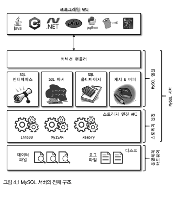
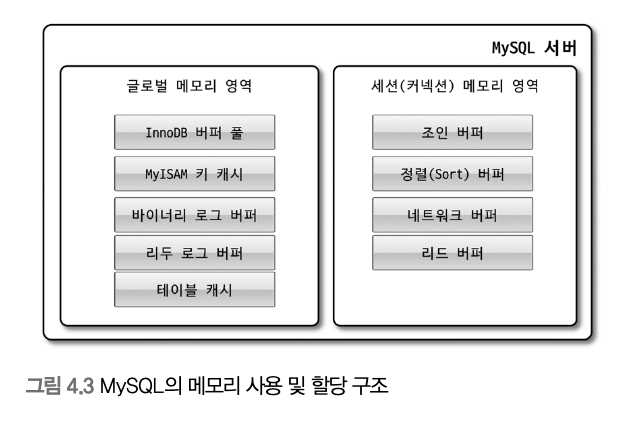
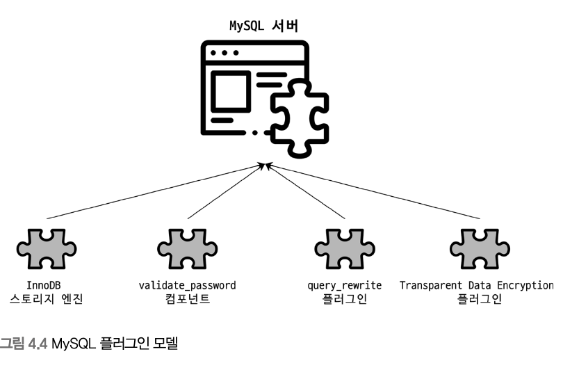
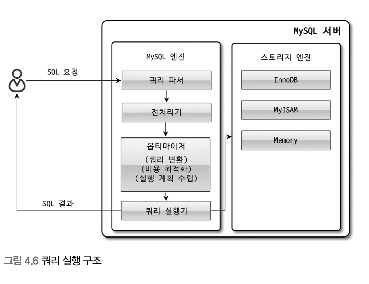

# 4.1 MySQL 엔진 아키텍처
MySQL 서버 = MySQL 엔진 + 스토리지 엔진 (InnoDB / MyISAM)

## 4.1.1 MySQL의 전체 구조

MySQL은 대부분의 프로그래밍 언어로부터 접근 방법을 모두 지원함

### 4.1.1.1 MySQL 엔진
- 클라이언트로부터의 접속 및 쿼리 요청을 처리하는 커넥션 핸들러
- SQL 파서 및 전처리기
- 쿼리의 최적화된 실행을 위한 옵티마이저

표준 문법에 따라 작성된 쿼리는 타 DBMS와 호환되어 실행 가능

### 4.1.1.2 스토리지 엔진
실제 데이터를 디스크 스토리지에 저장하거나 디스크 스토리지로부터 데이터를 읽어오는 부분

```
mysql> CREATE TABLE test_table (fd1 INT, fd2 INT) ENGINE=INNODB;
```

test_table에 대해 INSERT, UPDATE, DELTE, SELECT 등의 작업이 발생하면 InnoDB 스토리지 엔진이 처리를 담당

### 4.1.1.3 핸들러 API
MySQL 엔진의 쿼리 실행기에서 데이터를 쓰거나 읽어야 할 때는 각 스토리지 엔진에 쓰기 또는 읽기 요청 = 핸들러 요청

핸들러 요청에서 사용되는 API = 핸들러 API

InnoDB 스토리지 엔진도 이 핸들러 API를 이용해 MySQL 엔진과 데이터를 주고받음

## 4.1.2 MySQL 스레딩 구조
MySQL 서버는 프로세스 기반이 아니라 스레드 기반으로 작동

프로그라운드와 백그라운드 스레드로 구분됨

### 4.1.2.1 포그라운드 스레드
최소한 MySQL 서버에 접속된 클라이언트의 수만큼 존재하며, 주로 각 클라이언트 사용자가 요청하는 쿼리 문장을 처리함

### 4.1.2.2 백그라운드 스레드

- 인서트 버퍼를 병합하는 스레드
- 로그를 디스크로 기록하는 스레드
- InnoDB 버퍼 풀의 데이터를 디스크에 기록하는 스레드
- 데이터를 버퍼로 읽어 오는 스레드
- 잠금이나 데드락을 모니터링하는 스레드

가장 중요한 것 : 로그 스레드, 쓰기 스레드

## 4.1.3 메모리 할당 및 사용 구조


글로벌 메모리 영역

로컬 메모리 영역

## 4.1.4 플러그인 스토리지 엔진 모델


스토리지 엔진 외에도 여러 기능들(인증 등)이 플러그인 형태로 제공된다.

핸들러(Handler) - MySQL엔진과 스토리지엔진 사이에 데이터가 오가려면 핸들러(명령)를 통해야 한다.

SHOW ENGINES; 를 통해 상태를 확인할 수 있다.

## 4.1.5 컴포넌트

플러그인의 단점을 보완하기 위해 만들어졌다.

플러그인은 오직 MySQL 서버와 인터페이스 할 수 있고, 플러그인끼리는 통신할 수 없다.

플러그인은 MySQL 서버의 변수나 함수를 직접 호출하기 때문에 안전하지 않다.

플러그인은 상호 의존 관계를 설정할 수 없어서 초기화가 어렵다.

MySQL 8.0의 비밀번호 검증 기능은 컴포넌트로 개선되었다. (이전에는 플러그인 형태로 제공)

## 4.1.6 쿼리 실행 구조



- 쿼리 파서 - SQL을 DB가 이해할 수 있도록 변환(트리구조)
- 전처리기 - 테이블명이나 컬럼명 등 확인, 접근 권한 확인
- 옵티마이저 - 쿼리 최적화
- 실행엔진 - 옵티마이저(경영진), 실행엔진(중간관리자), 핸들러(실무자)
- 핸들러
- 쿼리 캐시 - 8.0에서 제거된 기능, DDL 실행시 관련된 캐시를 삭제하는 과정에서 성능 저하
- 스레드 풀 - Enterprise Edition에서만 제공
- 트랜잭션 지원 메타데이터
    파일(FRM파일, TRN, TRG, PAR 등)로 관리하던 5.7 이전 버전
    8.0부터는 (시스템)테이블 구조로 관리 -> InnoDB 스토리지 엔진 사용