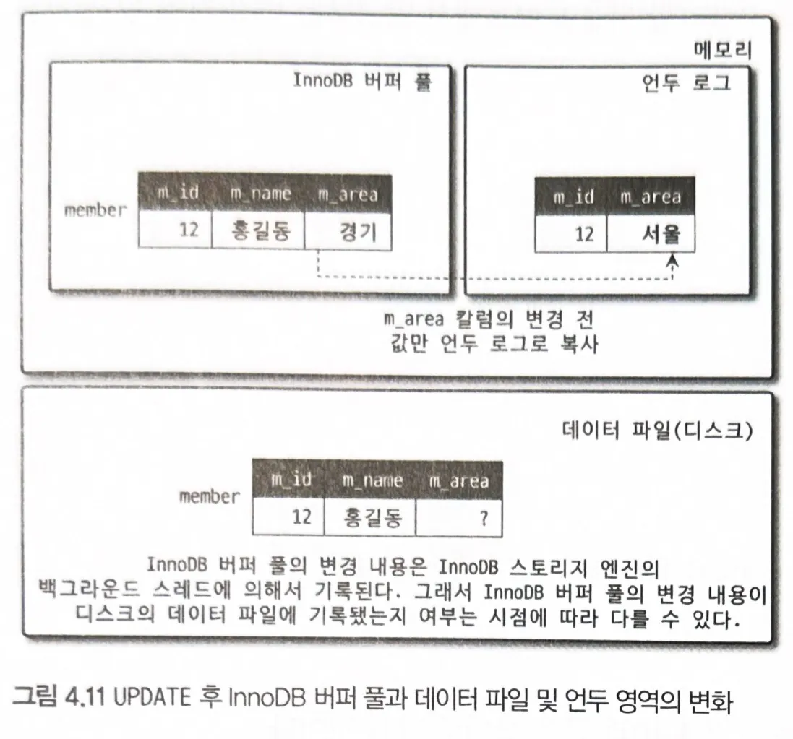
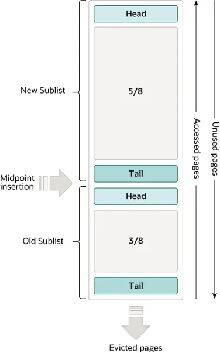

## 버퍼 풀(Buffer Pool)

버퍼 풀은 주 메모리(RAM) 안에 있는 영역으로, InnoDB가 접근되는 테이블 데이터와 인덱스 데이터를 캐시(저장)하는 곳이다. 버퍼 풀 덕분에 자주 쓰는 데이터는 메모리에서 바로 접근할 수 있어 처리 속도가 빨라진다. 전용 서버에서는 보통 물리 메모리의 최대 80%까지 버퍼 풀에 할당하는 경우도 많다.

대량 읽기(read)를 효율적으로 처리하기 위해, 버퍼 풀은 페이지(page) 단위로 나뉘며, 한 페이지에는 여러 행(row)이 들어갈 수 있다. 캐시 관리를 효율적으로 하기 위해 버퍼 풀은 페이지들의 연결 리스트(linked list)로 구현되어 있고, 거의 사용되지 않는 데이터는 LRU(Least Recently Used) 알고리즘의 변형으로 캐시에서 밀려나게 된다.

버퍼 풀을 잘 활용해 자주 접근하는 데이터를 메모리에 유지하는 방법을 아는 것은 MySQL 튜닝에서 중요한 요소다.

## 버퍼 풀 LRU 알고리즘

버퍼 풀은 LRU 알고리즘의 변형을 사용한 리스트로 관리된다. 새 페이지를 넣기 위해 공간이 필요하면 가장 오랫동안 사용되지 않은 페이지가 제거되고(evict), 새 페이지는 리스트의 중간(midpoint)에 추가된다. 이 “중간 삽입”전략은 리스트를 두 개의 서브리스트로 나눠서 취급한다.

- 머리(head): 최근 접근된 새로운(young) 페이지들의 서브리스트
- 꼬리(tail): 덜 최근에 접근된 오래된(old) 페이지들의 서브리스트

이 알고리즘은 자주 쓰는 페이지를 new(young) 서브리스트에 유지한다. old 서브리스트는 덜 쓰는 페이지들이며, 이 페이지들이 제거 후보가 된다.

- 버퍼 풀의 3/8이 old 서브리스트에 할당된다.
- 리스트의 중간지점(midpoint) 이 경계로서, new 서브리스트의 꼬리와 old 서브리스트의 머리가 만나는 곳이다.
- InnoDB가 페이지를 버퍼 풀로 읽어올 때, 처음에는 midpoint에 삽입한다.
- old 서브페이지에 있는 페이지를 접근하면 그 페이지는 young 이 되어 new 서브페이지 머리로 이동한다.
- 결국 계속 안 쓰인 페이지는 old 서브리스트의 꼬리에 도달해 제거된다.

## 버퍼 풀 설정

버퍼 풀의 여러 요소를 설정해서 성능을 개선할 수 있다.

- 이상적으로는, 다른 프로세스가 동작할 메모리를 남겨두되 가능한 한 크게 설정한다.
  버퍼 풀이 클수록 InnoDB는 “디스크에서 한 번 읽고 이후에는 메모리에서 반복 접근” 하는 형태가 되어 메모리 DB처럼 동작한다.
- 갑작스런 대량 스캔 때문에 자주 쓰는 데이터들이 밀려나버리는 것을 방지할 수 있다.
- 메모리가 충분하면 버퍼 풀을 여러 인스턴스로 나눠 동시 처리 시 경합을 줄일 수도 있다. → 버퍼 풀 인스턴스 여러 개 설정.

> 버퍼 풀은 기본 설정에서는 보통 1개(하나의 큰 버퍼 풀)처럼 보이지만, 성능/동시성 때문에 여러 인스턴스로 나눠서 여러 개처럼 운영될 수 있다.
>

버퍼풀을 여러 인스턴스로 나누는 경우는 꽤 흔하다.

조건이 맞으면 기본 튜닝 항목 중 하나다.

- 나누는 편이 많은 경우
    - 서버 RAM이 큰 편(8~16GB) 이고
    - 동시 접속/쿼리 수가 많아 버푸풀 내부 락/경합이 생길 수 있는 환경
    - 특히 OLTP(짧은 트랜잭션이 많이 도는 서비스)

→ 이런 환경에서는 `innodb_buffer_pool_instances`를 여러 개로 두는게 흔하다.

- 장점
    - 버퍼 풀 내부에서 동시에 많은 스레드가 부딪히는 경합을 줄여서, 처리량과 지연시간을 개선한다.
    - 동시 쿼리가 많으면 여러 스레드가 여기 접근하면서 락을 잡고 기다리는 시간이 커진다. 버퍼 풀을 인스턴스로 쪼개면 이런 구조들이 분리되서 대기 시간이 감소되고 처리량이 증가한다.

한 도로의 차선을 늘려서 정체를 줄이는 것에 비유할 수 있다.

핵심은, 버퍼 풀에는 메모리 덩어리만 있는 것이 아니라 LRU 관리, free list, flush list 등과 같은 “캐시 관리 작업”이 계속 일어나고, 백그라운드 스레드가 같은 지점에 몰리면서 락 대기 오버헤드가 커진다.

그래서 버퍼 풀을 여러 인스턴스로 쪼개면 각 인스턴스가 자기만의 락을 따로 갖게 되어 경합이 분산되고, 처리량이 올라가면서 지연시간은 줄어드는 효과가 나온다.

정리하자면, `캐시 관리의 병목을 줄이려고 쪼개는 튜닝`
