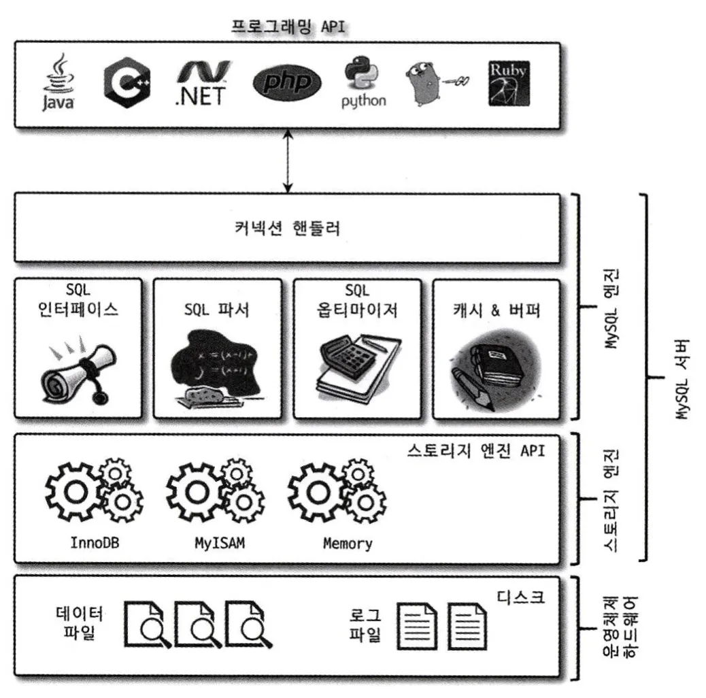
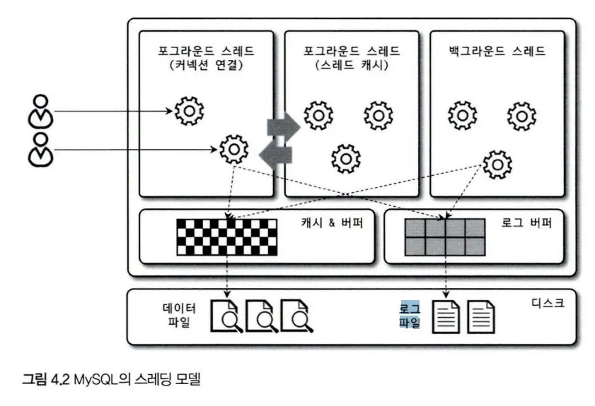
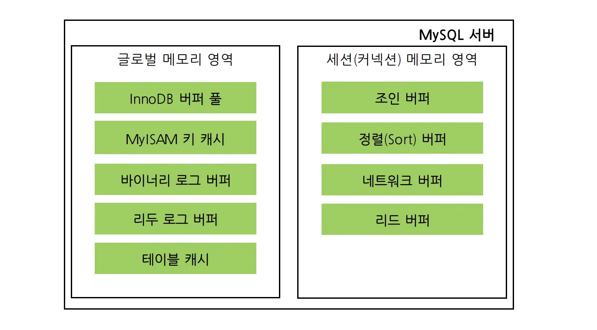
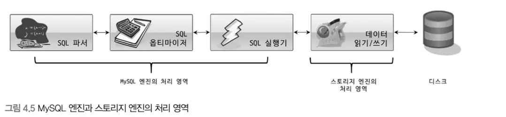
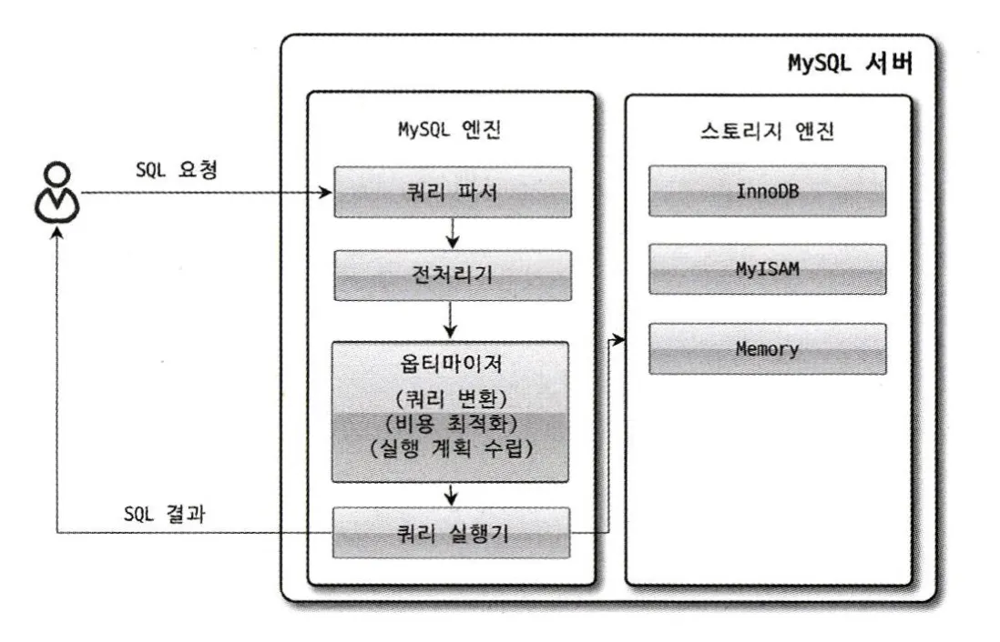
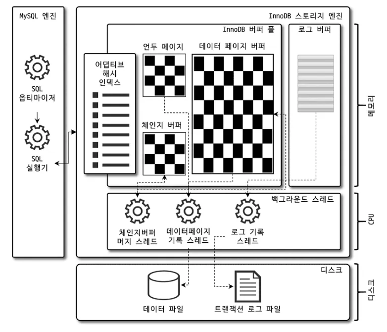
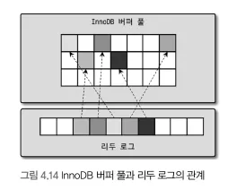

MySQL 서버는 사람의 머리 역할을 담당하는 MySQL 엔진과 손발 역할을 담당하는 스토리지 엔진으로 구분할 수 있다.

## 4.1 MySQL 엔진 아키텍처

MySQL 서버는 다른 DBMS에 비해 구조가 상당히 독특하다. 사용자 입장에서 보면 거의 차이가 느껴지지 않지만 이러한 독특한 구조 때문에 다른 DBMS에서는 가질 수 없는 엄청난 혜택을 누릴 수 있으며, 반대로 다른 DBMS에서는 문제되지 않았을 것들이 가끔 문제가 되기도 한다.



MySQL 서버는 크게 MySQL 엔진과 스토리지 엔진으로 구분할 수 있다. 이 책에서는 MySQL의 쿼리 파서나 옵티마이저 등과 같은 기능을 스토리지 엔진과 구분하고자 그림 4.1처럼 ‘MySQL 엔진’과 ‘스토리지 엔진’으로 구분했다. 그리고 이 둘을 합쳐 MySQL 또는 MySQL 서버라고 표현하겠다.

**4.1.1.1 MySQL 엔진(사람의 머리 역할)**

요청된 SQL 문장을 분석하거나 최적화하는 등 DBMS의 두뇌에 해당하는 처리를 수행

MySQL 엔진

- 커넥션 핸들러
    - 클라이언트로부터의 접속 및 쿼리 요청을 처리
- SQL 파서 및 전처리기
- 옵티마이저
    - 쿼리의 최적화된 실행을 하게함

**4.1.1.2 스토리지 엔진(손과 발의 역할)**

실제 데이터를 디스크 스토리지에 저장하거나 디스크 스토리지로부터 데이터를 읽어오는 부분은 스토리지 엔진이 전담한다.

스토리지 엔진은 여러 개를 동시에 사용할 수 있다.

다음과 같이 테이블이 사용할 스토리지 엔진을 지정하면 이후 해당 테이블의 모든 읽기 작업이나 변경 작업은 정의된 스토리지 엔진이 처리한다.

```sql
mysql> CREATE TABLE test_table (fd1 INT, fd2 INT) ENGINE=INNODB;
```

***새로 설계하는 서비스에서 테이블마다 엔진을 섞는 건 흔하지 않고, 대부분 InnoDB로 통일**하는 게 일반적

**4.1.1.3 핸들러 API**

MySQL 엔진의 쿼리 실행기에서 데이터를 쓰거나 읽어야 할 때는 각 스토리지 엔진에 쓰기 또는 읽기를 요청하는데, 이러한 요청을 핸들러 요청이라 하고,  여기서 사용되는 API를 핸들러 API라고 한다.

### 4.1.2 MySQL 스레딩 구조



- MySQL 서버는 프로세스 기반이 아니라 스레드 기반으로 작동.
- 포그라운드 스레드와 백그라운드 스레드로 구분

*실제 사용자 요청을 처리하는 스레드가 포그라운드 스레드

*전통적인 스레드 모델뿐 아니라 스레드 풀 모델을 사용할 수도 있다.

**4.1.2.1 포그라운드 스레드(클라이언트 스레드)**

- 포그라운드 스레드는 MySQL 서버에 접속된 클라이언트의 수 만큼 존재.
  각 클라이언트 사용자가 요청하는 쿼리 문장을 처리한다.
- 클라이언트 사용자가 작업을 마치고 커넥션을 종료하면 해당 커넥션을 담당하던 스레드는 다시 스레드 캐시로 되돌아간다. 이때 이미 스레드 캐시에 일정 개수 이상의 대기중인 스레드가 있으면 스레드 캐시에 넣지 않고 스레드를 종료시켜 일정 개수의 스레드만 스레드 캐시에 존재하게 한다.

MySQL에서 사용자 스레드와 포그라운드 스레드는 똑같은 의미로 사용된다. 클라이언트가 MySQL 서버에 접속하게 되면 MySQL 서버는 그 클라이언트의 요청을 처리해 줄 스레드를 생성해 그 클라이언트에게 할당한다.

**4.1.2.2 백그라운드 스레드**

InnoDB는 다음과 같이 여러 가지 작업이 백그라운드로 처리된다.(MyISAM은 해당X)

- 인서트 버퍼(Insert Buffer)를 병합하는 스레드
- 로그를 디스크로 기록하는 스레드
- InnoDB 버퍼 풀의 데이터를 디스크에 기록하는 스레드
- 데이터를 버퍼로 읽어 오는 스레드
- 잠금이나 데드락을 모니터링하는 스레드

가장 중요한 것은 로그 스레드와 버퍼의 데이터를 디스크로 내려쓰는 작업을 처리하는 쓰기 스레드일 것이다.

사용자의 요청을 처리하는 도중 데이터의 쓰기 작업은 지연(버퍼링)되어 처리될 수 있지만 데이터의 읽기 작업은 절대 지연될 수 없다. InnoDB 또한 쓰기 작업을 버퍼링해서 일괄 처리하는 방식으로 처리한다.

InnoDB에서는 INSERT, UPDATE, DELETE 쿼리로 데이터가 변경되는 경우 데이터가 디스크의 데이터 파일로 완전히 저장될 때까지 기다리지 않아도 된다.

### 4.1.3 메모리 할당 및 사용 구조



MySQL에서 사용되는 메모리 공간은 크게 글로벌 메모리, 로컬 메모리 영역으로 구분할 수 있다.

- 글로벌 메모리 영역
    - MySQL 서버가 시작되면서 운영체제로부터 할당된다.
    - MySQL의 시스템 변수로 설정해 둔 만큼 운영체제로부터 메모리를 할당받는다.
- 로컬 메모리 영역
    - MySQL 서버 내에 존재하는 많은 스레드가 공유해서 사용하지 않는 공간

**4.1.3.1 글로벌 메모리 영역**

일반적으로 클라이언트 스레드의 수와 무관하게 하나의 메모리 공간만 할당된다.

- 테이블 캐시
- InnoDB 버퍼 풀
- InnoDB 어댑티브 해시 인덱스
- InnoDB 리두 로그 버퍼

**4.1.3.2 로컬 메모리 영역(세션 메모리 영역)**

MySQL 서버상에 존재하는 클라이언트 스레드가 쿼리를 처리하는 데 사용하는 메모리 영역이다.

클라이언트가 MySQL 서버에 접속하면 MySQL 서버에서는클라이언트 커넥션으로부터의 요청을 처리하기 위해 스레드를 하나씩 할당하게 되는데, 클라이언트 스레드가 사용하는 공간이라고 해서 클라이언트 메모리 영역이라고도 한다.

*클라이언트와 MySQL 서버의 커넥션을 세션이라고 한다.

- 각 클라이언트 스레드별로 독립적으로 할당되며 절대 공유되지 않는다.
- 각 쿼리의 용도별로 필요할 때만 공간이 할당되고 필요하지 않은 경우에는 MySQL이 메모리 공간을 할당조차 하지 않을 수도 있다.

### 4.1.4 플러그인 스토리지 엔진 모델



MySQL에서 쿼리가 실행되는 과정을 크게 나눈다면 거의 대부분의 작업이 MySQL 엔진에서 처리되고, 마지막 ‘데이터 읽기/쓰기’ 작업만 스토리지 엔진에 의해 처리된다.(만약 사용자가 새로운 용도의 스토리지 엔진을 만든다 하더라도 DBMS의 전체 기능이 아닌 일부분의 기능만 수행하는 엔진을 작성하게 된다는 의미다).

MySQL 엔진이 각 스토리지 엔진에게 데이터를 읽어오거나 저장하도록 명령하려면 반드시 핸들러를 통해야 한다.

MySQL 서버에서는 스토리지 엔진뿐만 아니라 다양한 기능을 플러그인 형태로 지원한다.

MySQL 서버의 기능을 커스텀하게 확장할 수 있게 플러그인 API가 메뉴얼에 공개되어 있어 새로운 기능들을 플러그인을 이용해 구현할 수도 있다.

### 4.1.5 컴포넌트

MySQL 8.0부터는 기존의 플러그인 아키텍처를 대체하기 위해 컴포넌트 아키텍처가 지원된다.

### 4.1.6 쿼리 실행 구조



**4.1.6.1 쿼리 파서**

- 쿼리 문장을 MySQL이 인식할 수 있는 최소 단위인 토큰으로 분해해 트리 형태의 구조로 만들어 내는 작업
- 쿼리 문장의 문법 오류는 이 과정에서 발견되고 오류 메시지를 사용자에게 전달

**4.1.6.2 전처리기**

- 파서 과정에서 만들어진 파서 트리를 기반으로 내장 함수, 접근 권한 확인 등을 통해 문제점이 있는지 확인한다.

**4.1.6.3 옵티마이저**

- 저렴한 비용으로 가장 빠르게 처리할 수 있도록 하는 역할.(DBMS의 두뇌)
- 옵티마이저가 더 나은 선택을 할 수 있게 유도하는 것이 중요

**4.1.6.4 실행 엔진(쿼리 실행기)**

옵티마이저가 GROUP BY를 처리하기 위해 임시 테이블을 사용하기로 했다고 해보자.

1. 실행 엔진이 핸들러에게 임시 테이블을 만들라고 요청
2. 다시 실행 엔진은 WHERE 절에 일치하는 레코드를 읽어 오라고 핸들러에게 요청
3. 읽어온 레코드들을 1번에서 준비한 임시 테이블로 저장하라고 다시 핸들러에게 요청
4. 데이터가 준비된 임시 테이블에서 필요한 방식으로 데이터를 읽어 오라고 핸들러에게 다시 요청
5. 최종적으로 실행 엔진은 결과를 사용자나 다른 모듈로 넘김

즉, 실행 엔진은 만들어진 계획대로 각 핸들러에게 요청해서 받은 결과를 또 다른 핸들러 요청의 입력으로 연결하는 역할을 수행.(중간 관리자 역할)

**4.1.6.5 핸들러(스토리지 엔진)**

- MySQL 서버의 가장 밑단에서 MySQL 실행엔진의 요청에 따라 데이터를 디스크로 저장하고 디스크로부터 읽어 오는 역할
- ex) MyISAM, InnoDB, …

### 4.1.8 쿼리 캐시

- SQL의 실행 결과를 메모리에 캐시하고 동일 SQL 쿼리가 실행되면 테이블을 읽지 않고 즉시 결과를 반환
- MySQL 8.0 부터 쿼리 캐시는 MySQL 서버의 기능에서 완전히 제거되었다.(수 많은 버그의 원인으로 지목되는 경우가 많았기 때문이다.)

## 4.2 InnoDB 스토리지 엔진 아키텍처

InnoDB는 MySQL에서 사용할 수 있는 스토리지 엔진 중 거의 유일하게 레코드 기반의 잠금을 제공하며, 그 때문에 높은 동시성 처리가 가능하고 안정적이며 성능이 뛰어나다.



### 4.2.1 프라이머리 키에 의한 클러스터링

- InnoDB의 모든 테이블은 기본적으로 프라이머리 키를 기준으로 클러스터링되어 저장된다.
    - 즉, 프라이머리 키 값의 순서대로 디스크에 저장된다는 뜻
- 모든 세컨더리 인덱스는 레코드의 주소 대신 프라이머리 키의 값을 논리적인 주소로 사용한다.

*MyISAM 스토리지 엔진에서는 클러스터링 키를 지원하지 않는다.

### 4.2.2 외래 키 지원

- 외래 키에 대한 지원은 InnoDB 스토리지 엔진 레벨에서 지원하는 기능.
  MyISAM이나 MEMORY 테이블에서는 사용 불가.
- 외래키는 데이터베이스 서버 운영의 불편함 때문에 서비스용 데이터베이스에서는 생성하지 않는 경우도 자주 있는데, 개발 환경의 데이터베이스에서는 좋은 가이드 역할을 수행할 수 있다.
- InnoDB의 외래 키는 자식과 부모 테이블 모두 해당 컬럼에 인덱스 생성이 필요하고, 변경 시 두 테이블에 데이터가 있는지 체크하는 작업이 필요하므로 잠금이 여러 테이블로 전파되고, 그로 인해 데드락이 발생할 때가 많다.

### 4.2.3 MVCC(Multi Version Concurrency Control)

- MVCC의 가장 큰 목적은 잠금을 사용하지 않는 일관된 읽기를 제공하는 데 있다.
- InnoDB는 Undo log(언두 로그)를 이용해 이 기능을 구현한다.
- 멀티 버전이라 함은 하나의 레코드에 대해 여러 개의 버전이 동시에관리된다는 의미이다.

```sql
mysql> UPDATE member SET m_area='경기' WHERE m_id=12;
```


- UPDATE 문장이 실행되면 커밋 실행 여부와 관계 없이 InnoDB의 버퍼풀은 새로운 값으로 업데이트된다.
- 이 때, 작업 중인 레코드를 조회하면 MySQL의 격리 수준에 따라 조회하는 결과가 다르다.
    - READ_UNCOMMITTED 인 경우에는 InnoDB 버퍼 풀이 현재 가지고 있는 변경된 데이터를 읽어서 반환한다.
    - READ_COMMITTED 이상의 격리 수준일 경우 아직 커밋되지 않았기 때문에 InnoDB 버퍼 풀이나 데이터 파일에 있는 내용 대신 변경되기 이전 내용인 언두로그를 조회한다.
- COMMIT 명령 실행 시 InnoDB는 더 이상의 변경 작업 없이 지금의 상태를 영구적인 데이터로 만들어버린다. (언두 로그는 자신을 필요로하는 트랜잭션이 더 없을 때 삭제)
- ROLLBACK 시 InnoDB는 언두 영역에 있는 백업된 데이터를 InnoDB 버퍼풀로 다시 복구하고, 언두 영역의 내용을 삭제해버린다.

### 4.2.4 잠금 없는 일관된 읽기

- InnoDB에서 읽기 작업은 다른 트랜잭션이 가지고 있는 잠금을 기다리지 않고, 일기 작업이 가능하다. (격리 수준이 SERIALIZABLE이 아닐경우)
- InnoDB에서는 변경되기 전의 데이터를 읽기 위해 언두 로그를 사용한다.
  (잠금 없는 일관된 읽기)

### 4.2.5 자동 데드락 감지

- InnoDB 스토리지 엔진은 내부적으로 잠금이 교착 상태(데드락)에 빠지지 않았는지 체크하기 위해 잠금 대기 목록을 그래프 형태로 관리한다.
- 주기적으로 데드락 감지 스레드가 교착 상태에 빠진 트랜잭션들을 강제 종료한다.

### 4.2.6 자동화된 장애 복구

### 4.2.7 InnoDB 버퍼 풀

- 디스크의 데이터 파일이나 인덱스 저보를 메모리에 캐시해 두는 공간이다.
- INSERT, UPDATE, DELETE 같은 데이터 변경 쿼리를 모아서 처리해 랜덤한 디스크 작업의 횟수를 줄일 수 있다.

**4.2.7.1 버퍼 풀의 크기 설정**

- 전체 메모리 공간이 8GB 미만이라면 50% 정도만 InnoDB 버퍼 풀로 설정.
- 전체 메모리 공간이 그 이상이라면 버퍼 풀의 크기를 50%에서 시작해서 조금씩 올려가면서 최적점을 찾는다.

### 4.2.7.2 버퍼 풀(메모리 공간)의 구조

InnoDB 스토리지 엔진은 버퍼 풀이라는 거대한 메모리 공간을 페이지 크기의 조각으로 쪼개어 저장한다.

- 버퍼 풀의 페이지 크기 조각을 관리하기 위해 3가지 자료구조를 관리한다.
    - LRU(Least Recently Used), Flush 리스트, Free 리스트

LRU 리스트를 관리하는 목적은 디스크로부터 한 번 읽어온 페이지를 최대한 오랫동안 InnoDB 버퍼풀의 메모리에 유지해서 디스크 읽기를 최소화하는 것이다.

플러시 리스트는 디스크로 동기화되지 않은 데이터를 가진 데이터 페이지의 변경 시점 기준의 페이지 목록을 관리한다.

**4.2.7.3 버퍼 풀과 리두 로그**



- 클린 페이지: 디스크에서 읽은 상태로 전혀 변경되지 않은 페이지
- 더티 페이지: INSERT, UPDATE, DELETE 명령으로 변경된 페이지
- 활성 리두 로그: 재사용 불가능한 공간

- **Undo log = “이전 값(되돌리기)”** → 트랜잭션 **롤백** + **MVCC(일관된 읽기)** 용
- **Redo log = “변경 사실(다시 하기)”** → 장애 시 디스크에 반영 안 된 변경을 **재적용(crash recovery)** 용

### 4.2.9 언두 로그

InnoDB 스토리지 엔진은 트랜잭션과 격리 수준을 보장하기 위해 DML로 변경되기 이전 버전의 데이터를 별도로 백업한다. 이렇게 백업된 데이터를 언두 로그라고 한다.

- 트랜잭션 보장
    - 트랜잭션이 롤백되면 트랜잭션 도중 변경된 데이터를 변경 전 데이터로 복구해야 하는데, 이때 언두 로그에 백업해둔 이전 버전의 데이터를 이용해 복구한다.
    - 격리 수준 보장
        - 특정 커넥션에서 데이터를 변경하는 도중에 다른 커넥션에서 데이터를 조회하면 트랜잭션 격리수준에 맞게 변경 중인 레코드를 읽지 않고 언두 로그에 백업해둔 데이터를 읽어서 반환하기도 한다.

**4.2.9.1 언두 로그 레코드 모니터링**

언두 영역은 INSERT, UPDATE, DELETE 같은 문장으로 데이터를 변경했을 때 변경되기 전의 데이터(이전 데이터)를 보관하는 곳이다.

- 용도
    - 트랜잭션의 롤백 대비용
    - 트랜잭션의 격리 수준을 유지하면서 높은 동시성을 제공하는 것

언두 로그가 무한정 쌓이게 되면 언두로그를 읽는 쿼리는 성능이 전반적으로 떨어지게 된다.

따라서, MySQL 서버의 언두 로그 레코드가 얼마나 되는지는 항상 모니터링 하는 것이 좋은데, 다음과 같이 확인할 수 있다.

```sql
mysql> SELECT count
				FROM information_schema.innodb_metrics
				WHERE SUBSYSTEM='transaction' AND NAME='trx_rseg_history_len';
```

### 4.2.10 체인지 버퍼(임시 메모리 공간)

InnoDB는 변경해야 할 인덱스 페이지가 버퍼 풀에 있으면 바로 업데이트를 수행하지만 그렇지 않고 디스크로부터 읽어와서 업데이트해야 한다면 이를 즉시 실행하지 않고 임시 공간에 저장해 두고 바로 사용자에게 결과를 반환하는 형태로 성능을 향상시킨다.

이때 사용하는 임시 메모리 공간을 체인지 버퍼라고 한다.

*중복 여부를 체크해야 하는 유니크 인덱스는 체인지 버퍼를 사용할 수 없다.

**4.2.11 리두 로그 및 로그 버퍼**

리두 로그는트랜잭션의 Durable에 해당하는 영속성과 가장 밀접하게 연관돼 있다.

리두 로그는 크래시 상황으로 인해 서버가 비정상적으로 종료됐을 때 데이터 파일에 기록되지 못한 데이터를 잃지 않게 해주는 안전장치다.

MySQL 서버를 포함한 대부분의 데이터베이스 서버는 데이터 변경 내용을 로그로 먼저 기록한다.

데이터베이스 서버는 ACID도 중요하지만 성능도 중요하기 때문에 버퍼링할 수 있는 InnoDB 버퍼 풀이나 리두 로그를 버퍼링 할 수 있는 로그 버퍼와 같은 자료 구조도 가지고 있다.

(데이터베이스 서버에서 리두 로그는 트랜잭션이 커밋되면 즉시 디스크로 기록되도록 시스템 변수 설정 권장)

리두 로그이 기록 작업이 큰 경우 사용 되는 공간이 로그버퍼.

## 4.4 MySQL 로그 파일

로그 파일을 이용하면 MySQL 서버의 깊은 내부 지식이 없어도 MySQL의 상태나 부하를 일으키는 원인을 쉽게 찾아서 해결할 수 있다.

무엇보다 MySQL 서버에 문제가 생겼을 때는 로그 파일들을 자세히 확인하는 습관을 들일 필요가 있다.

### 4.4.1 에러 로그 파일

MySQL이 실행되는 도중에 발생하는 에러나 경고 메시지가 출력되는 로그 파일이다.

4.4.1.1 MySQL이 시작하는 과정과 관련된 정보성 및 에러 메시지

4.4.1.2 마지막으로 종료할 때 비정상적으로 종료된 로그

### 4.4.2 제너럴 쿼리 로그 파일

MySQL 서버에서 실행되는 쿼리로 어떤 것들이 있는지 전체 목록을 뽑아서 검토할 때 사용.

제너럴 쿼리 로그는 실행되기 전에 MySQL이 쿼리 요청을 받으면 바로 기록하기 때문에 쿼리 실행 중에 에러가 발생해도 일단 로그 파일에 기록된다.

### 4.4.3 슬로우 쿼리 로그

MySQL 서버의 쿼리 튜닝은 크게 서비스가 적용되기 전에 전체적으로 튜닝하는 경우와 서비스 운영 중에 MySQL 서버의 전체적인 성능 저하를 검사하거나 정기적 검사를 위한 튜닝으로 나눌 수 있다.

후자의 경우 어떤 쿼리가 문제의 쿼리인지 판단하기가 상당히 어려운데 이런 경우에 서비스에 사용되는 쿼리 중에서 어떤 쿼리가 문제인지를 판단하는 데 슬로우 쿼리 로그가 상당히 많은 도움이 된다.