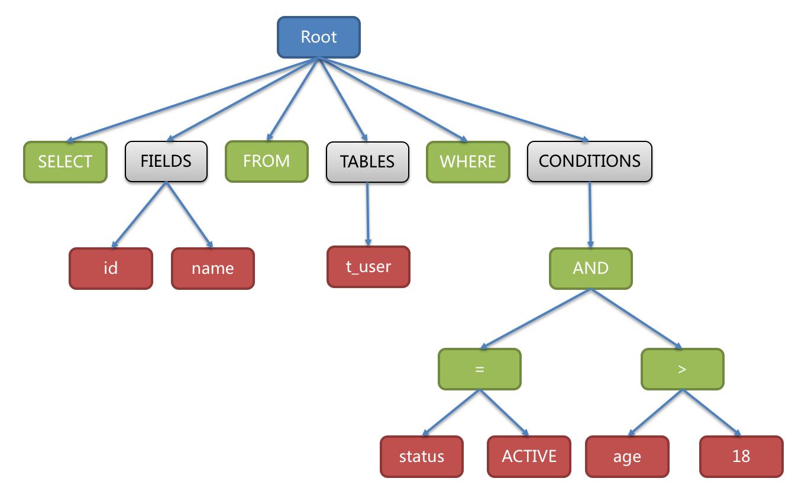

## (+) MySQL Query Parser와 Parse Tree 생성 과정 분석

MySQL 엔진의 첫 관문인 Query Parser는 단순한 문법 검사기를 넘어, 
SQL이라는 '텍스트'를 DB가 계산할 수 있는 '수학적 구조(Tree)'로 탈바꿈시키는 핵심 역할을 수행합니다.

### 1. 쿼리 처리 아키텍처 내 위치
파서는 전체 흐름의 앞단에 위치하며 뒤이어올 전처리기와 옵티마이저가 일할 수 있는 '재료'를 만듭니다.


</br>
</br>

### 2. Query Parser의 2단계 동작원리

① Lexical Analysis (토큰화)
컴파일러의 Lexer와 동일한 단계로, 공백과 구분자를 기준으로 SQL 문자열을 의미 있는 최소 단위인 **토큰(Token)**으로 쪼갭니다.
```sql
# SQL
SELECT name FROM users WHERE id = 1;

# Tokens
SELECT | name | FROM | users | WHERE | id | = | 1
```
</br>
② Syntax Analysis (문법 분석)

- 분리된 토큰들을 MySQL 내부 *Grammar 규칙(Bison 기반)* 에 대입하여 Parse Tree를 구성합니다.
    - SELECT 뒤에 컬럼이 오는가? FROM 뒤에 테이블이 오는가? 등
    - 규칙에 맞지 않으면 즉시 Syntax Error를 발생시키며 중단합니다.

</br>
</br>

### 3.Parse Tree의 구조와 생성 과정
MySQL Parser는 토큰을 앞에서부터 읽어가며, 미리 정의된 문법 규칙에 맞는지 확인하면서 내부 트리 구조를 만들어 나갑니다.

#### Parse Tree
우리가 작성한 평면적인 쿼리는 내부적으로 다음과 같은 계층적 객체 구조로 나뉜다.

```sql
SELECT id, name FROM t_user WHERE status = 'ACTIVE' AND age > 18
```


1. Root (최상위 노드) : 전체 쿼리 문장을 대표하는 시작점입니다.

2. Clause Nodes (절 단위 분기)
- SELECT / FIELDS: 어떤 데이터를 가져올지 정의합니다. (id, name)
- FROM / TABLES: 어디에서 데이터를 가져올지 정의합니다. (t_user)
- WHERE / CONDITIONS: 어떤 데이터를 필터링할지 정의합니다.

3. WHERE 절의 계층 구조 
- CONDITIONS 아래에 AND가 있고, 그 아래에 다시 =와 >가 매달려 있습니다.
- *논리 연산자(AND)*가 부모가 되어 두 개의 *비교 연산자(=, >)*를 자식으로 가집니다.
- *비교 연산자(=, >)*는 다시 각각의 *컬럼명(status, age)*과 *값(ACTIVE, 18)*을 자식으로 가집니다.


이렇게 계층화되어 있기 때문에 컴퓨터는 "먼저 status = ACTIVE인지 확인하고, 그다음 age > 18인지 확인한 뒤 두 결과가 모두 참(AND)인지 보자"라는 실행 순서를 자연스럽게 알 수 있게 됩니다. 따라서 이 구조 덕분에 이후 Optimizer가 조건 재배치 및 실행순서를 결정할 수 있습니다.


(cf) 왜 트리구조일까?
    1. 우선순위 결정: WHERE a=1 AND b=2처럼 복잡한 조건에서 연산 우선순위를 트리 깊이(Depth)로 명확히 표현할 수 있습니다.

    2. 재귀적 처리: 서브쿼리(SELECT 안에 SELECT)가 들어와도 트리의 자식 노드로 새로운 쿼리 블록을 매달면 되므로 확장이 용이합니다.

    3. 최적화 기초: 이후 옵티마이저가 이 트리를 순회(Traversal)하면서 "불필요한 조건 삭제", "인덱스 활용 여부 판단" 등을 수행하기에 가장 적합한 자료구조입니다.

</br>

### 4. Parser 단계의 최종 산출물
파싱이 끝나면 MySQL 내부에는 하나의 SELECT 쿼리 블록마다 SELECT_LEX가 생성되며, 여기에는 다음 정보들이 구조화되어 담겨 있습니다.
- Field List : 추출하려는 컬럼들의 객체 리스트
- Table List : 참조하는 테이블 정보 (Join 포함)
- Where Clause : 필터링 조건식의 트리 (Item 객체 체인)
- Query Type : SELECT, INSERT, UPDATE 중 어떤 명령인지 판별

(cf) SELECT_LEX = MySQL이 “하나의 SELECT 쿼리 블록”을 저장하는 내부 객체. 이후 전처리기 과정에서 이 SELECT_LEX를 읽어 테이블, 컬럼을 실제로 연결한다

</br>

### 정리
- Parser는 SQL을 토큰으로 나누고 문법 규칙을 검사한다.
- Parse Tree는 단순 텍스트를 DB가 이해할 수 있는 객체 간의 계층 구조로 변환한 결과물이다.
- 이 트리가 생성되지 않는다면(문법 오류) 쿼리는 단 1ms도 실행되지 못하고 즉시 거부된다.
- 이렇게 완성된 트리는 *전처리기(Preprocessor)*로 넘어가 실제 테이블 존재 여부 등의 검증을 받게 된다.