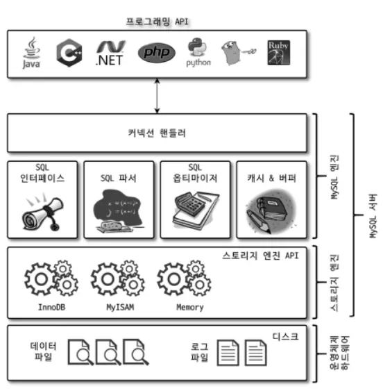
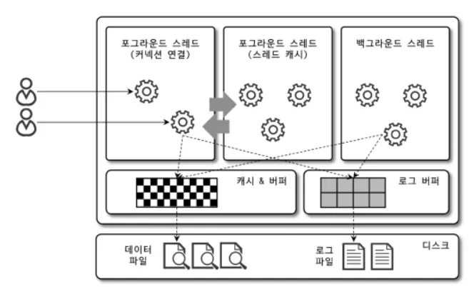
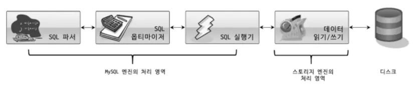
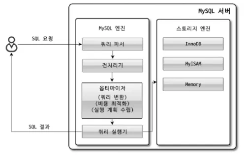
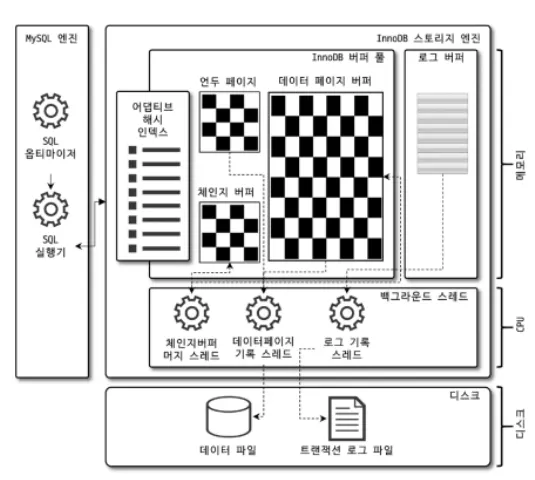
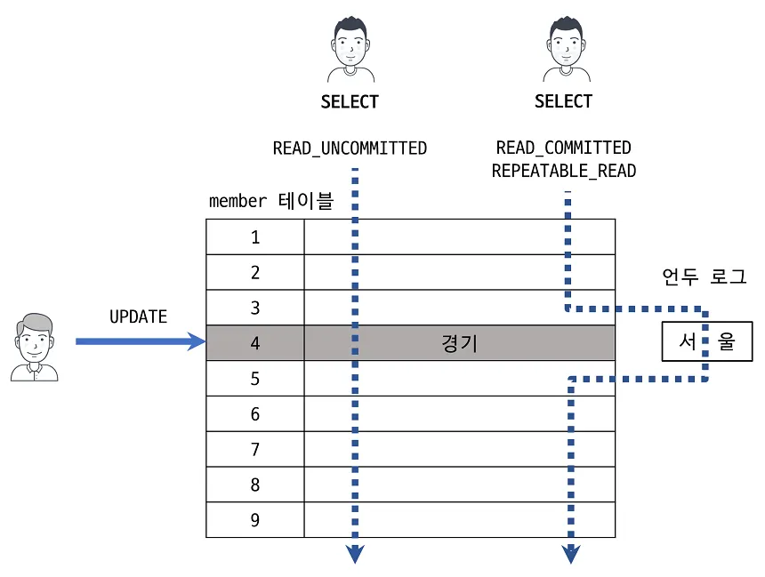
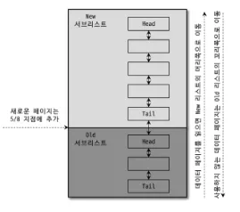
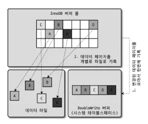
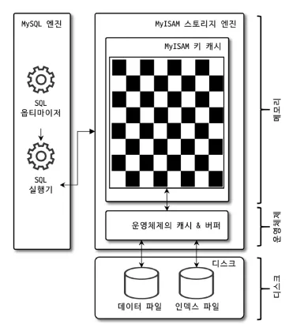

# 4. 아키텍처

4장은 MySQL엔진 아키텍처에 대해 알아보고, 해당 아키텍처 내부에 있는 스토리지 엔진의 두가지종료(InnoDB엔진, MyISAM 엔진)에 대해 알아본다. 그리고 MySQL 8.0의 ACID를 보장하기 위한 핵심기능중 하나인 로그파일 기능에 대해 알아본다.

---

## 목차

- 4.1 MySQL 엔진 아키텍처
- 4.2 InnoDB 스토리지 엔진 아키텍처
- 4.3 MyISAM 스토리지 엔진 아키텍처
- 4.4 MySQL 로그파일
- MySQL Query Parser와 Parse Tree 생성 과정 분석

---

## 4.1 MySQL 엔진 아키텍처

MySQL의 아키텍처는 머리역할을 담당하는 `MySQL엔진`과 손발역할을 담당하는 `스토리지엔진`으로 구분할 수 있다. 스토리지엔진은 핸들러API를 만족하면 누구든 스토리지 엔진을 구현해서 MySQL서버에 추가해 사용할 수 있다.

### 4.1 MySQL의 전체구조

> **4.1.1 MySQL의 전체구조**
> 
- **MySQL 엔진**
    - SQL문장을 분석하거나 최적화하는 등 DBMS의 두뇌에 해당하는 처리 수행
    - 커넥션 핸들러(클라의 접속및 쿼리요청처리), SQL파서 및 전처리기, 옵티마이저로 이루어져있다.
    - MySQL서버에서 MySQL엔진은 하나이다.
- **스토리지 엔진**
    - 실제 디스크 스토리지로부터 데이터를 읽어온다.
    - MySQL서버에서 스토리지 엔진은 동시에 여러개를 사용할 수 있다.
- **핸들러 API**
    - MySQL엔진에서 쿼리실행을 위해 데이터를 쓰거나 읽기 위해서 각 스토리지 엔진에 요청할때 사용하는 API

> **4.1.2 MySQL 스레딩 구조**
> 

MySQL서버는 스레드 기반으로 작동하며, `포그라운드 스레드`와 `백그라운드 스레드`로 구분할 수 있다.

- **포그라운드 스레드(클라이언트 스레드)**
    - 각 클라이언트 사용자가 요청하는 쿼리문장을 처리
    - 최소 MySQL서버에 접속된 클라이언트의 수만큼 존재
    - 클라이언트가 커넥션을 종료하면 스레드 캐시로 되돌아가며, 이미 스레드 캐시에 일정개수 이상의 대기스레드가 있다면 캐시에 넣지 않고 스레드를 종료시킨다. → 일정개수의 스레드만 스레드 캐시에 존재한다.
    - 데이터를 가죠올때 MySQL의 데이터 버퍼나 캐시로부터 가져오고, 이에 없다면 직접 디스크나 인덱스에 접근해 작업을 처리한다.
        - MyISAM은 디스크 쓰기까지 포그라운드 스레드가 처리
        - InnoDB는 데이터버퍼/캐시까지만 포그라운드가 처리, 나머지 쓰기는 백그라운드 스레드가 처리
- **백그라운드스레드**
    - InnoDB의 경우 쓰기작업이나 버퍼로 데이터 읽어오기 작업, 데드락 모니터링 등의 작업을 백그라운드 스레드에서 처리한다.
    - InnoDB 포함 일반적인 DBMS에서는 쓰기작업을 버퍼링해서 일괄처리하는 기능이 탑재되어있다. 따라서 데이터가 변경되는 경우 데이터가 디스크의 데이터파일로 저장될때까지 기다리지 않아도 된다.

> **4.1.3 메모리 할당 및 사용구조**
> 

MySQL의 메모리공간은 글로벌 메모리영역과 로컬 메모리영역이 있다.

글로벌 메모리 영역과 로컬 메모리영역은 MySQL서버 내에 존재하는 스레드들이 공유해서 사용하는 공간인지 여부에 따라 구분된다.

- 글로벌 메모리영역
    - 글로벌메모리 영역은 MySQL서버가 시작되면서 운영체제로부터 할당된다.
    - 클라이언트 스레드 수와 무관하게 하나의 메모리공간만 할당되며, 모든 스레드에 의해 공유된다.
    - 테이블캐시, InnoDB버퍼풀, InnoDB 어댑티드해시인덱스, InnoDB리두로그버퍼
- 로컬 메모리영역(=클라이언트 메모리영역, 세션메모리영역)
    - MySQL서버상에 존재하는 클라이언트 스레드가 쿼리를 처리하는데 사용하는 메모리영역(클라이언트가 MySQL서버에 접속하면 MySQL서버는 클라이언트 요청 처리를 위해 스레드를 하나씩 할당)
    - 스레드별로 독립적으로 할당되며 절대 공유되지 않는다.
    - 정렬버퍼, 조인버퍼, 바이너리로그캐시, 네트워크버퍼

> **4.1.4 플러그인 스토리지 엔진모델**
> 

MySQL에서 스토리지 엔진만 플러그인이 가능한것이 아니다. 부가적인 기능을 더 제공하는 스토리지엔진이 필요할 수도 있으며 직접 개발해서 사용하는것도 가능하다.

MySQL의 쿼리실행과정에서 대부분 작업이 MySQL엔진에서 처리되고, 마지막 데이터 읽기/쓰기작업만 스토리지 엔진에서 처리하므로 새로운 용도의 스토리지엔진을 만들어도 DBMS의 일부기능만 하게된다.

- 핸들러
    - MySQL엔진이 스토리지 엔진을 조정하기 위해 핸들러를 사용한다.
    - 데이터를 읽어오거나 저장하도록 명령할때 활용하는것.

> **4.1.5 컴포넌트**
> 

MySQL 8.0부터는 플러그인을 대체하기위해 컴포넌트 아키텍처가 지원된다.

(플러그인은 MySQL서버 변수나 함수를 직접 호출하므로 캡슐화가 안되는 문제 등이 있었다)

> **4.1.6 쿼리 실행구조**
> 

- 쿼리 파서
    - 요청 쿼리를 토큰으로 분리해 트리형태 구조로 만들어내는 작업 수행
    - 쿼리의 기본 문법 오류가 여기서 발견됨
- 전처리기
    - 파서로 만들어진 파서트리를 기반으로 쿼리문장의 구조적 문제점 확인
    - 실제 존재하지 않거나 권한상 사용할 수 없는 개체의 토큰 검출
- 옵티마이저
    - 요청쿼리를 저렴한 비용으로 어떻게 가장 빠르게 처리할지를 결정
- 실행엔진
    - 옵티마이저를 통해 만들어진 계획대로 각 핸들러에 요청한다. 계획에 따라 또 다른 핸들러에 요청하기도 하고, 결과를 사용자나 모듈에 넘기기도 한다.
- 핸들러(스토리지엔진)
    - MySQL실행엔진의 요청에 따라 데이터를 디스크로 저장하고 읽어오는 역할
    - MyISAM의 경우 핸들러가 MyISAM스토리지엔진이 되고 InnoDB일경우 핸들러가 InnoDB스토리지 엔진이 된다.

> **4.1.8 쿼리캐시**
> 
- 쿼리캐시는 SQL실행결과를 메모리에 캐시하고 같은요청이 오면 즉시 결과를 반환하여 빠른 성능을 보인다. 그러나 데이터가 변경되면 캐시에 저장된 결과 중에서 변경된 테이블과 관련된것들은 모두 삭제해야 하므로 성능문제가 존재했다.
- MySQL8.0부터는 이러한 쿼리캐시가 완전히 제거되었다.

> **4.1.9 스레드 풀**
> 
- 엔터프라이즈 에디션에서 제공하며, 커뮤니티 에디션이라면 플러그인을 통해 사용 가능하다.
- 스레드풀이란 동시에 실행중인 스레드를 CPU가 최대한 잘 처리할 수 있는 수준으로 줄여 빠르게 작업을 처리하도록 하는 기능이다.
    - 따라서 잘못쓰면 쿼리속도가 더 느려질 수 있고, 잘쓰면 CPU 프로세서 친화도를 높이고 불필요한 컨텍스트 스위치를 줄여 오버헤드를 낮출 수 있다.

> **4.1.10 트랜잭션 지원 메타데이터**
> 

- MySQL8.0부터 테이블구조나 stored프로그램의 코드관련 정보를 InnoDB테이블에 저장하도록 개선했다.
    - InnoDB에 저장이 되므로 스키마변경작업 중간에 MySQL서버가 비정상 종료 되더라도 스키마변경이 완전성공 또는 완전실패로 정리됨
- 시스템 테이블과 딕셔너리 정보를 모두 모아 mysqlDB에 저장하며, 이는 통째로 mysql.ibd라는 이름의 테이블스페이스에 저장된다.

---

## 4.2 InnoDB 스토리지 엔진 아키텍처

InnoDB는 MySQL에서 사용할 수 있는 스토리지 엔진중 유일하게 레코드 기반 잠금을 제공하며, 그때문에 높은 동시성 처리가 가능하고 안정적이며 성능이 뛰어나다.

> **4.2.1 프라이머리키에 의한 클러스터링**
> 
- InnoDB의 테이블은 기본적으로 PK를 기준으로 클러스터링됨. 즉, PK순서대로 디스크에 저장
- 모든 세컨더리 인덱스는 레코드 주소 대신 PK값을 논리적 주소로 사용
- 쿼리실행계획에서 PK는 다른 보조인덱스에 비해 선택될 확률이 높고, PK를 이용한 레인지 스캔은 빠르게 처리된다.

> **4.2.2 외래키지원**
> 
- 외래키에 대한 지원은 InnoDB 스토리지 엔진 레벨에서 지원하는 기능으로, MyISAM이나 MEMORY테이블에선 사용할수없다.
- 운영환경이나 스키마 변경 등 긴급한 조치를 해야할경우엔 `foreign_key_checks` 변수를 off로 설정해 체크를 일시적으로 멈출 수 있다.

> **4.2.3 MVCC(Multi Version Concurrency Control)**
> 
- 잠금을 사용하지 않는 일관된 읽기를 제공하기 위해 DBMS가 제공하는 기능이다.
- InnoDB는 언두로그를 이용해 이 기능을 구현한다.
- 격리수준이 READ_COMMITED일 경우, 특정 ROW에 대한 update작업이 있는 경우를 생각해보자.
    - 우선 어떤 값이 insert되어 디스크와 InnoDB버퍼풀에 있다고 가정하자.
    - 여기서 update를 실행할경우, innoDB버퍼풀의 내용이 변경되고, 원래 버퍼풀에 있던 값은 복사되어 언두로그에 키값과 함께 저장된다. 디스크엔 업데이트가 적용될수도안될수도 있다(백그라운드 스레드가 실행되어야 기록됨. 일반적으론 동일한 상태)
    - 여기서 Commit이나 rollback이 적용되지 않은 상태에서 다른 사용자가 해당 row를 조회할경우, 격리수준에 따라 결과가 달라진다.
        - READ_UNCOMMITED의 경우 버퍼풀의 데이터(변경된값)을 읽어서 반환한다. 그러나 그외의 격리수준(READ_COMMITED, REPEATBLE< SERIALIZABLE)의 경우 아직 언두영역의 데이터를 반환한다.
    - 또한 롤백을 실행할경우, InnoDB는 언두영역에 있는 백업데이터를 InnoDB 버퍼풀로 복구하고 언두영역의 내용을 삭제한다.

> **4.3.4 잠금없는 일관된 읽기**
> 

- InnoDB 스토리지 엔진은 MVCC기술을 활용해 잠금을 걸지 않고 읽기작업을 수행할 수 있다.
- 격리수준이 SERIALIZABLE이 아닌 나머지의 경우 INSERT와 연결되지 않은 순수한 읽기작업은 다른 트랜잭션의 변경작업과 관계없이 항상 잠금을 대기하지 않고 바로 실행된다.
- InnoDB에서는 변경전의 데이터를 읽기 위해 언두로그를 사용한다.

> **4.2.5 자동 데드락 감지**
> 
- InnoDB 스토리지 엔진은 내부적으로 잠금이 교착상태에 빠지지 않았는지 체크하기 위해 잠금대기목록을 그래프형태로 관리
- 데드락에 걸린 트랜잭션을 발견하면 일시적으로 트랜잭션들 중에서 언두로그가 가장 적은 트랜잭션을 롤백한다(롤백비용 적음)
- 상위레이어인 MySQL엔진에서 관리되는 테이블LOCK은 볼 수 없어 데드락감지가 불확실할 수 있는데, innodb_table_locks를 활성화하면 테이블레벨의 잠금까지 감시할 수 있다.
- 동시처리스레드가 너무 많아지거나 락의 갯수가 많아지면 데드락감지 스레드가 느려질 수 있다. 이것이 느려지면 서비스 쿼리를 처리하는 스레드들도 대기해야하므로 악영향을 끼칠 수 있다.

> **4.2.6 자동화된 장애복구**
> 
- MySQL서버가 시작될때 완료되지 못한 트랜잭션이나 디스크에 일부만 기록된 데이터 페이지 등에 대한 일련의 복구작업이 자동으로 진행된다.
- InnoDB데이터파일은 기본적으로 MySQL서버가 시작될때 자동복구를 수행한다. 자동복구 불가능한 손상이 있다면 멈추고 서비스를 종료한다.

> **4.2.7 InnoDB 버퍼풀**
> 

InnoDB의 가장 핵심부분으로, 디스크의 데이터파일이나 인덱스 정보를 메모리에 캐시해두는 공간이다. 쓰기작업을 지연시켜 일괄작업을 처리하는 버퍼역할도 수행한다.

INSERT, UPDATE, DELETE는 디스크의 랜덤한 영역에 동작하는데, 이걸 일괄수행함으로써 랜덤한 디스크 작업횟수 줄일 수 있다.

- 버퍼풀의 크기 설정
    - 동적으로 조절할 수 있다.
    - 전체 버퍼 풀을 여러개의 작은 버퍼 풀로 쪼개서 관리한다. 이를 통해 버퍼 풀 관리를 위한 LOCK(세마포어) 경합을 줄일 수 있다.
- 버퍼 풀의 구조
    
    
    
    - InnoDB 스토리지 엔진은 버퍼 풀이라는 거대한 메모리 공간을 페이지 크기의 조각으로 쪼개어 InnoDB 엔진이 데이터를 필요로 할 때 해당 데이터 페이지를 읽어서 각 조각에 저장한다.
    - 버퍼 풀 페이지들을 관리하기 위해 LRU리스트 구조가 사용된다.
    - LRU리스트
        - 한번 읽어온 페이지를 오랫동안 InnoDB 버퍼풀에 유지하여 디스크 읽기를 최소화 하기 위한 리스트로, 엄밀히 말하면 LRU와 MRU의 조합이다.
    - 플러시리스트
        - 디스크로 동기화되지 않은 데이터를 가진 페이지(더티페이지)의 변경시점 기준의 페이지 목록을 관리
        - 한번이라도 변경이 가해진 데이터 페이지는 플러시 리스트에 의해 관리된다.
        - 리두로그(데이터 복구시사용)의 각 엔트리는 플러시리스트의 특정페이지와 연결된다
        - 어떤 리두로그와 엔트리로부터 복구해야하는지 알기 위해 리두로그와 데이터페이지를 체크포인트를 통해 동기화한다.
    - 프리리스트
        - 실제 사용자 데이터로 채워지기 전인 비어있는 페이지

> **4.2.8 Double Write Buffer**
> 

- 더티페이지를 디스크로 플러시할때 일부만 기록되는 파셜페이지나 톤페이지 문제를 방지하기 위해 사용하는 버퍼
- 엔진은 실제 디스크상의 데이터 파일에 더티페이지 내용을 기록하기 전에 Double Write Buffer에 먼저 기록하고, 쓰기 작업이 중간에 실패할경우 버퍼 내 내용과 디스크 내 데이터 파일의 내용을 비교해 동기화 작업을 완료한다.

> **4.2.9 언두로그**
> 
- InnoDB에서 롤백과 트랜잭션 격리수준을 보장하기 위해 INSERT, UPDATE, DELETE로 변경되기 이전의 데이터를 별도로 백업해두는 공간
- 트랜잭션 롤백시 언두로그에 백업해둔 데이터를 이용

> **4.2.10 체인지 버퍼**
> 
- RDBMS에서 레코드가 INSERT, UPDATE될경우 인덱스를 업데이트하는 작업도 발생하는데, 랜덤하게 디스크를 읽는 작업이 필요해 많은 자원을 소비한다.
- 이렇게 인덱스를 업데이트할때 업데이트 결과를 메모리상 버퍼에 담아두었다가 메모리상에서 먼저처리하고 사용자에게 결과를 반환하기 위해 사용되는 버퍼.

> **4.2.11 리두로그 및 로그버퍼**
> 
- 트랜잭션의 ACID특징중 D에 해당하는 영속성과 관련이 있다.
- 트랜잭션 중간에 서버가 비정상적으로 종료돼도 하려던 작업을 이어 하기 위한 로그
    - 커밋되었지만 데이터파일에 기록되지 않은 데이터
    - 롤백되었지만 데이터파일에 이미 기록된 데이터

> **4.2.12 어댑티드 해시인덱스**
> 
- B-Tree의 검색시간을 줄여주기위해 도입된 기능
- 자주 사용되는 컬럼을 해시로 정의하여 B-Tree인덱스를 타지 않고 바로 데이터에 접근할 수 있는 기능
- 그러나 새로운 데이터를 메모리풀에서 접근하는것을 빠르게 만들어주는 기능이므로, 버퍼풀이 아닌 디스크에서 읽어와야하는 작업이 많은 경우엔 오히려 오버헤드.
    - 대부분 쿼리가 일부 특정 데이터를 빈번하게 읽으면서 B-Tree인덱스를 타는 비용을 줄일때 효과.

> **4.2.13 InnoDB와 MyISAM, MEMORY 스토리지엔진 비교**
> 
- MySQL 8.0부터는 모든 시스템 테이블이 InnoDB 스토리지엔진으로 교체되었다.
- 나머지 두 스토리지 엔진은 InnoDB에 비해 각자가 갖는 장점이 없어졌으며, 향후 제거될것으로 보임.

---

## 4.3 MyISAM 스토리지 엔진 아키텍처

> **4.3.1 키캐시**
> 
- InnoDB의 버퍼풀과 비슷한 역할을 하는 MyISAM의 키캐시(키버퍼라고도 불림)
- 키캐시는 인덱스만을 대상으로 하며, 인덱스의 디스크 쓰기 작업에 대해서만 부분적으로 버퍼링 역할을 한다.

> **4.3.2 운영체제의 캐시 및 버퍼**
> 
- MyISAM테이블의 인덱스는 키캐시를 이용해 디스크를 검색하지 않고도 충분히 빠르게 검색할 수 있다.
- 그러나 디스크로의 I/O를 해결할 캐시나 버퍼링 기능을 가지고 있지 않아 빈번한 디스크I/O 호출을 발생시킬 수 있다.

> **4.3.3 데이터파일과 프라이머리 키(인덱스) 구조**
> 
- InnoDB 스토리지 엔진을 사용하는 테이블은 PK에 의해 클러스터링이 되어 저장되는 반면 MyISAM테이블은 INSERT되는 순서대로 데이터파일에 저장되어 힙공간처럼 활용된다.
- 따라서 저장되는 레코드는 모두 ROWID라는 물리적 주솟값을 가지며 모든 인덱스는 이 값을 포인터로 가진다.
- MyISAM 테이블에서 ROWID는 가변길이와 고정길이방법으로 저장될 수 있다.

---

## 4.4 MySQL 로그파일

로그파일을 사용하면 MySQL 서버의 깊은 내부지식 없이도 상태나 부하원인을 쉽게 찾아 해결할 수 있다.

> **4.4.1 에러로그파일**
> 
- MySQL 실행도중 발생하는 에러나 경고메세지가 출력되는 로그파일
- my.cnf에서 log_err이라는 이름의 파라미터로 정의된 경로에 생성됨
    - MySQL이 시작하는 과정과 관련된 정보성 에러메세지
    - 비정상적으로 종료된 경우 나타나는 InnoDB의 트랜잭션 복구 메시지
    - 쿼리 처리 도중에 발생하는 문제에 대한 에러 메시지
    - 비정상적으로 종료된 커넥션 메시지(Aborted connection)
    - InnoDB의 모니터링 또는 상태 조회 명령의 결과 메시지
    - MySQL의 종료 메시지

> **4.4.2 제너럴 쿼리 로그파일**
> 
- MySQL서버에서 실행되는 전체 쿼리를 조회하기 위해 사용
- 시스템에서 어떤 쿼리가 실행되었는지 전체적으로 추적하고자 할때 유용

> **4.4.3 슬로우쿼리로그**
> 
- 슬로우쿼리로그파일엔 `long_query_time` 시스템 변수에 설정한 시간 이상이 소요된 쿼리가 기록
- 서버성능저하의 원인이 되는 쿼리를 분석하는데 사용

