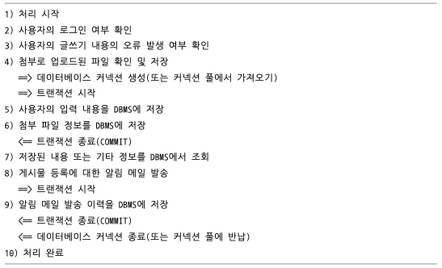

# 5.1 트랜잭션

- MyISAM : 트랜잭션 지원 x
- InnoDB : 트랜잭션 지원 o

## 5.1.1 MySQL에서의 트랜잭션
논리적인 작업 셋 자체가 100% 적용되거나 아무것도 적용되지 않아야 함을 보장해 줌

** MyISAM의 부분 업데이트 현상 **
MyISAM : 쿼리가 실패해도 부분적으로 업데이트 됨

InnoDB : 쿼리 중 일부라도 오류가 발생하면 전체를 원 상태로 만듦

```sql
try {
    START TRANSACTION;
    INSERT INTO tab_a ...;
    INSERT INTO tab_b ...;
    COMMIT;
} catch(exception) {
    ROLLBACK;
}

```

## 5.1.2 주의사항
프로그램 코드에서 트랜잭션 범위를 최소화하라



# 5.2 MySQL 엔진의 잠금
## 5.2.1 글로벌 락

```sql
FLUSH TABLES WITH READ LOCK
```
MySQL에서 제공하는 잠금 가운데 가장 범위가 크다

여러 데이터베이스에 존재하는 테이블에 대해 mysqldump로 일관된 백업을 받아야 할 때는 글로벌 락을 사용해야 함

한 세션에서 글로벌 락을 획득하면 다른 세션에서 SELECT를 제외한 대부분의 DDL 문장이나 DML 문장을 실행하는 경우 글로벌 락이 해제될 때까지 해당 문장이 대기 상태로 남는다

장시간 실행되는 쿼리와 글로벌 락이 최악의 케이스로 실행되면 MySQL 서버의 모든 테이블에 대한 INSERT, UPDATE, DELETE 쿼리가 아주 오랜 시간 동안 실행되지 못하고 기다릴 수도 있음

=> 조금 더 가벼운 글로벌 락의 필요성이 생김 : **백업 락** 이 도입

### 백업 락

```sql
LOCK INSTANCE FOR BACKUP;

UNLOCK INSTANCE;
```
백업 락은 백업을 수행하는 동안 스키마 변경과 사용자 인증 정보 변경을 막아 백업의 일관성을 보장하기 위한 기능 

기존의 글로벌 락처럼 서버 전체를 강하게 멈추는 것이 아니라, DDL 위주의 변경만 제한

제한되는 작업
- 데이터베이스 및 테이블 생성·변경·삭제
- REPAIR TABLE, OPTIMIZE TABLE
- 사용자 관리 및 비밀번호 변경

허용되는 작업
- 일반적인 데이터 변경 작업(DML)

백업 락은 복제는 계속 진행하면서도 DDL을 차단해 백업 실패를 방지하는 데 목적이 있다.

XtraBackup이나 Enterprise Backup 도구는 복제 중에도 일관된 백업을 생성할 수 있지만, 실행 중 스키마 변경이 발생하면 실패할 수 있다. 

## 5.2.2 테이블 락

테이블 락은 **개별 테이블 단위의 잠금**이다. 명시적으로 설정할 수도 있고, 스토리지 엔진에 따라 묵시적으로 발생할 수도 있음

### 명시적 테이블 락

```sql
LOCK TABLES table_name [READ | WRITE]

UNLOCK TABLES
```
- InnoDB와 MyISAM 모두 가능
- 온라인 서비스 환경에서는 다른 트랜잭션에 큰 영향을 주기 때문에 일반적으로 잘 사용되지 않음

### 묵시적 테이블 락
- MyISAM, MEMORY 엔진에서 데이터 변경 쿼리 실행 시 자동 발생
- 쿼리 실행 동안 잠금 유지, 완료 후 자동 해제

## 5.2.3 네임드 락
GET_LOCK() 함수를 이용해 임의의 문자열에 잠금 설정

단순히 사용자가 지정한 문자열에 대해 획득하고 반납하는 잠금

많은 레코드에 대해서 복잡한 요건으로 레코드를 변경하는 트랜잭션에 유용하게 사용

```sql
SELECT GET_LOCK('mylock',2);

SELECT IS_FREE_LOCK('mylock');

SELECT RELEASE_LOCK('mylock');

SELECT REALESE_ALL_LOCKS();
```

## 5.2.4 메타데이터 락
데이터베이스 객체의 이름이나 구조를 변경하는 경우에 획득하는 잠금

명시적으로 획득하거나 해제할 수 있는 것이 아니고 **테이블의 이름을 변경하는 경우** 자동으로 획득

# 5.3 InnoDB 스토리지 엔진 잠금


