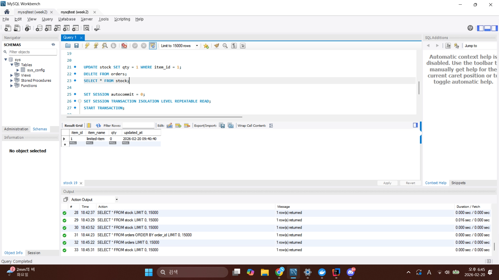
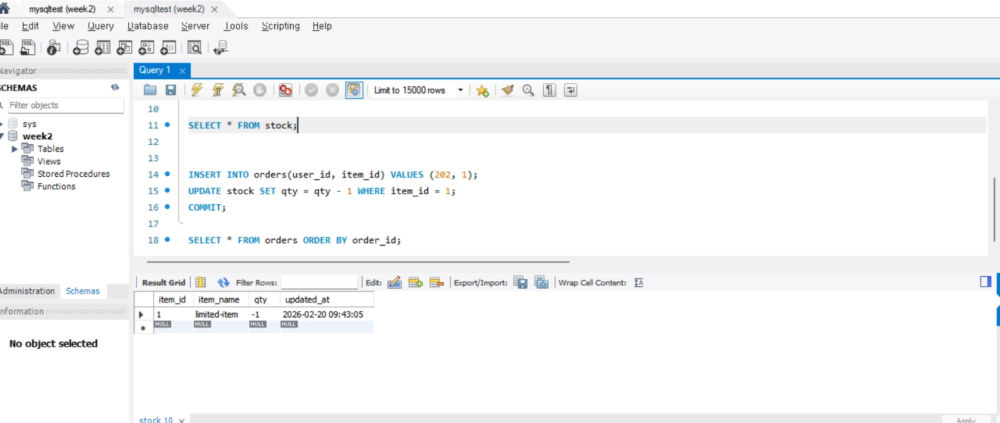
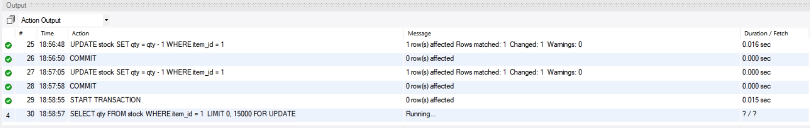
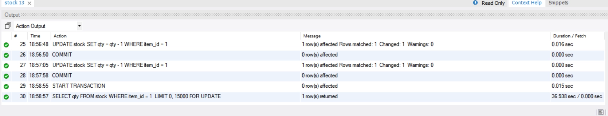
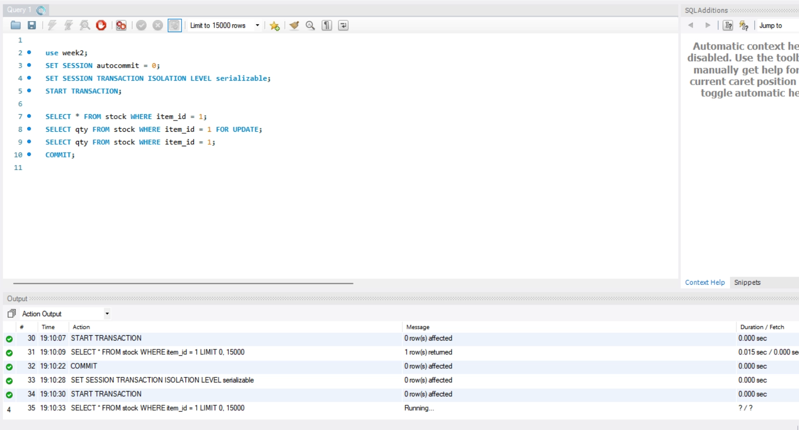

## 실험1) 격리 수준만 올려도 선착순이 안전해지나?

조건

- 세션1에서 사용한 쿼리문들

```sql
CREATE TABLE stock (
  item_id BIGINT PRIMARY KEY,
  item_name VARCHAR(50) NOT NULL,
  qty INT NOT NULL,
  updated_at TIMESTAMP NOT NULL DEFAULT CURRENT_TIMESTAMP ON UPDATE CURRENT_TIMESTAMP
) ENGINE=InnoDB;

INSERT INTO stock(item_id, item_name, qty) VALUES (1, 'limited-item', 5);

select * from stock;

CREATE TABLE orders (
  order_id BIGINT AUTO_INCREMENT PRIMARY KEY,
  user_id BIGINT NOT NULL,
  item_id BIGINT NOT NULL,
  created_at TIMESTAMP NOT NULL DEFAULT CURRENT_TIMESTAMP,
  UNIQUE KEY uk_user_item (user_id, item_id)
) ENGINE=InnoDB;

UPDATE stock SET qty = 1 WHERE item_id = 1;
DELETE FROM orders;
SELECT * FROM stock;

SET SESSION autocommit = 0;
SET SESSION TRANSACTION ISOLATION LEVEL REPEATABLE READ;
START TRANSACTION;

SELECT qty FROM stock WHERE item_id = 1;

-- // 문제 만들기
INSERT INTO orders(user_id, item_id) VALUES (101, 1);
SELECT * FROM orders;
UPDATE stock SET qty = qty - 1 WHERE item_id = 1;
COMMIT;

SELECT * FROM orders ORDER BY order_id;
```

- 세션2에서 사용한 쿼리문들

```sql
show databases;

use week2;

SET SESSION autocommit = 0;
SET SESSION TRANSACTION ISOLATION LEVEL REPEATABLE READ;
START TRANSACTION;

SELECT qty FROM stock WHERE item_id = 1;

SELECT * FROM stock;

INSERT INTO orders(user_id, item_id) VALUES (202, 1);
UPDATE stock SET qty = qty - 1 WHERE item_id = 1;
COMMIT;

SELECT * FROM orders ORDER BY order_id;
```





락이 없이 트랜잭션에서 격리 수준만 높여(REPEATABLE READ) 데이터를 함께 변경하면 재고가 1개인데 조회 시 한 세션에서는 0개가 표시되고 다른 세션에서는 음수 재고가 되는 등 데이터 정합성이 깨진다.

즉, **격리수준만으로 ‘선착순 규칙’을 구현했다고 착각하면 안 됨.**


## 실험2) 락으로 선착순을 DB에 강제하기

조회 단계에서부터 레코드락을 걸면 다른 트랜잭션은 선착순으로 대기하게 된다.



다른 세션에서 마찬가지로 레코드락을 해당 레코드에 걸려고 하면 Running 상태로 무한정 대기가 된다.



락을 잡던 세션에서 커밋을 하면 그 다음으로 Running이 풀리고 락을 잡는 명령이 수행된다. 단순 select는 락을 요구하지 않기 때문에 SERIALIZABLE을 제외한 격리 수준에서는 단순 조회는 락이 있어도 수행된다.

격리수준이 SERIALIZABLE이나 METADATA LOCK인 경우 SELECT 자체도 대기하게 될 수도 있다.


