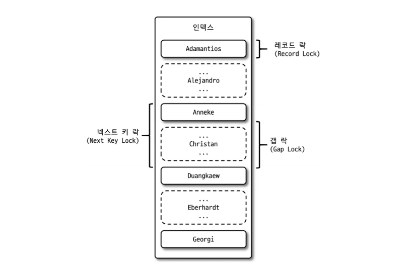

MySQL의 동시성에 영향을 미치는 잠금(Lock)과 트랜잭션, 트랜잭션 격리수준(Isolation Level)

트랜잭션은 작업의 완전성을 보장해 주는 것이다. Partial update가 발생하지 않게 만들어주는 기능이다.

잠금과 트랜잭션은 서로 비슷한 개념 같지만 사실 잠금은 동시성을 제어하기 위한 기능이고 트랜잭션은 데이터의 정합성을 보장하기 위한 기능이다.

잠금은 여러 커넥션에서 동시에 동일한 자원(레코드나 테이블)을 요청할 경우 순서대로 한 시점에는 하나의 커넥션만 변경할 수 있게 해주는 역할을 한다.

격리 수준이라는 것은 하나의 트랜잭션 내에서 또는 여러 트랜잭션 간의 작업 내용을 어떻게 공유하고 차단할 것인지를 결정하는 레벨을 의미한다.

## 5.1 트랜잭션

*MyISAM이나 MEMORY 같이 트랜잭션을 지원하지 않는 스토리지 엔진의 테이블이 더 많은 고민거리를 만들어 낸다.

### 5.1.1 MySQL 에서의 트랜잭션

트랜잭션은 한 개의 변경 작업에도 작업 셋 자체가 100% 적용되거나(COMMIT) 아무것도 적용되지 않아야(ROLLBACK) 함을 보장해 주는 것이다.

MyISAM나 MEMORY 스토리지 엔진을 사용하는 테이블에 INSERT 문장이 실행되면 차례대로 데이터를 저장하고 중간에 오류가 발생하면 INSERT 된 데이터는 저장된 채로 두고 그대로 실행을 종료해 버린다.

하지만 InnoDB는 이러한 부분 업데이트 현상을 발생시키지 않는다.

이러한 부분 업데이트 현상은 테이블 데이터의 정합성을 맞추는 데 상당히 어려운 문제를 만들어 낸다. 예를 들어, 부분 업데이트 된 데이터의 재처리 작업을 만드는 일이 있다.

### 5.1.2 주의사항

트랜잭션 또한 DBMS의 커넥션과 동일하게 꼭 필요한 최소의 코드에만 적용하는 것이 좋다. 이는 프로그램 코드에서 트랜잭션의 범위를 최소화하라는 의미다.

게시판에 사용자가 게시물을 작성한 후 저장 버튼을 클릭할 때 서버에서 처리하는 내용을 정리해보자.

```java
1) 처리 시작
		==> 데이터베이스 커넥션 생성
		==> 트랜잭션 시작
2) 사용자의 로그인 여부 확인
3) 사용자의 글쓰기 내용의 오류 여부 확인
4) 첨부로 업로드된 파일 확인 및 저장
5) 사용자의 입력 내용을 DBMS에 저장
6) 첨부 파일 정보를 DBMS에 저장
7) 저장된 내용 또는 기타 정보를 DBMS에서 조회
8) 게시물 등록에 대한 알림 메일 전송
9) 알림 메일 발송 이력을 DBMS에 저장
		<== 트랜잭션 종료(COMMIT)
		<== 데이터베이스 커넥션 반납
10) 처리 완료
```

위 처리 절차 중에서 DBMS의 트랜잭션 처리에 좋지 않은 영향을 미치는 부분을 나눠서 살펴보자.

- 실제로 많은 개발자가 데이터베이스의 커넥션을 생성하는 코드를 1번과 2번 사이에 구현하며 그와 동시에 START TRANSACTION 명령으로 트랜잭션을 시작한다.
  그리고 9번과 10번 사이에서 트랜잭션을 커밋하고 커넥션을 종료한다.
  실제로 DBMS에 데이터를 저장하는 작업은 5번부터 시작된다는 것을 알 수 있다. 그래서 2번과 3번, 4번의 절차는 굳이 트랜잭션에 포함시킬 필요가 없다. → 트랜잭션 범위 최소화
  일반적으로 커넥션의 개수가 제한적이어서 각 단위 프로그램이 커넥션을 소유하는 시간이 길어질수록 사용 가능한 여유 커넥션의 개수는 줄어들 것이다. 그리고 어느 순간에는 각 단위 프로그램에서 커넥션을 가져가기 위해 기다려야 하는 상황이 발생할 수도 있다.
- 더 큰 위험은 8번 작업이라고 볼 수 있다. 메일 전송이나 FTP 파일 전송 작업 또는 네트워크를 통해 원격 서버와 통신하는 등과 같은 작업은 어떻게 해서든 DBMS의 트랜잭션 내에서 제거하는 것이 좋다.
- 또한 이 처리 절차에는 DBMS의 작업이 크게 4개가 있다. 사용자가 입력한 정보를 저장하는 5번 6번 작업은 반드시 하나의 트랜잭션으로 묵어야 하며, 7번 작업은 저장된 데이터의 단순 확인 및 조회이므로 트랜잭션에 포함할 필요는 없다. (트랜잭션을 별도로 사용하지 않아도 무방해 보인다.)
  그리고 9번 작업은 조금 성격이 다르기 떄문에 이전 트랜잭션과 함께 묶지 않아도 무방해 보인다. 이는 별도의 트랜잭션 작업으로 분리하는 것이 좋다.

다시 위의 처리 절차를 설계해보자.

```java
1) 처리 시작
2) 사용자의 로그인 여부 확인
3) 사용자의 글쓰기 내용의 오류 발생 여부 확인
4) 첨부로 업로드된 파일 확인 및 저장
		==> 데이터베이스 커넥션 생성(또는 커넥션 풀에서 가져오기)
		==> 트랜잭션 시작
5) 사용자의 입력 내용을 DBMS에 저장
6) 첨부 파일 정보를 DBMS에 저장
		<== 트랜잭션 종료(COMMIT)
7) 저장된 내용 또는 기타 정보를 DBMS에서 조회
8) 게시물 등록에 대한 알림 메일 발송
		==> 트랜잭션 시작
9) 알림 메일 발송 이력을 DBMS에 저장
		<== 트랜잭션 종료(COMMIT)
		<== 데이터베이스 커넥션 종료(또는 커넥션 풀에 반납)
10) 처리 완료
```

여기서 설명하려는 바는 프로그램의 코드가 데이터베이스 커넥션을 갖고 있는 범위와 트랜잭션이 활성화돼 있는 프로그램의 범위를 최소화해야 한다는 것이다.

또한 프로그램의 코드에서 라인 수는 한두 줄이라고 하더라도 네트워크 작업이 있는 경우에는 반드시 트랜잭션에서 배제해야 한다.

ex) 나쁜 패턴

```java
@Transactional
public Order pay(Long orderId) {
    Order order = orderRepository.findByIdForUpdate(orderId); // 락 잡힘

    // ❌ 네트워크 호출 (PG 결제 승인)
    PaymentResult result = pgClient.capture(order.getPaymentKey());

    order.markPaid(result.getApprovedAt());
    return order;
}

```

ex) 좋은 패턴

```java
public void signup(SignupCommand cmd) {
    User user = txSaveUser(cmd);     // DB 작업만 트랜잭션
    mailClient.sendWelcomeMail(user.getEmail()); // 트랜잭션 밖
}

@Transactional
protected User txSaveUser(SignupCommand cmd) {
    return userRepository.save(new User(cmd));
}

```

## 5.2 MySQL 엔진의 잠금

MySQL에서 사용되는 잠금은 크게 스토리지 엔진 레벨과 MySQL 엔진 레벨로 나눌 수 있다. MySQL 엔진 레벨의 잠금은 모든 스토리지 엔진에 영향을 미치지만, 스토리지 엔진 레벨의 잠금은 스토리지 엔진 간 상호 영향을 미치지는 않는다.

MySQL 엔진에서는 테이블 락, 메타데이터 락, 네임드 락이라는 잠금 기능도 제공한다.

### 5.2.1 글로벌 락

글로벌 락(GLOBAL LOCK)은 TABLES WITH READ LOCK 명령으로 획득할 수 있으며, MySQL에서 제공하는 잠금 가운데 가장 범위가 크다.

일단 한 세션에서 이 글로벌 락을 획득하면 다른 세션에서 SELECT를 제외한 대부분의 DDL문장이나 DML 문장을 실행하는 경우 글로벌 락이해제될 때까지  해당 문장이 대기 상태로 남는다.

글로벌 락이 영향을 미치는 범위는 MySQL 서버 전체이며, 작업 대상 테이블이나 데이터베이스가 다르더라도 동일하게 영향을 미친다.

여러 데이터베이스에 존재하는 MyISAM이나 MEMORY 테이블에 대해 mysqldump로 일관된 백업을 받아야 할 때는 글로벌 락을 사용해야 한다.(트랜잭션이 없기 때문이다.)

InnoDB 스토리지 엔진은 트랜잭션을 지원하기 떄문에 일관된 데이터 상태를 위해 모든 데이터 변경 작업을 멈출 필요가 없다. 또한 MySQL 8.0부터는 InnoDB가 기본 스토리지 엔진으로 채택되면서 조금 더 가벼운 글로벌 락의 필요성이 생겼다. 그래서 MySQL 8.0 버전부터는 Xtrabackup이나 Enterprise Backup과 같은 백업 툴들의 안정적인 실행을 위해 백업 락이 도입됐다.

```sql
mysql> LOCK INSTANCE FOR BACKUP;
-- // 백업 실행
mysql> UNLOCK INSTANCE;
```

**특정 세션에서 백업 락을 획득하게 되면 모든 세션에서 다음과 같이 테이블의 스키마나 사용자의 인증 관련 정보를 변경할 수 없게된다.**

- 데이터베이스 및 테이블 등 모든 객체 생성 및 변경, 삭제
- REPAIR TABLE과 OPTIMIZE TABLE 명령
- 사용자 관리 및 비밀번호 변경

하지만 백업 락은 일반적인 테이블의 데이터 변경은 허용된다.

일반적인 MySQL 서버의 구성은 소스 서버와 레플리카 서버로 구성되는데, 주로 백업은 레플리카 서버에서 실행된다. 하지만 글로벌락을 백업을 위해 획득하면 복제는 백업 시간만큼 지연될 수 밖에 없다.

MySQL 서버의 백업 락은 이런 부분에 사용하기 위한 목적으로 도입됐으며, 정상적으로 복제는 실행되지만 백업의 실패를 막기 위해 DDL 명령이 실행되면 복제를 일시 중지하는 역할을 한다.

### 5.2.2 테이블 락

테이블 락(Table Lock)은 개별 테이블 단위로 설정되는 잠금이다.

테이블 락은 MyISAM뿐 아니라 InnoDB 스토리지 엔진을 쓰는 테이블도 동일하게 설정할 수 있다. 명시적인 테이블락은 특별한 상황이 아니면 애플리케이션에서 사용할 필요가 거의 없다.

묵시적 테이블 락은 쿼리가 실행되는 동안 자동으로 획득됐다가 쿼리가 완료된 후 자동 해제된다. InnoDB에서는 레코드락을 제공하기 떄문에 대부분의 데이터 변경 쿼리에서는 테이블락이 무시되고 스키마를 변경하는 쿼리의 경우에만 영향을 미친다.

### 5.2.3 네임드 락

네임드 락(Named Lock)은 GET_LOCK() 함수를 이용해 임의의 문자열에 대해 잠금을 설정할 수 있다.

네임드 락은 단순히 사용자가 지정한 문자열(String)에 대해 획득하고 반납하는 잠금이다. 네임드 락은 자주 사용되지 않는다. 예를 들어, 데이터베이스 서버 1대에 5개의 웹 서버가 접근해서 서비스하는 상황에서 5대의 웹 서버가 어떤 정보를 동기화해야 하는 요건처럼 여러 클라이언트가 상호 동기화를 처리해야 할 때 네임드 락을 이용하면 쉽게 해결할 수 있다.

```sql
-- // "mylock"이라는 문자열에 대해 잠금을 획득한다.
-- // 이미 잠금을 사용 중이면 2초 동안만 대기한다.
mysql> SELECT GET_LOCK('mylock', 2);

-- // "mylock"이라는 문자열에 대해 잠금이 설정돼 있는지 확인한다.
mysql> SELECT IS_FREE_LOCK('mylock');

-- // "mylock"이라는 문자열에 대해 획득했던 잠금을 반납(해제)한다.
mysql> SELECT RELEASE_LOCK('mylock');

-- // 3개 함수 모두 정상적으로 락을 획득하거나 해제한 경우에는 1을,
-- // 아니면 NULL 이나 0을 반환한다.
```

또한 네임드 락의 경우 많은 레코드에 대해서 복잡한 요건으로 레코드를 변경하는 트랜잭션에 유용하게 사용될 수 있다. 배치 프로그램처럼 한꺼번에 많은 레코드를 변경하는 쿼리는 자주 데드락의 원인이 되곤 한다. 이러한 경우에 동일 데이터를 변경하거나 참조하는 프로그램끼리 분류해서 네임드 락을 걸고 쿼리를 시행하면 아주 간단히 해결할 수 있다.

### 5.2.4 메타데이터 락

메타데이터 락(Metadata Lock)은 데이터베이스 객체의이름(테이블 자체에)이나 구조를 변경하는 경우에 획득하는 잠금이다. 메타데이터 락은 명시적으로 사용하는 것은 아니고 RENAME TABLE과 같이 테이블의 이름을 변경하는 경우 자동으로 획득하는 잠금이다. RENAME TABLE 명령의 경우 원본 이름과 바뀌게 될 이름 두 개 모두 한꺼번에 잠금을 설정한다.

```sql
-- // 배치 프로그램에서 별도의 임시 테이블에 서비스용 랭킹 데이터를 생성

-- // 랭킹 배치가 완료되면 현재 서비스용 랭킹 테이블을 rank_backup으로 백업
-- // 새로 만들어진 랭킹 테이블을 서비스용으로 대체하고자 하는 경우
mysql> RENAME TABLE rank TO rank_backup, rank_new TO rank;
```

위와 같이 하나의 RENAME TABLE 명령문에 두 개의 RENAME 작업을 한꺼번에 실행하면 실제 애플리케이션에서는 “Table not found rank” 같은 상황을 발생시키지 않고 적용하는 것이 가능하다. 하지만 이 문장을 2개로 나눠 실행하면 아주 짧은 시간이지만 rank 테이블이 존재하지 않는 순간이 생기며, “Table not found ‘rank’”를 발생시킨다.

때로는 메타데이터 잠금과 InnoDB의 트랜잭션을 동시에 사용해야 하는 경우도 있다.

예를 들어, 다음과 같은 구조의 INSERT만 실행되는 로그 테이블을 가정해보자. 이 테이블은 웹 서버의 액세스로그를 저장만 하기 때문에 update와 delete가 없다.

```sql
mysql> CREATE TABLE access_log (
				id BIGINT NOT NULL AUTO_INCREMENT,
				client_ip INT UNSIGNED,
				access_dttm TIMESTAMP,
				...
				PRIMARY KEY(id)
			);
```

그런데 어느 날 이 테이블의 구조를 변경해야 할 요건이 발생했다. 물론 MySQL 서버의 Online DDL을 이용해서 변경할 수도 있지만 시간이 너무 오래 걸리는 경우라면 언두 로그의 증가와 Online DDL이 실행되는 동안 누적된 Online DDL 버퍼의 크기 등 고민해야 할 문제가 많다. 더 큰 문제는 MySQL 서버의 DDL은 단일 스레드로 시행되기 때문에 상당히 많은 시간이 소모될 것이라는 점이다.

이때는 새로운 구조의 테이블을 생성하고 먼저 최근의 데이터까지는 프라이머리 키인 id 값을 범위별로 나눠서 여러 개의 스레드로 빠르게 복사한다.

```sql
-- // 테이블의 압축을 적용하기 위해 KEY_BLOCK_SIZE=4 옵션을 추가해 신규 테이블을 생성
mysql> CREATE TABLE access_log_new (
				id BIGINT NOT NULL AUTO_INCREMENT,
				client_ip INT UNSIGNED,
				access_dttm TIMESTAMP,
				...
				PRIMARY KEY(id)
			) KEY_BLOCK_SIZE=4;

-- // 4개의 스레드를 이용해 id 범위별로 레코드를 신규 테이블로 복사
mysql_thread1> INSERT INTO access_log_new SELECT * FROM access_log WHERE id>=0 AND id<10000;
mysql_thread1> INSERT INTO access_log_new SELECT * FROM access_log WHERE id>=10000 AND id<20000;
...
```

그리고 나머지 데이터는 다음과 같이 트랜잭션과 테이블 잠금, RENAME TABLE 명령으로 응용 프로그램의 중단 없이 실행할 수 있다.

```sql
-- // 트랜잭션을 autocommit으로 실행(BEGIN이나 START TRANSACTION으로 실행하면 안 됨)
mysql> SET autocommit=0;

-- // 작업 대상 테이블 2개에 대해 테이블 쓰기 락을 획득
mysql> LOCK TABLES access_log WRITE, access_log_new WRITE;

-- // 남은 데이터를 복사
mysql> SELECT MAX(id) as MAX_ID FROM access_log;
mysql> INSERT INTO access_log_new SELECT * FROM access_log WHERE pk>MAX_ID;
mysql> COMMIT;

-- // 새로운 테이블로 데이터 복사가 완료되면 RENAME 명령으로 새로운 테이블을 서비스로 투입
mysql> RENAME TABLE access_log TO access_log_old, access_log_new TO access_log;
mysql> UNLOCK TABLES;

-- // 불필요한 테이블 삭제
mysql> DROP TABLE access_log_old;
```

## 5.3 InnoDB 스토리지 엔진 잠금

InnoDB 스토리지 엔진은 MySQL에서 제공하는 잠금과는 별개로 스토리지 엔진 내부에서 레코드 기반의 잠금 방식을 탑재하고 있다.

최근 버전에서는 InnoDB의 트랜잭션과 잠금, 그리고 잠금 대기 중인 트랜잭션의 목록을 조회할 수 있는 방법이 도입됐다.

### 5.3.1 InnoDB 스토리지 엔진의 잠금

InnoDB 스토리지 엔진은 레코드 기반의 잠금 기능을 제공하며, 잠금 정보가 상당히 작은 공간으로 관리되기 때문에 레코드 락이 페이지 락으로, 또는 테이블 락으로 레벨업되는 경우는 없다.

일반 사용 DBMS와는 조금 다르게 InnoDB 스토리지 엔진에서는 레코드 락뿐 아니라 레코드와 레코드 사이의 간격을 잠그는 갭(GAP) 락이라는 것이 존재.




**5.3.1.1 레코드 락**

레코드 자체만을 잠그는 것을 레코드 락이라고 하며, 다른 상용 DBMS의 레코드 락과 동일한 역할을 한다. 한 가지 중요한 차이는 InnoDB 스토리지 엔진은 레코드 자체가 아니라 **인덱스의 레코드를 잠근다**는 점이다. 인덱스가 하나도 없는 테이블이더라도 내부적으로 자동 생성된 클러스터 인덱스를 이용해 잠금을 설정한다.

InnoDB에서는 대부분 보조 인덱스를 이용한 변경 작업은 이어서 설명할 넥스트 키 락 또는 갭 락을 사용하지만 프라이머리 키 또는 유니크 인덱스에 의한 변경 작업에서는 갭에 대해서는 잠그지 않고 레코드 자체에 대해서만 락을 건다.

**5.3.1.2 갭 락**

다른 DBMS와의 또 다른 차이가 바로 갭 락이다. 갭 락은 레코드 자체가 아니라 레코드와 바로 인접한 레코드 사이의 간격만을 잠그는 것을 의미한다. 갭 락의 역할은 레코드와 레코드 사이의 간격에 새로운 레코드가 생성되는 것을 제어하는 것이다. 갭 락은 그 자체보다는 이어서 설명할 넥스트 키 락의 일부로 자주 사용된다.

**5.3.1.3 넥스트 키 락**

레코드 락 + 갭 락을 넥스트 키 락(Next key lock)이라고 한다.

InnoDB의 갭 락이나 넥스트 키 락은 바이너리 로그에 기록되는 쿼리가 레플리카 서버에서 실행될 때 소스 서버에서 만들어 낸 결과와 동일한 결과를 만들어내도록 보장하는 것이 주목적이다. 그런데 의외로 넥스트 키 락과 갭 락으로 인해 데드락이 발생하거나 다른 트랜잭션을 기다리게 만드는 일이 자주 발생한다. 가능하다면 넥스트 키 락이나 갭 락을 줄이는 것이 좋다.

**5.3.1.4 자동 증가 락**

MySQL에서는 자동 증가하는 숫자 값을 추출(채번)하기 위해 AUTO_INCREMENT라는 칼럼 속성을 제공한다. AUTO_INCREMENT 칼럼이 사용된 테이블에 동시에 여러 레코드가 INSERT되는 경우, 저장되는 각 레코드는 중복되지 않고 저장된 순서대로 증가하는 일련번호 값을 가져야 한다. InnoDB 스토리지 엔진에서는 이를 위해 내부적으로 AUTO_INCREMENT 락(Auto increment lock)이라고 하는 테이블 수준의 잠금을 사용한다.

AUTO_INCREMENT 락은 INSERT와 REPLACE 쿼리 문장과 같이 새로운 레코드를 저장하는 쿼리에서만 필요하며, UPDATE나 DELETE 에서는 걸리지 않는다. 이 락은 트랜잭션과 상관 없이 AUTO_INCREMENT 값을 가져오는 순간만 락이 걸렸다가 즉시 해제된다. AUTO_INCREMENT 락은 테이블에 단 하나만 존재하기 때문에 두 개의 INSERT 쿼리가 동시에 실행되는 경우 하나의 쿼리가 락을 기다려야 한다.

- innodb_autoinc_lock_mode=0
  - MySQL 5.0과 동일한 잠금 방식으로 모든 INSERT 문장은 자동 증가 락을 사용한다.
- innodb_autoinc_lock_mode=1
  - 단순히 한 건 또는 여러 건의 레코드를 INSERT하는 SQL 중에서 MySQL 서버가 INSERT되는 레코드의 건수를 정확히 예측할 수 있을 때는 자동 증가 락을 사용하지 않고, 훨씬 가볍고 빠른 뮤텍스(래치)를 이용해 처리한다. 예측 할 수 없을 때는 5.0에서와 같이 자동 증가 락을 사용한다.
- innodb_autoinc_lock_mode=2
  - 이 모드는 절대 자동 증가 락을 걸지 않고 경량화된 래치(뮤텍스)를 사용한다. 하지만 이 설정에서는 하나의 INSERT 문장으로 insert되는 레코드라고 하더라도 연속된 자동 증가 값을 보장하지 않는다.

자동 증가 값이 한 번 증가하면 절대 줄어들지 않는 이유가 AUTO_INCREMENT 잠금을 최소화하기 위해서다. 설령 insert가 실패했더라도 한 번 증가된 값은 다시 줄어들지 않고 그대로 남는다.

mysql 8.0 버전부터는 이 모드의 기본 값이 2로 바뀌었다.

### 5.3.2 인덱스와 잠금

InnoDB의 잠금과 인덱스는 상당히 중요한 연관 관계가 있다.

“레코드 락”은 InnoDB의 잠금으로 레코드를 잠그는 것이 아니라 인덱스를 잠그는 방식으로 처리된다. 즉, 변경해야 할 레코드를 찾기 위해 검색한 인덱스의 레코드를 모두 락을 걸어야 한다.

```sql
-- // 예제 데이터베이스의 employees 테이블에는 아래와 같이 first_name
-- // 칼럼만 멤버로 담긴 ix_firstname이라는 인덱스가 준비돼 있다.
-- // KEY ix_firstname (first_name)
-- // employees 테이블에서 first_name='Georgi'인 사원은 전체 253명이
-- // first_name='Georgi'이고 last_name='Klassen'인 사원은 딱 1명인 것
-- // 을 확인할 수 있다.

mysql> SELECT COUNT(*) FROM employees WHERE first_name='Georgi';
|------------|
|        253 |
|------------|

-- // employees 테이블에서 first_name='Georgi'이고 last_name='Klassen'
-- // 인 사원의 입사 일자를 오늘로 변경하는 쿼리를 알아보자.
mysql> UPDATE employees SET hire_date=NOW() WHERE first_name='Georgi' AND last_name='Klassen';
```

UPDATE 문장이 실행되면 1건의 레코드가 업데이트될 것이다. 하지만 이 1건의 업데이트를 위해 몇 개의 레코드에 락을 걸어야 할까?

이 UPDATE 문에서 인덱스를 이용할 수 있는 조건은 first_name=’Georgi’이며, last_name 칼럼은 인덱스에 없기 때문에 first_name=’Georgi’인 레코드 253건의 레코드가 모두 잠긴다.

적절히 인덱스가 준비돼 있지 않다면 각 클라이언트 간의 동시성이 상당히 떨어져 한 세션에서 UPDATE 작업을 하는 중에는 다른 클라이언트는 그 테이블을 업데이트하지 못하고 기다려야 하는 상황이 발생할 것이다.

만약 이 테이블에 인덱스가 하나도 없다면 테이블을 풀 스캔하면서 UPDATE 작업을 하는데, 이 과정에서 테이블에 있는 30여만 건의 모든 레코드를 잠그게 된다.

MySQL의 InnoDB에서 인덱스 설계가 중요한 이유 또한 이것이다.

### 5.3.3 레코드 수준의 잠금 확인 및 해제

레코드 수준의 잠금은 테이블의 레코드 각각에 잠금이 걸리므로(실제로는 인덱스의 레코드) 그 레코드가 자주 사용되지 않는다면 오랜 시간 동안 잠겨진 상태로 남아 있어도 잘 발견되지 않는다.

MySQL 5.1부터는 레코드 잠금과 잠금 대기에 대한 조회가 가능하므로 쿼리 하나만 실행해 보면 잠금과 잠금 대기를 바로 확인할 수 있다.

| 커넥션1 | 커넥션2 | 커넥션3 |
| --- | --- | --- |
| BEGIN; |  |  |
| UPDATE employees
SET birth_date=NOW() WHERE emp_no=100001; |  |  |
|  | UPDATE employees SET hire_date=NOW() WHERE emp_no=100001; |  |
|  |  | UPDATE employees SET hire_date=NOW() WHERE emp_no=100001; |

각 트랜잭션이 어떤 잠금을 기다리고 있는지, 기다리고 있는 잠금을 어떤 트랜잭션이 가지고 있는지를 쉽게 메타 정보를 통해 조회할 수 있다.

MySQL 8.0부터는 performance_schema의 테이블을 이용해 잠금과 잠금 대기 순서를 확인하는 방법을 살펴보자.

아래 내용은 MySQL 서버에서 앞의 UPDATE 명령 3개가 실행된 상태의 프로세스 목록을 조회한 것이다. 17번 스레드는 지금 아무것도 하지 않고 있지만 트랜잭션을 완료한 상태다.

```sql
mysql> SHOW PROCESSLIST;
|--------|-----------|---------------|--------------------------------------------|
|      id|     Time  |         State |Info                                        |
|--------|-----------|---------------|--------------------------------------------|
|      17|       607 |               |NULL                                        |
|      18|        22 | updating      |UPDATE employees SET birth_date=NOW() ...   |
|      19|        21 | updating      |UPDATE employees SET birth_date=NOW() ...   |
|--------|-----------|---------------|--------------------------------------------|
```

이제 performance_schema의 data_locks 테이블과 data_lock_waits 테이블을 조인해서 잠금 대기 순서를 한 번 살펴보자.

```sql
mysql> SELECT 
				r.trx_id waiting_trx_id,
				r.trx_mysql_thread_id waiting_thread,
				r.trx_query waiting_query,
				b.trx_id blocking_trx_id,
				btrx_mysql_thread_id blocking_thread,
				b.trx_query blocking_query
			FROM performance_schema.data_lock_waits w
			INNER JOIN information_schema.innodb_trx b
				ON b.trx_id = w.blocking_engine_transaction_id
			INNER JOIN information_schema.innodb_trx r
				ON r.trx_id = w.requesting_engine_transaction_id;

|--------|-------------|--------------------------|--------------|-------------|-----------------------------|
|waiting |waiting_thr  |waiting_query             |blocking_trx_ | blocking_thr|blocking_query               |
|_trx_id |ead          |                          |         id   |          ead|                             |
|--------|-------------|--------------------------|--------------|-------------|-----------------------------|
|   11990|           19| UPDATE employees...      |  11989       |          18 | UPDATE employees..          |
|   11990|           19| UPDATE employees...      |  11984       |          17 | NULL                        |
|   11989|           18| UPDATE employees...      |  11984       |          17 | NULL                        |
|--------|-------------|--------------------------|--------------|-------------|-----------------------------|
```

18번 스레드는 17번 스레드를 기다리고 있고, 19번 스레드는 17번 스레드를 기다리고 있다는 것을 알 수 있다. 17번 스레드가 가지고 잇는 잠금을 해제하고, 18번 스레드가 그 잠금을 확득하고 UPDATE 완료 후 잠금을 풀어야만 19번 스레드가 UPDATE를 실행할 수 있음을 의미한다.

17번 스레드가 어떤 잠금을 가지고 잇는지 더 상세히 확인하고 싶다면 performance_schema의 data_locks 테이블이 가진 칼럼을 모두 살펴보면 된다.

## 5.4 MySQL의 격리 수준

트랜잭션의 격리 수준(isolation level)이란 여러 트랜잭션이 동시에 처리될 때 특정 트랜잭션이 다른 트랜잭션에서 변경하거나 조회하는 데이터를 볼 수 있게 허용할지 말지를 결정하는 것이다.

SERIALIZABLE 격리 수준이 아니라면 크게 성능의 개선이나 저하는 발생하지 않는다.

|  | DIRTY READ | NON-REPEATABLE READ | PHANTOM READ |
| --- | --- | --- | --- |
| READ UNCOMMITTED | 발생 | 발생 | 발생 |
| READ COMMITTED | 없음 | 발생 | 발생 |
| REPEATABLE READ | 없음 | 없음 | 발생(InnoDB 는 없음) |
| SERIALIZABLE | 없음 | 없음 | 없음 |


일반적인 온라인 서비스 용도의 데이터베이스는 READ COMMITTED와 REPEATABLE READ 중 하나를 사용한다. 오라클 같은 DBMS에서는 주로 READ COMMITTED 수준을 많이 사용하며, MySQL에서는 REPEATABLE READ를 주로 사용한다.

### 5.4.1 READ UNCOMMITTED

READ UNCOMMITTED 격리 수준에서는 각 트랜잭션에서의 변경 내용이 COMMIT이나 ROLLBACK 여부에 상관없이 다른 트랜잭션에서 보인다.

어떤 트랜잭션에서 처리한 작업이 완료되지 않았는데도 다른 트랜잭션에서 볼 수 있는 현상을 더티 리드(Dirty Read)라 하고, 더티 리드가 허용되는 격리 수준이 READ UNCOMMITTED다. 더티 리드 현상은 데이터가 나타났다 사라졌다 하는 현상을 초래하므로 애플리케이션 개발자와 사용자를 상당히 혼란스럽게 만들 것이다.

또한 더티 리드를 유발하는 READ UNCOMMITTED 는 RDBMS 표준에서는 트랜잭션의 격리 수준으로 인정하지 않을 정도로 정합성에 문제가 많은 격리 수준이다.

MySQL을 사용한다면 최소한 READ COMMITTED 이상의 격리 수준을 사용할 것을 권장한다.

### 5.4.2 READ COMMITTED

READ COMMITTED는 오라클 DBMS에서 기본으로 사용되는 격리 수준이며, 온라인 서비스에서 가장 많이 선택되는 격리 수준이다.

트랜잭션 a가 특정 레코드의 컬럼을 변경하면 이때 새로운 값은 테이블에 즉시 기록되고 언두 영역에 이전 값이 백업된다.

여기서 다른 트랜잭션에서 조회되는 데이터는 언두 영역에서 백업된 레코드에서 가져온 것이다. READ COMMITTED 격리 수준에서는 어떤 트랜잭션에서 변경한 내용이 커밋되기 전까지는 다른 트랜잭션에서 그러한 변경 내역을 조회할 수 없기 때문이다.

최종적으로 변경된 내용이 ‘커밋’되면 그때 부터 변경된 새로운 값을 조회할 수 있다.

트랜잭션 A가 커밋되기 전과 후에 트랜잭션 B가 두 번 각각 조회 시 반복 가능한 읽기인 “REPEATABLE READ”가 불가능하다. (=NON-REPEATABLE READ)

### 5.4.3 REPEATABLE READ

REPEATABLE READ는 MySQL의 InnoDB 스토리지 엔진에서 기본으로 사용되는 격리 수준이다. 바이너리 로그를 가진 MySQL 서버에서는 최소 REPEATABLE READ 격리 수준 이상을 사용해야 한다.

InnoDB 스토리지 엔진은 언두 공간에 백업을해두고 실제 레코드 값을 변경한다. 이를 MVCC라 한다.

`사실 READ COMMITTED도 MVCC를 이용해 COMMIT 되기 전에 데이터를 보여준다.`

**REPEATABLE READ와 READ COMMITTED의 차이는 언두 영역에 백업된 레코드의 여러 버전 가운데 몇 번째 이전 버전까지 찾아 들어가야 하느냐에 있다.**

모든 InnoDB의 트랜잭션은 고유의 트랜잭션 번호(순차적으로 증가)를 가지며, 언두 영역에 백업된 모든 레코드에는 변경을 발생시킨 트랜잭션의 번호가 포함되어 있다.

그리고 언두 영역의 백업된 데이터는 InnoDB 스토리지 엔진이 불필요하다고 판단하는 시점에 주기적으로 삭제한다. REPEATABLE READ 격리 수준에서는 MVCC를 보장하기 위해 실행 중인 트랜잭션 가운데 가장 오래된 트랜잭션 번호보다 트랜잭션 번호가 앞선 언두 영역의 데이터는 삭제할 수가 없다. 그렇다고 가장 오래된 트랜잭션 번호 이전의 트랜잭션에 의해 변경된 모든 언두 데이터가 필요한 것은 아니다.

트랜잭션 A가 데이터를 변경하더라도 트랜잭션 번호가 트랜잭션 B보다 뒤라면 트랜잭션 B는 자신보다 이전 값의 트랜잭션 번호들을 보기 때문에 A가 변경되어도 트랜잭션 B가 조회하는 값은 항상 일정하다.

REPEATABLE READ 격리 수준에서도 다음과 같은 부정합이 발생할 수 있다.

SELECT 를 수행할때와 SELECT FOR UPDATE를 수행할 때 PHANTOM READ(수행한 변경 작업에 의해 레코드가 보였다 안 보였다 하는 현상)가 발생한다.

SELECT FOR UPDATE 쿼리는 SELECT하는 레코드에 쓰기 잠금을 걸어야 하는데, 언두 레코드에는 잠금을 걸 수가 없다. 따라서 현재 레코드의 값을 가져오게 되는 것이다.

### 5.4.4 SERIALIZABLE

가장 단순한 격리 수준이면서 동시에 가장 엄격한 격리 수준이다. 그만큼 동시 처리 성능도 다른 트랜잭션 격리 수준보다 떨어진다. InnoDB 테이블에서 기본적으로 순수한 select 작업은 아무런 잠금도 설정하지 않고 실행된다.

트랜잭션의 격리 수준이 SERIALIZABLE로 설정되면 읽기 작업도 공유 잠금을 획득해야만 하며, 동시에 다른 트랜잭션은 그러한 레코드를 변경하지 못하게 된다. 즉, 한 트랜잭션에서 읽고 쓰는 레코드를 다른 트랜잭션에서는 절대 접근할 수 없는 것이다.

SERIALIZABLE 격리 수준에서는 따라서 PHANTOM READ가 발생하지 않는다.

하지만, InnoDB 스토리지 엔진에서는 갭 락과 넥스트 키 락 덕분에 REPEATABLE READ 격리 수준에서도 팬텀 리드가 발생하지 않기 때문에 굳이 SERIALIZABLE을 사용할 필요성은 없어 보인다.