# 8.1 디스크 읽기 방식
## 8.1.1 하드 디스크 드라이브(HDD)와 솔리드 스테이트 드라이브(SSD)
SSD : 기존 하드 디스크 드라이브에서 데이터 저장용 플래터를 제거하고 그 대신 플래시 메모리 장착

장점 : HDD보다 랜덤 I/O가 훨씬 빠르다

데이터베이스 서버에서는 순차 I/O 작업보다는 랜덤 I/O 를 통해 작은 데이터를 읽고 쓰는 작업이 대부분이므로 SSD는 DBMS용 스토리지에 최적

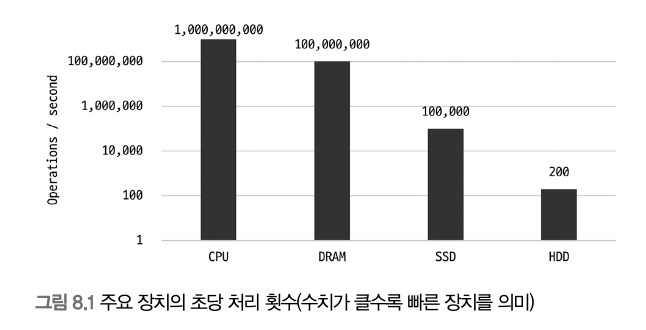

일반적인 OLTP 환경의 데이터베이스에서는 SSD가 HDD보다 훨씬 빠름

## 8.1.2 랜덤 I/O와 순차 I/O
랜덤 I/O : 하드 디스크 드라이브의 플래터를 돌려서 읽어야 할 데이터가 저장된 위치
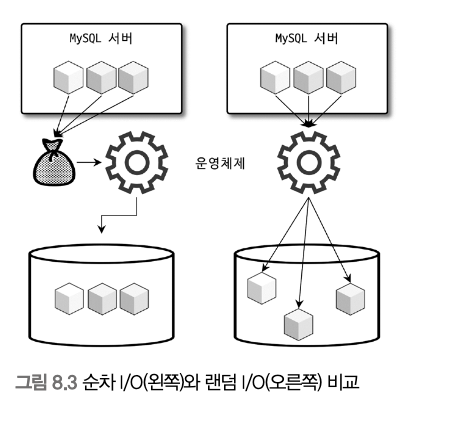

- 순차 I/O : 3개의 페이지를 디스크에 기록하기 위해 1번 시스템 콜
- 랜덤 I/O : 3개의 페이지를 디스크에 기록하기 위해 3번 시스템 콜

디스크에 데이터를 쓰고 읽는 데 걸리는 시간은 디스크 헤더를 얼마나 움직이는지에 따름

디스크의 성능은 디스크의 헤더의 위치 이동 없이 **얼마나 많은 데이터를 한번에 기록하느냐**에 달려 있음

SSD 드라이브에서도 전체 Throughput : 순차 I/O > 랜덤 I/O

일반적인 쿼리 튜닝 = 랜덤 I/O 자체를 줄여주는 것이 목적

# 8.2 인덱스
인덱스 = 책의 맨 끝의 찾아보기(색인)

(칼럼의 값, 해당 레코드가 저장된 주소) 와 같이 key-value 형태로 저장

칼럼의 값을 주어진 순서로 미리 정렬해서 보관

## SortedList vs ArrayList
SortedList : 인덱스와 같은 자료구조
- 저장되는 값을 항상 정렬된 상태로 유지
- 데이터가 저장될 때마다 정렬하므로 저장 과정이 복잡하고 느림
- 이미 정렬돼 있어서 아주 빨리 원하는 값 찾기 가능 
    - INSERT, UPDATE, DELETE 느리지만 SELECT 빠름
- **데이터의 저장 성능을 희생하고 읽기 속도를 높이는 기능**

> 테이블의 인덱스를 하나 더 추가할지 말지
> -> 데이터의 저장 속도를 어디까지 희생하고 읽기 속도를 얼마나 더 빠르게 > 만들건지 !!
> WHERE 조건절이라고 전부 인덱스에 추가하면 역효과
> (여러분의 경험이 궁금합니다)

ArrayList : 데이터 파일과 같은 자료구조
- 값을 저장되는 순서 그대로 유지하는 자료구조

## 인덱스의 역할
### Primary Key
그 레코드를 대표하는 칼럼의 값으로 만들어진 인덱스, **식별자**

NULL 허용 x, 중복 허용 x
### Secondary Key
프라이머리 키를 제외한 나머지 모든 인덱스

## 데이터 저장 방식
### B-Tree
가장 일반적으로 사용되는 인덱스 알고리즘

칼럼의 값을 변형하지 않고 원래의 값을 이용해 인덱싱하는 알고리즘
### Hash
칼럼의 값으로 해시값을 계산해서 인덱싱하는 알고리즘, 매우 빠른 검색 지원

값의 일부만 검색하거나 범위를 검색할때는 사용 불가

## 중복 허용 여부
- 유니크 인덱스 : 옵티마이저에게 항상 1건의 레코드만 찾으면 된다고 알려줄 수 있음
- 유니크하지 않은 인덱스

# 8.3 B-Tree 인덱스
B : Balanced

칼럼의 원래 값을 변형시키지 않고 인덱스 구조체 내에서는 항상 정렬된 상태로 유지

## 8.3.1 구조 및 특성
최상위에 **루트 노드**가 존재하고, 하위에 **자식 노드**가 붙어 있는 형태

- **리프 노드** : 트리 구조의 가장 하위에 있는 노드
- **브랜치 노드** : 루트 노드도 아니고 리프 노드도 아닌 중간의 노드

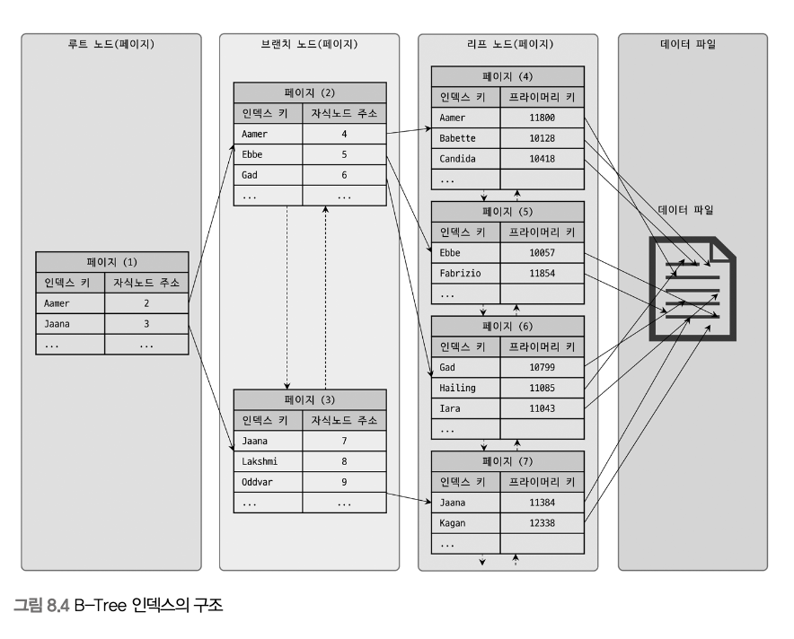

인덱스의 키 값은 모두 정렬되 있지만, 데이터 파일의 레코드는 정렬돼 있지 않고 임의의 순서로 저장돼 있음

항상 INSERT 된 순서로 저장되지 않음 : 레코드가 삭제되어 빈 공간이 생기면 그 다음의 INSERT는 가능한 삭제된 공간을 재활용

인덱스는 테이블의 키 칼럼만 가지고 있으므로 나머지 칼럼을 읽으려면 데이터 파일에서 해당 레코드를 찾아야 함

이를 위해 인덱스의 리프 노드는 데이터 파일에 저장된 레코드의 주소를 가짐

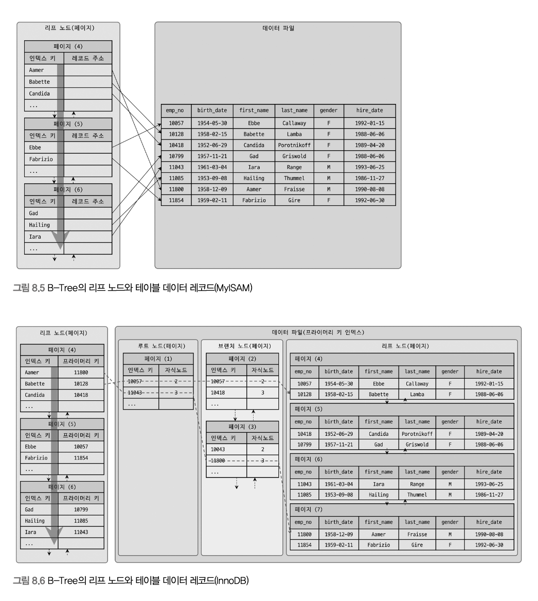

MyISAM
- 레코드 주소 = 레코드가 테이블에 INSERT된 순번이거나 데이터 파일 내의 위치
- 세컨더리 인덱스가 물리적인 주소를 가짐
InnoDB
- 프라이머리 키가 ROWID의 역할을 함
- 프라이머리 키를 주소처럼 사용하기 때문에 논리적인 주소를 가짐
- 인덱스에 저장돼 있는 프라이머리 키 값 -> 프라이머리 키 인덱스 검색 -> 리프 페이지에 저장되어 있는 레코드 읽기

## 8.3.2 B-Tree 인덱스 키 추가 및 삭제
### 8.3.2.1 인덱스 키 추가
새로운 키 값이 B-Tree에 저장될 때는 저장될 키 값을 이용해 B-Tree 상의 적잘한 위치를 검색
-> 레코드의 키 값과 대상 레코드의 주소 정보를 B-Tree의 리프 노드에 저장

- MyISAM/MEMORY : INSERT 문장이 실행되면 즉시 새로운 키 값을 B-Tree 인덱스에 변경
- InnoDB : 필요하다면 인덱스 키 추가 작업을 지연시켜 나중에 처리, 프라이머리 키나 유니크 인덱스는 즉시 추가하여 중복 체크

### 8.3.2.2 인덱스 키 삭제
해당 키 값이 저장된 B-Tree의 리프 노드를 찾아서 삭제 마킹

삭제 마킹된 인덱스 키 공간은 계속 그대로 방치하거나 재활용 가능

- InnoDB : 버퍼링되어 지연 처리 가능, 내부적으로 처리
- MyISAM/MEMORY : 체인지 버퍼 기능 x, 인덱스 키 삭제가 완료된 후 쿼리 실행이 완료됨

### 8.3.2.3 인덱스 키 변경
먼저 키 값을 삭제한 후, 다시 새로운 키 값을 추가하는 형태

### 8.3.2.4 인덱스 키 검색

**트리 탐색**
B-Tree의 루트 노드부터 시작해 브랜치 노드를 거쳐 최종 리프 노드까지 이동하면서 비교 작업 수행

SELECT 뿐만 아니라 UPDATE, DELETE를 위해 레코드 먼저 검색 시에도 사용

100% 일치 or 값의 앞부분만 일치하는 경우에 사용

인덱스의 키 값에 변형이 가해진 후 비교되는 경우에는 B-Tree의 빠른 검색 기능을 사용할 수 없음

InnoDB에서는 검색을 수행한 인덱스를 잠근 후 레코드를 잠그는 방식으로 구현됨

## 8.3.3 B-Tree 인덱스 사용에 영향을 미치는 요소
B-Tree 인덱스는 인덱스를 구성하는 칼럼의 크기와 레코드의 건수, 유니크한 인덱스 키 값의 개수 등에 의해 검색이나 변경 작업의 성능이 영향을 받는다.

### 8.3.3.1 인덱스 키 값의 크기
기본값 : 16KB (4KB ~ 64KB 사이 값 선택 가능)

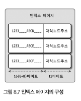

하나의 인덱스 페이지에 585개 저장 가능

인덱스를 구성하는 키 값의 크기가 커지면 
- 디스크로부터 읽어야 하는 횟수가 늘어나고, 그만큼 느려진다.
- 전체적인 인덱스의 크기가 커진다 -> 메모리에 캐시해 둘 수 있는 레코드 수는 줄어든다

### 8.3.3.2 B-Tree의 깊이
인덱스 키 값의 크기가 커지면 커질수록 하나의 인덱스 페이지가 담을 수 있는 인덱스 키 값의 개수가 적어지고,

B-Tree의 깊이가 깊어져서 디스크 읽기가 더 많이 필요ㅛ하게 됨

### 8.3.3.3 선택도
선택도(Selectivity) == 기수성(Cardinality)

모든 인덱스 키 값 가운데 유니크한 값의 수

중복된 값이 많아지면 기수성은 낮아지고 선택도도 떨어짐

- 예: `tb_test` 테이블의 전체 레코드가 1만 건이고, `country` 컬럼에만 인덱스가 있는 경우
- 케이스 A: `country` 컬럼의 유니크한 값의 개수가 10개
- 케이스 B: `country` 컬럼의 유니크한 값의 개수가 1,000개

```sql
SELECT *
FROM tb_test
WHERE country='KOREA' AND city='SEOUL';
```

MySQL은 인덱스의 통계 정보(유니크한 값의 개수)를 기준으로 대략 몇 건을 읽어야 하는지 예측한다.

- 케이스 A: `country='KOREA'` 조건으로 평균 1,000건 정도를 읽어야 한다고 판단
- 케이스 B: 같은 조건에서 평균 10건 정도만 읽으면 된다고 판단

즉, 실제로 `city='SEOUL'` 조건까지 만족하는 레코드가 1건뿐이라도 `city` 컬럼은 인덱스 통계에 직접 반영되지 않기 때문에, `country` 인덱스의 효율은 기수성에 크게 영향을 받는다.

결국 유니크한 값이 적은 컬럼에 단독 인덱스를 생성하면 비효율적일 수 있다.

각 국가의 도시를 저장하는 `tb_city` 테이블을 예로 들면, `country` 컬럼에만 인덱스가 있다고 가정할 수 있다.

```sql
CREATE TABLE tb_city(
    country VARCHAR(10),
    city VARCHAR(10),
    INDEX ix_country (country)
);
```

`tb_city` 테이블에 아래 쿼리를 실행한다고 가정하면, `country` 컬럼의 유니크 값 개수에 따라 인덱스 효율이 달라진다.

```sql
SELECT *
FROM tb_city
WHERE country='KOREA' AND city='SEOUL';
```

`country` 컬럼의 유니크 값이 10개라면, 전체 1만 건 기준으로 한 국가당 평균 1,000건의 레코드가 있다고 볼 수 있다.

이 경우 MySQL은 `country='KOREA'` 조건에 일치하는 레코드를 약 1,000건으로 예상하고, 그중 `city='SEOUL'`인 레코드가 1건뿐이라면 999건은 불필요하게 읽게 된다.

반대로 `country` 컬럼의 유니크 값이 1,000개라면, 한 국가당 평균 10건의 레코드가 있다고 볼 수 있다.

이 경우에는 `country='KOREA'` 조건에 대해 약 10건만 읽으면 되고, 실제로 `city='SEOUL'`인 레코드가 1건뿐이라면 불필요하게 읽는 레코드는 9건에 불과하다.

같은 쿼리라도 인덱스의 유니크 값 개수에 따라 MySQL이 읽는 레코드 수가 크게 달라지므로, 선택도는 인덱스의 효율에 매우 큰 영향을 준다.

### 8.3.3.4 읽어야 하는 레코드의 건수

인덱스를 이용한 읽기가 항상 빠른 것은 아니므로, 어느 정도의 레코드를 읽을 때 인덱스가 유리한지 판단해야 한다.

일반적으로 DBMS 옵티마이저는 인덱스를 통해 레코드 1건을 읽는 작업이, 테이블에서 직접 레코드 1건을 읽는 것보다 4~5배 정도 더 비싸다고 판단한다.

그 이유는 인덱스를 먼저 탐색한 뒤, 다시 실제 데이터 레코드를 읽어야 하기 때문이다.

따라서 옵티마이저가 예상한 조회 건수가 전체 테이블 레코드의 약 20~25%를 넘어가면, 인덱스를 사용하는 것보다 테이블을 처음부터 끝까지 읽으면서 필요한 레코드만 걸러내는 방식이 더 효율적일 수 있다.

예를 들어 전체 100만 건의 레코드 중 50만 건을 읽어야 한다면, 이는 이미 손익분기점인 20~25%를 크게 넘는다.

이 경우 MySQL 옵티마이저는 인덱스를 사용하지 않고 테이블 풀 스캔을 선택할 가능성이 높다.

반대로 읽어야 하는 레코드가 20~25% 이하라면 인덱스를 사용하는 편이 성능상 더 유리할 수 있다.

즉, 인덱스의 선택도뿐 아니라 실제로 읽어야 하는 레코드 건수도 인덱스 사용 여부를 결정하는 중요한 기준이다.

이러한 작업에 억지로 인덱스 힌트를 추가해도, MySQL은 비효율적이라고 판단하면 힌트를 무시하고 테이블을 직접 읽는 방식을 선택할 수 있다.

## 8.3.4 B-Tree 인덱스를 통한 데이터 읽기
MySQL은 대표적으로 인덱스 레인지 스캔, 인덱스 풀 스캔, 루스 인덱스 스캔, 인덱스 스킵 스캔 방식으로 인덱스를 읽는다.

### 8.3.4.1 인덱스 레인지 스캔
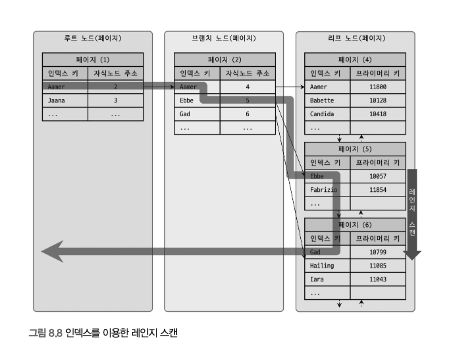
- 가장 대표적인 인덱스 접근 방식
- 조건에 맞는 시작 지점을 찾고, 필요한 범위만 순서대로 읽음
- 진행 순서
- 1. 인덱스 탐색(Index seek)으로 시작 위치 찾기
- 2. 필요한 범위를 인덱스에서 차례대로 읽기(Index scan)
- 3. 필요하면 실제 데이터 페이지를 읽기
- 장점: 필요한 구간만 읽으므로 효율적
- 주의: 인덱스만으로 처리되지 않으면 테이블 레코드 조회가 추가로 발생
- 커버링 인덱스면 3단계 없이 처리 가능

### 8.3.4.2 인덱스 풀 스캔
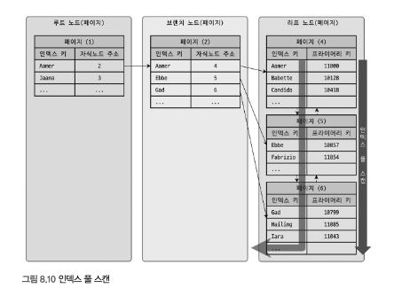
- 인덱스의 처음부터 끝까지 전부 읽는 방식
- 테이블 풀 스캔보다는 가볍지만, 필요한 범위만 읽는 레인지 스캔보다는 비효율적
- 주로 테이블 전체를 읽을 필요는 없고, 인덱스에 포함된 컬럼만으로 쿼리를 처리할 수 있을 때 사용
- `WHERE` 조건이 인덱스의 선행 컬럼을 사용하지 못하면 발생할 수 있음

### 8.3.4.3 루스 인덱스 스캔
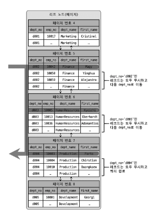
- 인덱스에서 필요한 값만 띄엄띄엄 건너뛰며 읽는 방식
- 중간의 불필요한 키는 스킵
- 주로 `GROUP BY`, `MIN()`, `MAX()` 최적화에 사용
- 모든 쿼리에 가능한 방식은 아니고, 적용 조건이 제한적
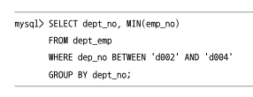

### 8.3.4.4 인덱스 스킵 스캔
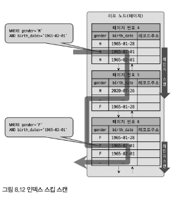
- 선행 컬럼 조건이 없어도, MySQL 8.0부터 일부 경우 인덱스 활용 가능
- 옵티마이저가 선행 컬럼의 유니크한 값을 하나씩 가정해 내부적으로 여러 번 탐색
- 장점: 선행 컬럼 조건이 없는 쿼리도 일부 최적화 가능
- 제약
- 선행 컬럼의 유니크 값 개수가 너무 많으면 비효율적
- 인덱스에 포함된 컬럼만 조회하는 형태(커버링 인덱스)에 유리

## 8.3.5 다중 칼럼(Multi-column) 인덱스
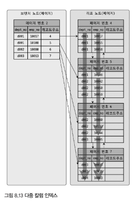
- 2개 이상 컬럼을 묶어서 만든 인덱스
- 각 컬럼이 독립적으로 정렬되는 것이 아니라, 앞 컬럼 기준으로 먼저 정렬되고 그 안에서 다음 컬럼이 정렬됨
- 즉, 컬럼 순서가 성능을 결정하는 핵심 요소
- 예: `(dept_no, emp_no)` 인덱스는 `dept_no` 기준 정렬 후 같은 `dept_no` 안에서 `emp_no` 정렬
- 뒤쪽 컬럼만 단독으로는 효율적으로 활용하기 어렵다

## 8.3.6 B-Tree 인덱스의 정렬 및 스캔 방향
- 인덱스는 생성 시 정렬 기준(오름차순/내림차순)을 가짐
- 하지만 실제 읽기는 정방향/역방향 모두 가능
- 즉, 오름차순 인덱스도 역순으로 읽어 `ORDER BY ... DESC`를 처리할 수 있음

### 8.3.6.1 인덱스 스캔 방향
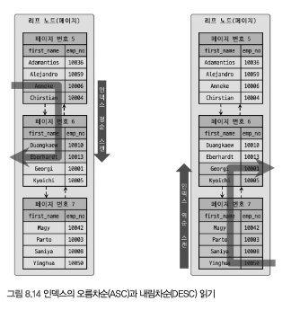
- 정순 스캔(Forward): 앞에서 뒤로 읽기
- 역순 스캔(Backward): 뒤에서 앞으로 읽기
- 같은 인덱스라도 스캔 방향만 바꿔 정렬 효과를 얻을 수 있음
- 일반적으로 역순 스캔이 정순 스캔보다 약간 비효율적일 수 있음

### 8.3.6.2 내림차순 인덱스
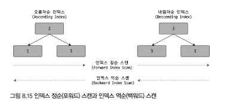
- MySQL 8.0부터 컬럼별 `DESC` 지정 가능
- 혼합 정렬(예: `ASC`, `DESC`)이 필요한 복합 정렬에 유리
- 자주 사용하는 정렬 방향이 명확하면 그 방향에 맞는 인덱스를 고려할 수 있음

## 8.3.7 B-Tree 인덱스의 가용성과 효율성
인덱스는 "사용 가능하냐"와 "효율적으로 사용되냐"를 구분해서 봐야 한다.
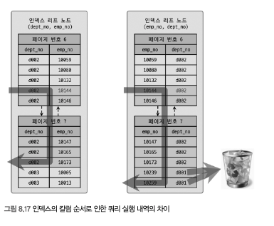

### 8.3.7.1 비교 조건의 종류와 효율성
- 동등 비교(`=`, `IN`)는 인덱스 활용도가 높음
- 범위 비교(`>`, `<`, `BETWEEN`, LIKE 접두사`)는 그 지점까지는 범위 탐색 가능
- 다중 칼럼 인덱스에서는 앞쪽 컬럼이 작업 범위를 줄이는 데 더 중요함
- 뒤쪽 컬럼 조건이 있어도, 앞쪽 컬럼이 비효율적이면 전체 성능은 떨어짐

### 8.3.7.2 인덱스의 가용성
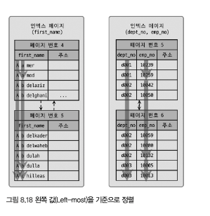
- B-Tree 인덱스는 Left-most(왼쪽부터) 원칙을 따름
- 즉, 다중 칼럼 인덱스는 선행 컬럼부터 조건이 있어야 효율적으로 사용 가능
- 예: `(dept_no, emp_no)` 인덱스에서 `emp_no`만 조건으로 검색하면 효율이 떨어짐
- `LIKE '%abc'`처럼 앞부분이 고정되지 않은 패턴은 B-Tree 인덱스를 효율적으로 사용하기 어려움

### 8.3.7.3 가용성과 효율성 판단
- 아래 조건은 작업 범위 결정 조건으로 쓰기 어렵다
- `NOT`, `!=`, `<>`, `NOT IN`, `NOT BETWEEN`
- 앞부분이 고정되지 않은 `LIKE`
- 컬럼을 함수로 변형한 비교 (`SUBSTRING()`, `DAYOFMONTH()` 등)
- 데이터 타입이 달라 변환이 필요한 비교
- 문자열 컬레이션이 다른 비교
- 반대로 `=`, `IN`, 크다/작다 비교, 앞부분 고정 `LIKE 'abc%'`는 인덱스 활용에 유리

### 다중 칼럼 인덱스 정리
- 인덱스가 `INDEX(col1, col2, col3, ...)` 일 때
- `col1`부터 연속해서 조건을 사용할수록 작업 범위를 잘 줄일 수 있음
- 중간 컬럼이 끊기면 그 뒤 컬럼은 보통 필터링 용도로만 사용됨
- 결국 "선행 컬럼", "비교 연산자 종류", "조건 순서"가 핵심이다

