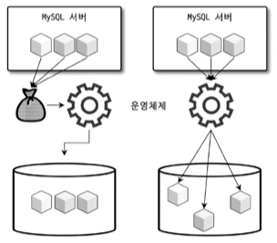
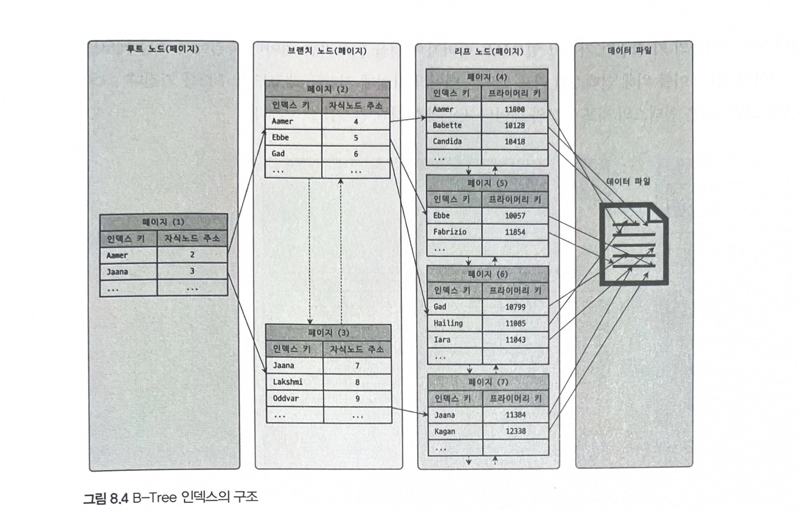
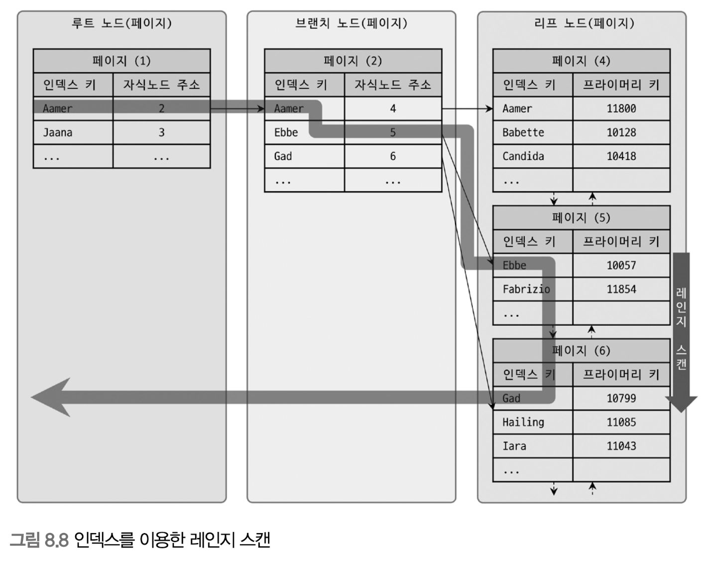

인덱스는 데이터베이스 쿼리의 성능을 언급하면서 빼놓을 수 없는 부분이다.

각 인덱스의 특성과 차이는 상당히 중요하며, 물리 수준의 모델링을 할 때도 중요한 요소가 될 것이다.

## 8.1 디스크 읽기 방식

컴퓨터의 CPU나 메모리처럼 전기적 특성을 띤 장치의 성능은 짧은 시간 동안 매우 빠른 속도로 발전했지만 디스크 같은 기계식 장치의 성능은 상당히 제한적으로 발전했다.

→ 데이터 저장 매체는 컴퓨터에서 가장 느린 부분.

- 데이터베이스의 성능 튜닝은 어떻게 디스크 I/O를 줄이느냐가 관건일 때가 상당히 많다.

### 8.1.2 랜덤 I/O와 순차 I/O

- 랜덤 I/O는 하드 디스크의 플래터(원판)를 돌려서 읽어야 할 데이터가 저장된 위치로 디스크 헤더를 이동시킨 다음 데이터를 읽는 것을 의미.
- 순차 I/O 도 이 작업 과정은 같다.

그렇다면 둘의 차이는?



(왼쪽이 순차, 오른쪽이 랜덤I/O)

순차 I/O는 3개의 페이지를 디스크에 기록하기 위해 1번 시스템 콜을 요청했지만, 랜덤 I/O는 3개의 페이지를 디스크에 기록하기 위해 3번 시스템 콜을 요청했다.

결국 순차 I/O는 랜덤 I/O보다 거의 3배 정도 빠르다고 볼 수 있다. 즉, 디스크의 성능은 디스크 헤더의 위치 이동 없이 얼마나 많은 데이터를 한 번에 기록하느냐에 의해 결정된다.

(디스크에 기록해야 할 우치ㅣ를 찾기 위해 순차 I/O는 디스크의 헤더를 1번 움직였고, 랜덤 I/O는 디스크 헤더를 3번 움직였다.)

그래서 여러 번 쓰기 또는 읽기를 요청하는 랜덤 I/O 작업이 작업 부하가 훨씬 더 크다.

데이터베이스 대부분의 작업은 이러한 작은 데이터를 빈번히 읽고 쓰기 때문에 MySQL 서버에는 그룹 커밋이나 바이너리 로그 버퍼 또는 InnoDB 로그 버퍼 등의 기능이 내장돼 있다.

디스크 원판을 갖지 않는 SSD 또한 랜덤 I/O는 순차 I/O보다 전체 스루풋이 떨어진다.

사실 쿼리를 튜닝해서 랜덤 I/O를 순차 I/O로 바꿔서 실행할 방법은 그다지 많지 않다. 일반적으로 쿼리를 튜닝하는 것은 랜덤 I/O 자체를 줄여주는 것이 목적이라고 할 수 있다. 여기서 랜덤 I/O 를 줄인다는 것은 쿼리를 처리하는 데 꼭 필요한 데이터만 읽도록 쿼리를 개선하는 것을 의미한다.

> 인덱스 레인지스캔은 데이터를 읽기 위해 주로 랜덤 I/O를 사용하며, 풀 테이블 스캔은 순차 I/O를 사용한다. 그래서 큰 테이블의 레코드 대부분을 읽는 작업에서는 인덱스를 사용하지 않고 풀 테이블 스캔을 사용하도록 유도할 때도 있다. 이는 순차 I/O가 랜덤 I/O보다 훨씬 빨리 많은 레코드를 읽어올 수 있기 때문인데, 이런 형태는 OLTP(On-Line Transaction Processing) 성격의 웹 서비스보다는 데이터 웨어하우스나 통계 작업에서 자주 사용된다.
>

## 8.2 인덱스란?

DBMS의 인덱스도 책의 색인과 마찬가지로 칼럼의 값을 주어진 순서로 미리 정렬해서 보관한다.

SortedList는 저장되는 값을 항상 정렬된 상태로 유지하는 자료 구조이다.

DBMS의 인덱스도 마찬가지로 저장되는 칼럼의 값을 이용해 항상 정렬된 상태를 유지한다. 데이터 파일은 ArrayList와 같이 저장된 순서대로 별도의 정렬 없이 그대로 저장해 둔다.

SortedList 자료 구조는 데이터가 저장될 때마다 항상 값을 정렬해야 하므로 저장하는 과정이 복잡하고 느리지만, 이미 정렬돼 있어서 아주 빨리 원하는 값을 찾아올 수 있다.

테이블의 인덱스를 하나 더 추가할지 말지는 데이터의 저장 속도를 어디까지 희생할 수 있는지, 읽기 속도를 얼마나 더 빠르게 만들어야 하느냐에 따라 결정해야 한다.

SELECT 쿼리 문장의 WHERE 조건절에 사용되는 칼럼이라고 해서 전부 인덱스로 생성하면 데이터 저장 성능이 떨어지고 인덱스의 크기가 비대해져 오히려 역효과만 불러올 수 있다.

- 프라이머리 키는 이미 잘 아는 것처럼 그 레코드를 대표하는 칼럼의 값으로 만들어진 인덱스를 의미한다. 이 칼럼은 해당 레코드를 식별할 수 있는 기준값.
  NULL 값을 허용하지 않으며 중복을 허용하지 않는 것이 특징.
- 프라이머리 키를 제외한 나머지 모든 인덱스는 세컨더리 인덱스로 분류한다.
  유니크 인덱스는 프라이머리 키와 성격이 비슷하고 프라이머리 키를 대체해서 사용할 수도 있다고 해서 대체 키라고도 하는데, 별도로 분류하기도 하고 그냥 세컨더리 인덱스로 분류하기도 한다.

데이터 저장 방식

- B-Tree 알고리즘은 가장 일반적으로 사용되는 인덱스 알고리즘. 그만큼 성숙해진 상태. B-Tree 인덱스는 칼럼의 값을 벼형하지 않고 원래의 값을 이용해 인덱싱하는 알고리즘.
  (R-Tree는 B-Tree의 응용)
- Hash 인덱스 알고리즘은 칼럼의 값으로 해시값을 계산해서 인덱싱하는 알고리즘으로 매우 빠른 검색을 지원한다.
  하지만 값을 변형해서 인덱싱하므로 값의 일부만 검색하거나 범위를 검색할 때는 해시 인덱스를 사용할 수 없다. Hash 인덱스는 주로 메모리 기반의 데이터베이스에서 많이 사용한다.

## 8.3 B-Tree 인덱스

아직도 가장 범용적인 목적으로 사용되는 인덱스 알고리즘. Balanced Tree

### 8.3.1 구조 및 특성



루트 노드 - 브랜치 노드 - 리프 노드

데이터베이스에서 인덱스와 실제 데이터가 저장된 데이터는 따로 관리되는데, 인덱스의 리프 노드는 항상 실제 데이터 레코드를 찾아가기 위한 주솟값을 가지고 있다.

많은 사람들이 데이터 파일의 레코드는 INSERT된 순서대로 저장되는 것으로 생각하지만 그렇지 않다. 레코드가 삭제되어 빈 공간이 생기면 그 다음의 INSERT는 가능한 한 삭제된 공간을 재활용하도록 DBMS가 설계되기 때문에 항상 INSERT된 순서대로 저장되는 것은 아니다.

인덱스는 테이블의 키 칼럼만 갖고 있으므로 나머지 칼럼을 읽으려면 데이터 파일에서 해당 레코드를 찾아야 한다. 이를 위해 인덱스의 리프 노드는 데이터 파일에 저장된 레코드의 주소를 가진다.

InnoDB 테이블에서 인덱스를 통해 레코드를 읽을 때는 데이터 파일을 바로 찾아가지 못한다. 인덱스에 저장돼 있는 프라이머리 키 값을 이용해 프라이머리 키 인덱스를 한 번 더 검색한 후, 프라이머리 키 인덱스의 리프 페이지에 저장돼 있는 레코드를 읽는다. 즉, InnoDB 스토리지 엔진에서는 모든 세컨더리 인덱스 검색에서 데이터 레코드를 읽기 위해서는 반드시 프라이머리 키를 저장하고 있는 B-Tree를 다시 한번 검색해야 한다.

### 8.3.2 B-Tree 인덱스 키 추가 및 삭제

테이블의 레코드를 저장하거나 변경하는 경우 인덱스 키 추가나 삭제 작업이 발생한다. 인덱스 키 추가나 삭제가 어떻게 처리되는지 알아두면 쿼리의 성능을 쉽게 예측할 수 있을 것이다.

**8.3.2.1 인덱스 키 추가**

- B-Tree에 새로운 키 값이 저장될 때는 저장될 키 값을 이용해 B-Tree상의 적절한 위치를 검색해야 한다. 저장될 위치가 결정되면 레코드의 키 값과 대상 레코드의 주소 정보를 B-Tree의 리프 노드에 저장한다

리프 노드가 꽉 차면 리프 노드가 분리돼야 하는데, 상위 브랜치 노드까지 처리 범위가 넓어진다.
이러한 작업 탓에 B-Tree는 상대적으로 쓰기 작업에 비용이 많이 든다.

테이블에 레코드를 추가하는 작업 비용을 1이라고 가정하면 해당 테이블의 인덱스에 키를 추가하는 작업 비용을 1.5 정도로 예측한다.

일반적으로 테이블에 인덱스가 3개 있다면 테이블에 인덱스가 하나도 없는 경우는 작업 비용이 1이고, 3개인 경우는 5.5(1 + 1.5*3) 정도의 비용으로 예측한다.

이 비용의 대부분이 메모리와 CPU에서 처리하는 시간이 아니라 디스크로부터 인덱스 페이지를 읽고 쓰기를 해야 해서 걸리는 시간이라는 점이다.

MyISAM이나 MEMORY 스토리지 엔진을 사용하는 테이블에서는 INSERT 문장이 실행되면 즉시 새로운 키 값을 B-Tree 인덱스에 변경한다. 하지만 InnoDB 스토리지 엔진은 이 작업을 조금 더 지능적으로 처리하는데, 필요하다면 인덱스 키 추가 작업을 지연시켜 나중에 처리할 수 있다.

하지만 프라이머리 키나 유니크 인덱스의 경우 중복 체크가 필요하기 때문에 즉시 B-Tree에 추가하거나 삭제한다.

**8.3.2.2 인덱스 키 삭제**

B-Tree의 키 값이 삭제되는 경우는 해당 키 값이 저장된 B-Tree의 리프 노드를 찾아서 그냥 삭제 마크만 하면 작업이 완료된다. 이렇게 삭제 마킹된 인덱스 키 공간은 계속 그대로 방치하거나 재활용할 수 있다. 삭제로 인한 마킹 작업 역시 디스크 I/O가 필요한 작업이다. MySQL 5.5 이상에서는 이 작업 또한 버퍼링되어 지연 처리될 수 있다.

**8.3.2.3 인덱스 키 변경**

B-Tree의 키 값 변경 작업은 먼저 키 값을 삭제한 후, 다시 새로운 키 값을 추가하는 형태로 처리된다.

**8.3.2.4 인덱스 키 검색**

인덱스를 검색하는 작업은 B-Tree의 루트 노드부터 시작해 브랜치 노드를 거쳐 최종 리프 노드까지 이동하면서 비교 작업을 수행하는데, 이 과정을 “트리 탐색”이라고 한다. 인덱스 트리 탐색은 SELECT, UPDATE, DELETE 와 같이 해당 레코드를 먼저 검색해야 할 경우 사용된다.

B-Tree 인덱스를 이용한 검색은 100% 일치 또는 값의 앞부분만 일치하는 경우에도 사용할 수 있다.

인덱스의 키 값에 변형이 가해진 후 비교되는 경우에는 절대 B-Tree의 빠른 검색 기능을 사용할 수 없다.

- 함수나 연산을 수행한 결과로 정렬한다거나 검색하는 작업은 B-Tree의 장점을 이용할 수 없다.

InnoDB 스토리지 엔진에서 인덱스는 더 특별한 의미가 있다. InnoDB 테이블에서 지원하는 레코드 잠금이나 넥스트 키락이 검색을 수행한 인덱스를 잠근 후 테이블의 레코드를 잠그는 방식으로 구현돼 있다. 따라서 적절히 사용할 인덱스가 없으면 불필요하게 많은 레코드를 잠근다.

### 8.3.3 B-Tree 인덱스 사용에 영향을 미치는 요소

B-Tree 인덱스는 인덱스를 구성하는 칼럼의 크기와 레코드의 건수, 그리고 유니크한 인덱스 키 값의 개수 등에 의해 검색이나 변경 작업의 성능이 영향을 받는다.

**8.3.3.1 인덱스 키 값의 크기**

InnoDB 스토리지 엔진은 디스크에 데이터를 저장하는 가장 기본 단위를 페이지(Page) 또는 블록(Block)이라고 하며, 디스크의 모든 읽기 및 쓰기 작업의 최소 작업 단위가 된다. 또한 페이지는 버퍼풀에서 데이터를 버퍼링하는 기본 단위이기도 하다.

`인덱스도 결국은 페이지 단위로 관리된다.`

(페이지의 기본값은 16KB)

인덱스를 구성하는 키 값의 크기가 커지면 디스크로부터 읽어야 하는 횟수가 늘어나고, 그만큼 느려진다.

**8.3.3.2 B-Tree 깊이**

B-Tree 인덱스의 깊이는 상당히 중요하지만 직접 제어할 방법은 없다.

B-Tree의 깊이는 MySQL에서 값을 검색할 때 몇 번이나 랜덤하게 디스크를 읽어야 하는지와 직결되는 문제다.

실제로 아무리 대용량 데이터베이스라도 B-Tree의 깊이가 5단계 이상 깊어지는 경우는 흔치 않다.

**8.3.3.3 선택도(기수성 - Cardinality)**

인덱스에서 선택도 또는 기수성은 거의 같은 의미로 사용되며, 모든 인덱스 키 값 가운데 유니크한 값의 수를 의미한다. 전체 인덱스 키 값은 100개인데, 그 중에서 유니크한 값의 수는 10개라면 기수성은 10이다.

인덱스 키 값 가운데 중복된 값이 많아지면 많아질수록 기수성은 낮아지고 동시에 선택도 또한 떨어진다.

인덱스는 선택도가 높을수록 검색 대상이 줄어들기 때문에 그만큼 빠르게 처리된다.

> 선택도가 좋지 않다고 하더라도 정렬이나 그루핑과 같은 작업을 위해 인덱스를 만드는 것이 훨씬 나은 경우도 많다. 인덱스가 항상 검색에만 사용되는 것은 아니므로 용도를 고려해서 적절히 인덱스를 설계할 필요가 있다.
>

**8.3.3.4 읽어야 하는 레코드의 건수**

인덱스를 통해 테이블의 레코드를 읽는 것은 인덱스를 거치지 않고 바로 테이블의 레코드를 읽는 것보다 높은 비용이 드는 작업이다.

인덱스를 이용한 읽기의 손익 분기점이 얼마인지 판단할 필요가 있는데, 일반적인 DBMS의 옵티마이저에서는 인덱스를 통해 레코드 1건을 읽는 것이 테이블에서 읽는 것보다 4~5배 정도 비용이 많이 드는 작업인 것으로 예측한다.

즉, 인덱스를 통해 읽어야 할 레코드의 건수(옵티마이저 판단)가 전체 테이블 레코드의 20~25%를 넘어서면 인덱스를 이용하지 않고 테이블을 모두 직접 읽어서 필요한 레코드만 가려내는 방식으로 처리하는 것이 효율적이다.

물론 이러한 작업은 옵티마이저가 기본적으로 힌트를 무시하고 테이블을 직접 읽는 방식으로 처리하겠지만 기본으로 알고 있어야 할 사항이다.

### 8.3.4 B-Tree 인덱스를 통한 데이터 읽기

MySQL이 인덱스를 이용하는 대표적인 방법 세 가지를 살펴보자.

**8.3.4.1 인덱스 레인지 스캔**

인덱스의 접근 방법 가운데 가장 대표적인 방식. 뒤에 설명할 나머지 두 가지 접근법 보다 빠른 방법이다.

```sql
mysql> SELECT * FROM employees WHERE first_name BETWEEN 'Ebbe' AND 'Gad';
```



인덱스 레인지 스캔은 검색해야 할 인덱스의 범위가 결정됐을 때 사용하는 방식이다. 검색하려는 값의 수나 검색 결과 레코드 건수와 관계 없이 레인지 스캔이라 표현한다. 루트 노드에서부터 비교를 시작해 브랜치 노드를 거치고 최종적으로 리프 노드까지 찾아 들어가야만 비로소 필요한 레코드의 시작 지점을 찾을 수 있다.

일단 시작 위치를 찾으면 그때부터는 리프 노드의 레코드만 순서대로 읽으면 된다.

최종적으로 스캔을 멈춰야 할 위치에 다다르면 지금까지 읽은 레코드를 사용자에게 반환하고 쿼리를 끝낸다.

그림 8.8은 실제 인덱스만을 읽는 경우를 보여준다. 하지만 B-Tree 인덱스의 리프 노드를 스캔하면서 실제 데이터 파일의 레코드를 읽어 와야 하는 경우도 많은데, 이 과정을 좀 더 자세히 보자.

어떤 방식으로 스캔하든 상관없이, 해당 인덱스를 구성하는 칼럼의 정순 또는 역순으로 정렬된 상태로 레코드를 가져온다는 것이다. 이는 별도 정렬 과정이 수반되는 것이 아니라 인덱스 자체의 정렬 특성 때문에 자동으로 그렇게 된다.

중요한 것은 인덱스의 리프 노드에서 검색 조건에 일치하는 건들은 데이터 파일에서 레코드를 읽어오는 과정이 필요하다는 것이다. 이때 리프 노드에 저장된 레코드 주소로 데이터 파일의 레코드를 읽어오는데, 레코드 한 건 한 건 단위로 랜덤 I/O가 한 번씩 일어난다.

*인덱스를 통해 읽어야 할 데이터 레코드가 20~25%를 넘으면 인덱스를 통한 읽기보다 테이블의 데이터를 직접 읽는 것이 더 효율적인 처리 방식이 된다.

1. 인덱스에서 조건을 만족하는 값이 저장된 위치를 찾는다. 이 과정을 인덱스 탐색(index seek)이라고 한다.
2. 1번에서 탐색된 위치부터 필요한 만큼 인덱스를 차례대로 쭉 읽는다. 이 과정을 인덱스 스캔이라 한다.
3. 2번에서 읽어 들인 인덱스 키와 레코드 주소를 이용해 레코드가 저장된 페이지를 가져오고, 최종 레코드를 읽어온다.

필요로 하는 데이터에 따라 3번 과정은 필요하지 않을 수도 있는데, 이를 커버링 인덱스라고 한다. 커버링 인덱스로처리되는 쿼리는 디스크 랜덤 IO가 줄어들어 성능은 그만큼 빨라진다.

**8.3.4.2 인덱스 풀 스캔**

인덱스의 처음부터 끝까지 모두 읽는 방식을 인덱스 풀 스캔이라고 한다. 대표적으로 쿼리의 조건절에 사용된 칼럼이 인덱스의 첫 번째 칼럼이 아닌 경우 인덱스 풀 스캔 방식이 사용된다.

일반적으로 인덱스의 크기는 테이블의 크기보다 작으므로 직접 테이블을 처음부터 끝까지 읽는 것보다는 인덱스만 읽는 것이 효율적이다.

쿼리가 인덱스에 명시된 칼럼만으로 조건을 처리할 수 있는 경우 주로 이 방식이 사용된다. (인덱스뿐만 아니라 데이터 레코드까지 모두 읽어야 한다면 절대 이 방식으로 처리되지 않는다)

이 방식은 인덱스 레인지 스캔보다는 빠르지 않지만 테이블 풀 스캔보다는 효율적이다.

<aside>

인덱스 풀 스캔 방식은 효율적인 방식은 아니며, 일반적으로 인덱스를 생성하는 목적은 아니다.

</aside>

**8.3.4.3 루스 인덱스 스캔**

루스 인덱스 스캔이란 말 그대로 느슨하게 또는 듬성듬성 인덱스를 읽는 것을 말한다.

루스 인덱스 스캔은 인덱스 레인지 스캔과 비슷하게 동작하지만 중간에 필요치 않은 인덱스 키 값은 무시하고 다음으로 넘어가는 형태로 처리한다.

일반적으로 GROUP BY 또는 집합 함수 가운데 MAX() 또는 MIN() 함수에 대해 최적화를 하는 경우에 사용된다.

```sql
mysql> SELECT dept_no, MIN(emp_no)
				FROM dept_emp
				WHERE dep_no BETWEEN 'd002' AND 'd004'
				GROUP BY dept_no;
```

이 쿼리에서 사용된 dept_emp 테이블은 dept_no와 emp_no라는 두 개의 칼럼으로 인덱스가 생성돼 있다. 또한 이 인덱스는 (dept_no, emp_no) 조합으로 정렬까지 돼 있어서 dept_no 그룹 별로 첫 번째 레코드의 emp_no 값만 읽으면 된다.

*루스 스캔은 사용하려면 여러 조건을 만족시켜야 한다.

**8.3.4.4 인덱스 스킵 스캔**

데이터베이스 서버에서 인덱스의 핵심은 값이 정렬돼 있다는 것이며, 이로 인해 인덱스를 구성하는 칼럼의 순서가 매우 중요하다.

```sql
mysql> ALLTER TABLE employees
				ADD INDEX ix_gender_birthdate (gender, birth_date);
```

이 인덱스를 사용하려면 WHERE 조건절에 gender 칼럼에 대한 비교 조건이 필수다.

```sql
-- // 인덱스를 사용하지 못하는 쿼리
mysql> SELECT * FROM employees WHERE birth_date >= '1965-02-01';

-- // 인덱스를 사용할 수 있는 쿼리
mysql> SELECT * FROM employees WHERE gender='M' AND birth_date>='1965-02-01';
```

그래서 위의 두 쿼리 중에서 gender 칼럼과 birth_date 칼럼의 조건을 모두 가진 두 번째 쿼리는 인덱스를 효율적으로 사용할 수 있지만 gender 칼럼에 대한 비교 조건이 없는 첫 번째 쿼리는 인덱스를 사용할 수가 없었다. 주로 이런 경우에는 birth_date 칼럼부터 시작하는 인덱스를 새로 생성해야만 했다.

MySQL 8.0 버전부터는 옵티마이저가 gender 칼럼을 건너뛰어서 birth_date 칼럼만으로도 인덱스 검색이 가능하게 해주는 인덱스 스킵 스캔 최적화 기능이 도입됐다. 루스 스캔은 유사하지만 GROUP BY 작업을 처리하기 위해 인덱스를 사용하는 경우에만 적용할 수 있었다. 하지만 MySQL 8.0 버전에 도입된 인덱스 스킵 스캔은 WHERE 조건절의 검색을 위해 사용 가능하도록 용도가 훨씬 넓어진 것이다.

인덱스 스킵  스캔은 아직 다음과 같은 단점이 있다.

- WHERE 조건 절에 조건이 없는 인덱스의 선행 칼럼의 유니크한 값의 개수가 적어야 함
- 쿼리가 인덱스에 존재하는 칼럼만으로 처리 가능해야 함(커버링 인덱스)

인덱스 스킵 스캔은 인덱스의 선행 칼럼이 가진 유니크한 값의 개수가 소량일 때만 적용 가능한 최적화라는 것을 기억하자.

### 8.3.5 다중 칼럼(Multi-column) 인덱스

실제 서비스용 데이터베이스에서는 2개 이상의 칼럼을 포함하는 인덱스가 더 많이 사용된다.

중요한 것은 인덱스의 두 번째 칼럼은 첫 번째 칼럼에 의존해서 정렬돼 있다는 것이다. 즉, 두 번째 칼럼의 정렬은 첫 번째 칼럼이 똑같은 레코드에서만 의미가 있다는 것이다. 만약 칼럼이 4개인 인덱스를 생성한다면 세 번째 칼럼은 두 번째 칼럼에 의존해서 정렬되고 네 번째 칼럼은 다시 세 번째 칼럼에 의존해서 정렬된다.

### 8.3.6 B-Tree 인덱스의 정렬 및 스캔 방향

인덱스를 생성할 때 설정한 정렬 규칙에 따라서 인덱스의 키 값은 항상 오름차순이거나 내림차순으로 정렬되어 저장된다. 오름차순으로 인덱스가 생성되었다고 해서 그 인덱스를 오름차순으로만 읽을 수 있다는 뜻은 아니다.

인덱스를 어느 방향으로 읽을지는 쿼리에 따라 옵티마이저가 실시간으로 만들어 내는 실행 계획에 따라 달라진다.

**8.3.6.1.1 인덱스의 스캔 방향**

first_name 칼럼에 대한 인덱스가 포함된 employees 테이블에 대해 다음 쿼리를 실행하는 과정을 한 번 살펴보자. MySQL은 이 쿼리를 실행하기 위해 인덱스를 처음부터 오름차순으로 끝까지 읽어 first_name이 가장 큰 값 하나를 가져오는것일까?

```sql
mysql> SELECT * 
				FROM employees
				ORDER BY first_name DESC
				LIMIT 1;
```

그렇지 않다. 옵티마이저는 이미 인덱스가 오름차순 정렬이라면 인덱스 최솟값부터 읽으면 오름차순으로 가져올 수 있다는 것을 알고 있다.

즉, 인덱스 생성 시점에 오름차순 또는 내림차순으로 정렬이 결정되지만 쿼리가 그 인덱스를 사용하는 시점에 인덱스를 익는 방향에 따라 오름차순 또는 내림차순 정렬 효과를 얻을 수 있다.

쿼리의 ORDER BY 처리나 MIN() 또는 MAX() 함수 등의 최적화가 필요한 경우에도 MySQL 옵티마이저는 인덱스의 읽기 방향을 전환해서 사용하도록 실행 계획을 만들어낸다.

**8.3.6.1.2 내림차순 인덱스**

다음과 같이 2개 이상의 칼럼으로 구성된 복합 인덱스에서 각가의 칼럼이 내림차순과 오름차순이 혼합된 경우에는 MySQL 8.0의 내림차순 인덱스로만 해결될 수 있다.

```sql
mysql> CREATE INDEX ix_teamname_userscore ON employees (team_name ASC, user_score DESC);
```

그렇다면 first_name 칼럼을 역순으로 정렬하는 요건만 있다면 다음 2개 인덱스 중에서 어떤 것을 선택하는 것이 좋을까? 아니면 두 인덱스 모두 동일한 성능을 보일까?

```sql
mysql> CREATE INDEX ix_firstname_asc ON employees (first_name ASC);
mysql> CREATE INDEX ix_firstname_desc ON employees (first_name DESC);
```

- 오름차순 인덱스: 작은 값의 인덱스 키가 B-Tree의 왼쪽으로 정렬된 인덱스
- 내림차순 인덱스: 큰 값의 인덱스 키가 B-Tree의 왼쪽으로 정렬된 인덱스
- 인덱스 정순 스캔(Forward index scan): 인덱스 키의 크고 작음에 관계없이 인덱스 리프 노드의 왼쪽 페이지부터 오른쪽으로 스캔
- 인덱스 역순 스캔(Backward index scan): 인덱스 키의 크고 작음에 관계 없이 인덱스 리프 노드의 오른쪽 페이지부터 왼쪽으로 스캔

내림차순 인덱스의 필요성?

```sql
mysql> CREATE TABLE t1 (
				tid INT NOT NULL AUTO_INCREMENT,
				TABLE_NAME VARCHAR(64),
				COLUMN_NAME VARCHAR(64),
				ORDINAL_POSITION INT,
				PRIMARY KEY(tid)
				) ENGINE=InnoDB;
				
mysql> INSERT INTO t1
				SELECT NULL, TABLE_NAME, COLUMN_NAME, ORDINAL_POSITION
				FROM information_schema.COLUMNS;

mysql> INSERT INTO t1
				SELECT NULL, TABLE_NAME, COLUMN_NAME, ORDINAL_POSITION
				FROM t1;
				
mysql> SELECT COUNT(*) FROM t1;

COUNT(*)
12619776
```

이제 이 테이블을 풀 스캔하면서 정렬만 수행하는 쿼리를 다음과 같이 한번 실행해보자. 다음 두 쿼리는 테이블의 프라이머리 키를 정순 또는 역순으로 스캔하면서 마지막 레코드 1건만 반환한다.

1천 2백여만 건을 스캔하는데, “1.2초 정도의 차이쯤이야”라고 생각할 수도 있다. 하지만 비율로 따져보면 역순 정렬 쿼리가 정순 정렬 쿼리보다 28.9% 더 시간이 걸리는 것을 확인할 수 있다. 하나의 인덱스를 정순으로 읽느냐 또는 역순으로 읽느냐에 따라 이런 차이가 발생한다는 것은 쉽게 이해하기 어려울 수 있다.

실제 내부적으로는 InnoDB에서 인덱스 역순 스캔이 인덱스 정순 스캔에 비해 느릴 수 밖에 없는 두 가지 이유가 있다.

- 페이지 잠금은 인덱스 정순 스캔에 적합하 ㄴ구조
- 페이지 내에서 인덱스 레코드가 단방향으로만 연결된 구조

다음 쿼리를 한번 살펴보자.

```sql
mysql> SELECT * FROM tab
				WHERE userid=?
				ORDER BY score DESC
				LIMIT 10;
```

이 쿼리의 경우 다음 두 가지 인덱스 모두 적절한 선택이 될 수 있다.

```sql
오름차순 인덱스: INDEX (useid ASC, score ASC)
내림차순 인덱스: INDEX (userid DESC, score DESC)
```

하지만 위 쿼리가 많은 레코드를 조회하면서 빈번하게 실행된다면 오름차순 인덱스보다는 내림차순 인덱스가 더 효율적이라고 볼 수 있다.

또한 많은 쿼리가 인덱스의 앞쪽만 또는 뒤쪽만 집중적으로 읽어서 인덱스의 특정 페이지 잠금이 병목이 될 것으로 예상된다면 쿼리에서 자주 사용되는 정렬 순서대로 인덱스를 생성하는 것이 잠금 병목 현상을 완화하는데 도움이 될 것이다.

### 8.3.7 B-Tree 인덱스의 가용성과 효율성

쿼리의 WHERE 조건이나 GROUP BY, 또는 ORDER BY 절이 어떤 경우에 인덱스를 사용할 수 있고 어떤 방식으로 사용할 수 있는지 식별할 수 있어야 한다. 그래야만 쿼리의 조건을 최적화하거나, 역으로 쿼리에 맞게 인덱스를 최적으로 생성할 수 있다.

**8.3.7.1 비교 조건의 종류와 효율성**

```sql
mysql> SELECT * FROM dept_emp
				WHERE dept_no='d002' AND emp_no >= 10114;
```

이 쿼리를 위해 dept_emp 테이블에 각각 칼럼의 순서만 다른 두 가지 케이스로 인덱스를 생성했다고 가정하자. 위의 쿼리가 처리되는 동안 각 인덱스에 어떤 차이가 있었는지 살펴보자.

- 케이스 A: INDEX (dept_no, emp_no)
- 케이스 B: INDEX (emp_no, dept_no)

케이스 A 인덱스는 “dept_no=’d002’ AND emp_no≥10144”인 레코드를 찾고, 그 이후에는 dept_no가 ‘d002’가 아닐 때까지 인덱스를 그냥 쭉 읽기만 하면 된다. 이 경우에는 읽은 레코드가 모두 사용자가 원하는 결과임을 알 수 있다. 즉, 조건을 만족하는 레코드가 5건이라고 할 대, 5건의 레코드를 찾는 데 꼭 필요한 5번의 비교 작업만 수행한 것이므로 상당히 효율적으로 인덱스를 사용한 것이다.

하지만 케이스 B 인덱스는 우선 “emp_no≥10144 AND dept_no=’d002’”인 레코드를 찾고, 그 이후 모든 레코드에 대해 dept_no가 ‘d002’인지 비교하는 과정을 거쳐야 한다.

이처럼 인덱스를 통해 읽은 레코드가 나머지 조건에 맞는지 조건에 맞는지 비교하면서 취사선택하는 작업을 ‘필터링’이라고도 한다.

케이스 A 인덱스에서 2번째 칼럼인 emp_no는 비교 작업의 범위를 좁히는 데 도움을 준다. 하지만 케이스 B 인덱스에서 2번째 칼럼인 dept_no는 비교 작업의 범위를 좁히는 데 아무런 도움을 주지 못하고, 단지 쿼리의 조건이 맞는지 검사하는 용도로만 사용됐다.

**8.3.7.2 인덱스의 가용성**

B-Tree 인덱스의 특징은 왼쪽 값에 기준해서 오른쪽 값이 정렬돼 있다는 것이다. 여기서 왼쪽이란 하나의 칼럼 내에서뿐만 아니라 다중 칼럼 인덱스의 칼럼에 대해서도 함께 적용된다.

- 케이스 A: INDEX (first_name)
- 케이스 B: INDEX (dept_no, emp_no)

```sql
mysql> SELECT * FROM employees WHERE first_name LIKE '%mer';
```

이 쿼리는 인덱스 레인지 스캔 방식으로 인덱스를 이용할 수는 없다. 그 이유는 first_name 칼럼에 저장된 값의 왼쪽부터 한 글자씩 비교해 가면서 일치하는 레코드를 찾아야 하는데, 조건절에 주어진 상숫값(’%mer’)에는 왼쪽 부분이 고정되어 있지 않기 때문이다. 따라서 정렬 우선순위가 낮은 뒷부분의 값만으로는 왼쪽 기준 정렬 기반의 인덱스인 B-Tree에서는 인덱스의 효과를 얻을 수 없다.

```sql
mysql> SELECT * FROM dept_emp WHERE emp_no>=10144;
```

인덱스가 dept_no, emp_no 칼럼 순서대로 생성돼 있다면 인덱스의 선행 칼럼인 dept_no 조건 없이 emp_no 값만으로 검색하면 인덱스를 효율적으로 사용할 수 없다. 케이스 B의 인덱스는 다중 칼럼으로 구성된 인덱스이므로 dept_no 칼럼에 대해 먼저 정렬한 후, 다시 emp_no 칼럼값으로 정렬돼 있기 때문이다.

인덱스의 왼쪽 값 규칙은 GROUP BY 절이나 ORDER BY 절에도 똑같이 적용된다.

**8.3.7.3 가용성과 효율성 판단**

기본적으로 B-Tree 인덱스의 특성상 다음 조건에서는 사용할 수 없다.(작업 범위 결정 조건 X, 체크 조건 O)

- NOT-EQUAL로 비교된 경우(”<>”, “NOT IN”, “NOT BETWEEN”, “IS NOT NULL”)
- LIKE ‘%??’(앞 부분이 아닌 뒷부분 일치) 형태로 문자열 패턴이 비교되는 경우
- 스토어드 함수나 다른 연산자로 다른 연산자로 칼럼이 변형된 후 비교된 경우
- NOT-DETERMINISTIC 속성의 스토어드 함수가 비교 조건에 사용된 경우
- 데이터 타입이 서로 다른 비교(인덱스 칼럼의 타입 변환을 해야 비교가 가능한 경우)
- 문자열 데이터 타입의 콜레이션이 다른 경우

다른 일반적인 DBMS에서는 NULL 값이 인덱스에 저장되지 않지만 MySQL에서는 NULL 값도 인덱스에 저장된다. 다음과 같은 WHERE 조건도 작업 범위 결정 조건으로 인덱스를 사용한다.

```sql
mysql> ... WHERE column IS NULL ...
```

다중 칼럼으로 만들어진인덱스는 어떤 조건에서 사용될 수 있고, 어떤 경우에 절대 사용될 수 없는지 살펴보자.

```sql
INDEX ix_test (column_1, column_2, column_3, ..., column_n )
```

- 작업 범위 결정 조건으로 인덱스를 사용하지 못하는 경우
  - column_1 칼럼에 대한 조건이 없는 경우
  - column_1 칼럼의 비교 조건이 위의 인덱스 사용 불가 조건 중 하나인 경우
- 작업 범위 결정 조건으로 인덱스를 사용하는 경우
  - col1~coli-1 칼럼까지 동등 비교 형태로 비교
  - 동등 비교(’=’, ‘IN’), 크다 작다 형태, LIKE로 좌측일치(LIKE ‘승환%’)

```sql
-- // 다음 쿼리는 인덱스를 사용할 수 없음
mysql> .. WHERE column_1 <> 2

-- // 다음 쿼리는 column_1과 column_2까지 범위 결정 조건으로 사용됨
mysql>.. WHERE column_1 = 1 AND column_2 > 10

-- // 다음 쿼리는 column_1, column_2, column_3까지 범위 결정 조건으로 사용됨
mysql>.. WHERE column_1 IN (1,2) AND column_2 = 2 AND column_3 <= 10

-- // 다음 쿼리는 column_1, column_2, column_3까지 범위 결정 조건으로,
-- // column_4는 체크 조건으로 사용됨
mysql>.. WHERE column_1 = 1 AND column_2 = 2 AND column_3 IN (10,20,30) AND column_4 <> 100

-- // 다음 쿼리는 column_1, column_2, column_3, column_4까지 범위 결정 조건으로 사용됨
-- // 좌측 패턴 일치 LIKE 비교는 크다 또는 작다 비교와 동급으로 생각하면 됨
mysql>.. WHERE column_1 = 1 AND column_2 IN (2,4) AND column_3 = 30 AND column_4 LIKE '김승%'

-- // 다음 쿼리는 column_1, column_2, column_3, column_4, column_5까지 범위 결정 조건
mysql>.. WHERE column_1 = 1 AND column_2 = 2 AND column_3 = 30
				AND column_4 = '김승환' AND column_5 = '서울'
```

여기서 설명하는 내용은 모두 B-Tree 인덱스의 특징이므로 MySQL뿐 아니라 대부분의 RDBMS에도 동일하게 적용된다.

## 8.5 전문 검색 인덱스

문서의 내용 전체를 인덱스화해서 특정 키워드가 포함된 문서를 검색하는 전문(Full Text) 검색에는 InnoDB나 MyISAM 스토리지 엔진에서 제공하는 일반적인 용도의 B-Tree 인덱스를 사용할 수 없다.

문서 전체에 대한 분석과 검색을 위한 이러한 인덱싱 알고리즘을 전문 검색 인덱스라고 하는데, 전문 검색 인덱스는 일반화된 기능의 명칭이지 전문 검색 알고리즘의 이름을 지칭하는 것은 아니다.

### 8.5.1 인덱스 알고리즘

전문 검색에서는 문서 본문의 내용에서 사용자가 검색하게 될 키워드를 분석해 내고, 빠른 검색용으로 사용할 수 있게 이러한 키워드로 인덱스를 구축한다.

전문 검색 인덱스는 문서의 키워드를 인덱싱하는 기법에 따라 크게 단어의 어근 분석과 n-gram 분석 알고리즘으로 구분할 수 있다.

**8.5.1.1 어근 분석 알고리즘**

MySQL 서버의 전문 검색 인덱스는 다음과 같은 두 가지 중요한 과정을 거쳐서 색인 작업이 수행된다.

- 불용어(Stop Word) 처리
- 어근 분석(Stemming)

불용어 처리는 검색에서 별 가치가 없는 단어를 모두 필터링해서 제거하는 작업을 의미한다. 불용어의 개수는 많지 않기 때문에 상수로 정의해서 사용하는 경우가 많고, 사용자가 추가하거나 삭제할 수 있게 구현하는 경우도 있다.

어근 분석은 검색어로 선정된 단어의 뿌리인 원형을 찾는 작업이다. MySQL 서버에서는 오픈소스 MeCab을 사용할 수 있게 지원한다.

8.5.1.2 n-gram 알고리즘

형태소 분석이 문장을 이해하는 알고리즘이라면, n-gram은 단순히 키워드를 검색해내기 위한 인덱싱 알고리즘이라고 할 수 있다.

n-gram이란 본문을 무조건 몇 글자씩 잘라서 인덱싱하는 기법이다. 일반적으로는 2글자로 쪼개서 인덱싱하는 2-gram 방식이 많이 사용된다.

MySQL 서버는 이렇게 구분된 토큰을 단순한 B-Tree 인덱스에 저장한다.

**8.5.1.3 불용어 변경 및 삭제**

“ti”와 “at”, “ha” 같은 토큰들은 “a”, “i” 철자가 불용어로 등록돼 있기 때문에 모두 걸려져서 버려졌다. 그래서 불용어 처리는 사용자에게 도움이 되기 보다는 더 혼란스럽게 하는 기능일 수도 있다. MySQL 내장 불용어 대신 커스텀하여 사용을 권장한다.

### 8.5.2 전문 검색 인덱스의 가용성

전문 검색 인덱스를 사용하려면 반드시 다음 두 가지 조건을 갖춰야 한다.

- 쿼리 문장이 전문 검색을 위한 문법(MATCH… AGINST …)을 사용
- 테이블이 전문 검색 대상 칼럼에 대해서 전문 인덱스 보유

다음과 같이 테이블의 DOC_BODY 칼럼에 전문 검색 인덱스를 생성했다고 해보자.

```sql
mysql> CREATE TABLE tb_test (
				doc_id INT,
				doc_body TEXT,
				PRIMARY KEY (doc_id),
				FULLTEXT KEY fx_docbody (doc_body) WITH PARSER ngram
				) ENGINE=InnoDB;
```

다음과 같은 검색 쿼리로도 원하는 검색 결과가 나올 것이다. 그러나 전문 검색 인덱스를 이용해 효율적으로 쿼리가 실행된 것이 아니라 테이블을 처음부터 끝까지 읽는 풀 테이블 스캔으로 쿼리를 처리한다.

```sql
mysql> SELECT * FROM tb_test WHERE doc_body LIKE '%애플%';
```

전문 검색 인덱스를 사용하려면 반드시 MATCH (…) AGAINST (…) 구문으로 검색 쿼리를 작성해야 하며, 전문 검색 인덱스를 구성하는 칼럼들은 MATCH 절 안에 모두 명시돼야 한다.

```sql
mysql> SELECT * FROM tb_test
				WHERE MATCH(doc_body) AGAINST('애플' IN BOOLEAN MODE);
```