### Like 검색의 한계

> **문제점 1. 성능**
> 

**인덱스를 만들면 해결할 수 있을까?**

- ‘keyword’로 시작하는 tite을 검색할경우 → range스캔
    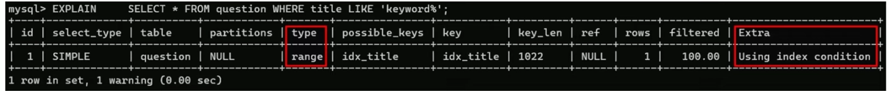
- ‘keyword’로 끝나거나 포함하는 title을 검색할경우 → 정렬된 인덱스를 활용할 수 없어 인덱스 사용 불가
    

    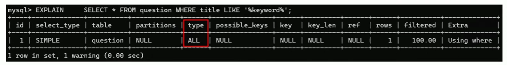
    
- 즉 접두어 검색이 아닐경우 인덱스를 사용할 수 없는 경우가 발생하여 Full Table Scan을 수행한다 → 성능저하 발생

> **문제점 2. 정확성**
> 
- ‘전문검색’으로 검색 쿼리 실행결과
    
    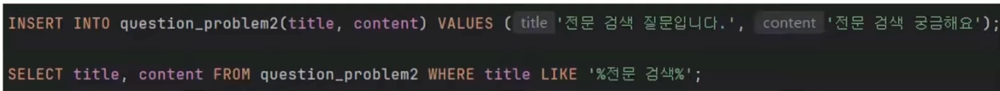
    
    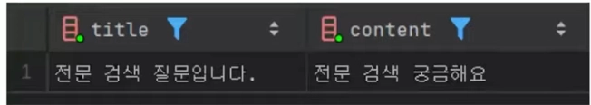
    
- ‘전문 검색’으로 검색 쿼리 실행결과
    
    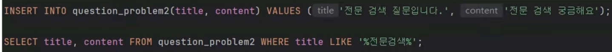
    
    - 결과 없음 - ‘전문 검색’이 존재하지만 완전일치하지 않기 때문

### 전문 검색 기능(Full Text Search)

- 텍스트 본문의 내용을 단어와 의미를 기반으로 빠르고 관련성 높게 찾아주는 기능
- 두가지 분석기법 존재
    1. 형태소/어근 분석
        - 단어의 변형을 명사 또는 어근으로 변환해 분석
        - ‘달리다’, ’달리고’ → ‘달리다’(어간)
        - 검색 정확도가 높지만 언어별 분석기 설정이 필요함
    2. N-gram 분석
        - 글자수 단위로 텍스트를 분해해 분석
        - ‘안녕하세요’ → ‘안녕’, ‘녕하’, ‘하세’
        - 모든 언어에 범용적으로 적용 가능하나 의미없는 토큰이 생성될 수 있음

한국어 환경에 유연하고 별도설정없이 적용 가능한 N-gram에 대해 더 알아보자.

### N-gram 분해의 2단계

1. 공백을 기준으로 분해
    - “전문적으로 검색하는 기능” → “전문적으로”, “검색하는”, “기능”
2. N을 기준으로 분해
    - “전문”, “문적”, “적으”, “으로” ..

### N-gram 저장 : 역인덱스 구조

- 역인덱스
    - 텍스트를 토큰단위로 분해하여 각 토큰이 어느문서에 포함되는지 빠르게 검색하는 데이터구조
    - 즉 레코드가 다음과 같이 존재할경우,
        
        
        | id | content |
        | --- | --- |
        | 1 | 개발자 |
        | 2 | 개발 |
    - 역인덱스 테이블이 다음과같이 생성
        
        ```sql
        "개발" → [1,2]
        "발자" → [1]
        ```
        

### 전문검색 기능을 지원하는 엔진

1. MySQL 버전 5.7.6 이상
2. 스토리지 엔진 : InnoDB, MyISAM
3. 데이터 타입 : CHAR, VARCHAR, TEXT 등 “문자형 필드”

### FullText Index 생성 및 사용법

- 생성

```sql
SET GLOBAL ngram_token_size = 3;
```

```sql
CREATE TABLE question(
	id BIGINT PRIMARY KEY AUTO_INCREMENT,
	title VATCHAR(255) NOT NULL,
	content TEXT NOT NULL,
	**FULLTEXT INDEX idx_title(title) WITH PARSER ngram**
	) ENGINE=InnoDB
	DEFAULT CHARSET=utf8mb4
	COLLATE=utf8mb4_unicode_ci;
```

- 사용하기 위한 문법 - 다음을 사용해야 FULLTEXT INDEX 적용

```sql
SELECT *
FROM TABLE
WHERE MATCH(열 이름)
			AGAINST('키워드', {검색모드});
```

### LIKE vs MATCH..AGAINST 성능비교

- 전제조건
    - 데이터 row 수 : 100만건
    - 검색 대상 keyword : ‘스프링’(14만건), ‘컴퓨터’(0건)
    - 최초 실행 결과를 제외하 5회 실행시간 평균

- **스프링**을 검색했을때
    
    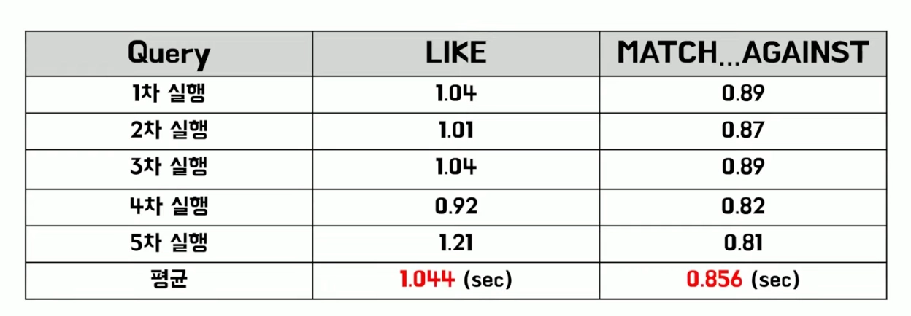
    
    - LIKE 대비 약 18%의 성능향상

- **컴퓨터**를 검색했을때
    

    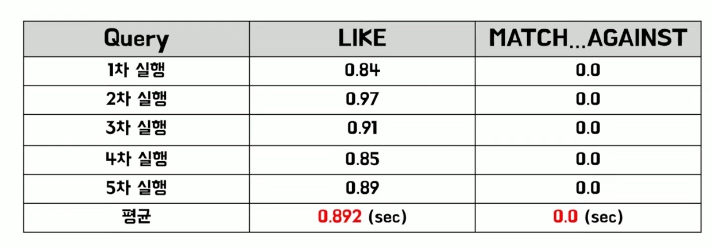
    
    - 존재하지 않는 키워드 기준, 더큰 차이 발생

### 전문 검색 기능 모드

> **자연어 모드(Natural Language Mode)**
> 
- 관련성 점수를 기반으로 검색하는 모드
    - 관련성 점수 = 문서와 검색어간 연관도를 나타내는 점수
    - 이 문서에 토큰이 자주 나올수록, 그 토큰이 전체에서 희귀할수록 관련성 점수가 높아진다.
- 관련성 점수 계산 예시
    

    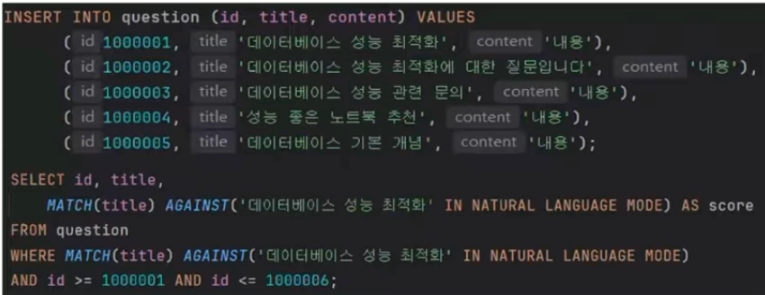
    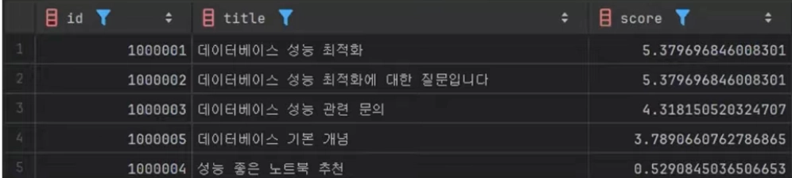
    
    - ORDER BY 절이 없어도 관련성 점수가 높은 순서로 자동 정렬된다.

> **불린모드(Boolean Mode)**
> 
- 논리연산자를 사용하여 조건기반으로 검색하는 모드
- 대표적 논리연산자 종류
    - `+` : 반드시 포함한다(AND)
    - `-` : 제외한다(NOT)
    - 이외에도 `<` `>`  등 논리연산자 존재
- 논리연산자 활용 예시
    - + 연산자 활용
        

        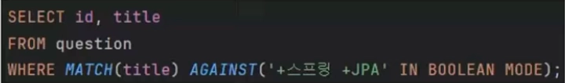
        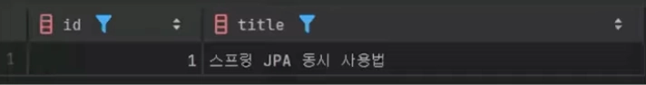
        
        - 스프링과 JPA가 모두 포함된 단어만 검색됨
    - - 연산자 활용

        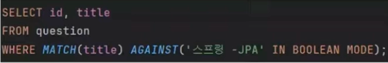
        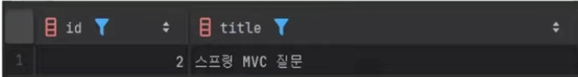
        
        - 스프링은 포함하고 JPA는 포함되지 않은 단어만 검색됨

### 주의사항 및 한계점
> **검색어 제한이 ngram 길의에 의존**
> 
- ngram_token_size보다 짧은 검색어는 검색불가
- 예를들어 3-gram으로 생성한경우
    - 2글자 검색 → 토큰생성불가 → 결과 0건
- 따라서 token_size 선택 시 서비스 검색 패턴을 반드시 고려해야 함

> **비 실시간성 index 갱신**
> 
- 트랜잭션 commit 이전에는 full-text index가 갱신되지 않음
    - LIKE문에서는 트랜잭션 커밋 이전에도 조회가 가능하다.
    - MATCH..AGAINST문에서는 커밋이전엔 조회결과가 없음.

> **많은 토큰 생성**
> 
- Ngram 방식은 텍스트를 기계적 분해 하므로 짧은 텍스트에서도 많은수의 토큰이 생성됨
- 토큰의 양이 많아져 인덱스의 쓰기작업에 부하를 줄 수 있음
- 100만건의 데이터를 인덱싱한 결과, 728만건의 토큰 생성

    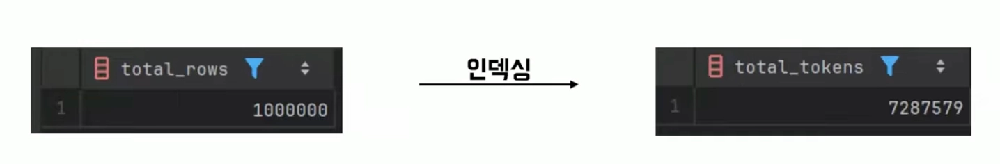
    

### 정리

- LIKE는 성능과 정확도면에서 한계가 있다.
- MySQL의 전문검색기능은 토큰기반 역인덱스를 활용하여 키워드 존재여부를 확인한다
- 비실시간 갱신, 쓰기부하 등 특성을 이해하고 현재상황에 적합한지 판단이 필요하다