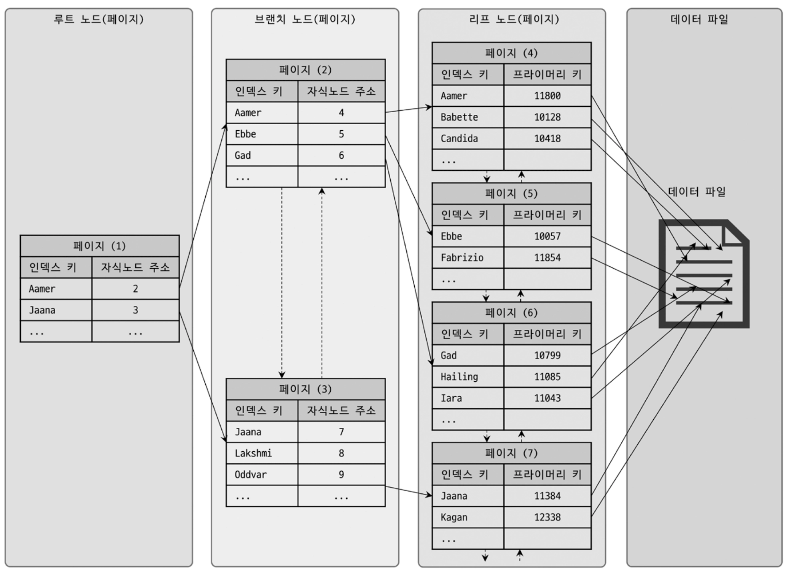
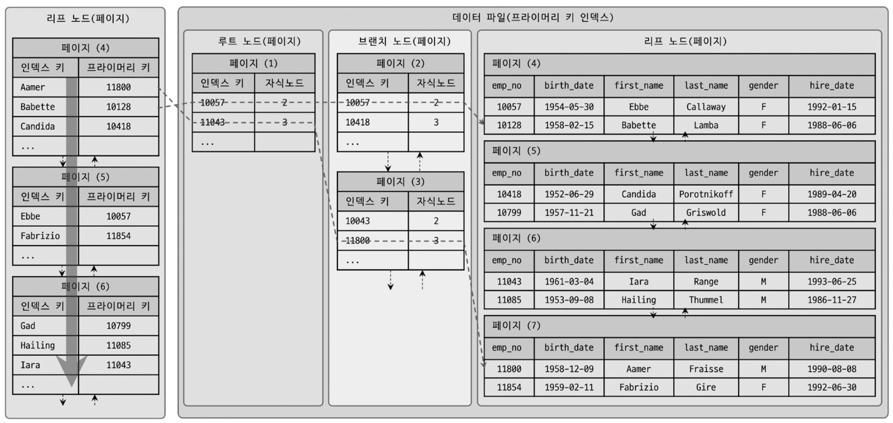
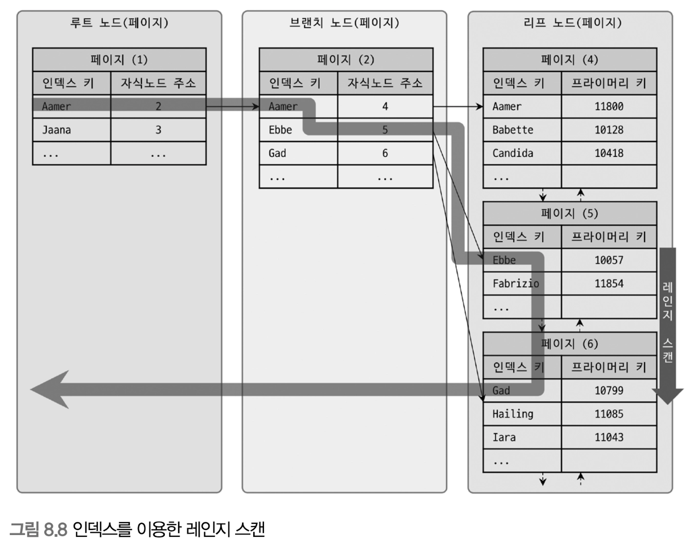
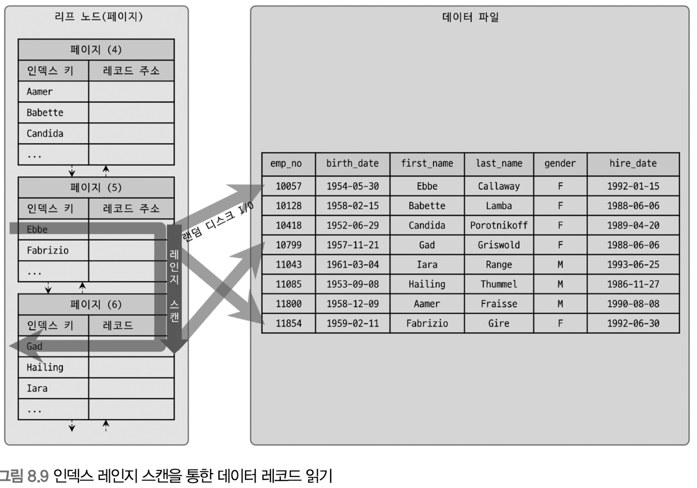
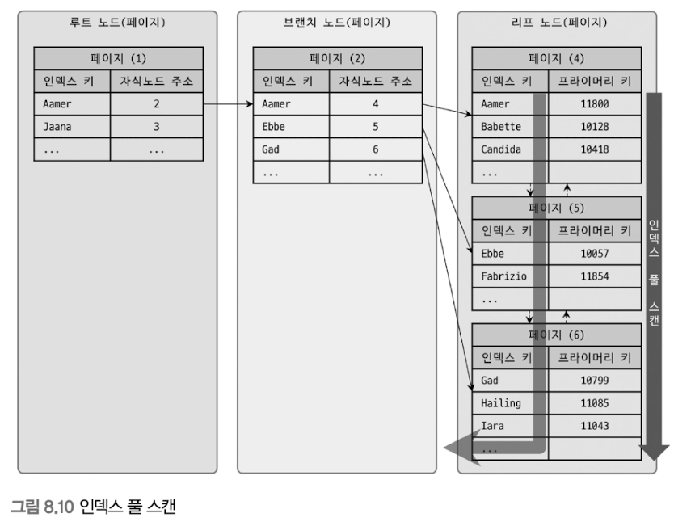
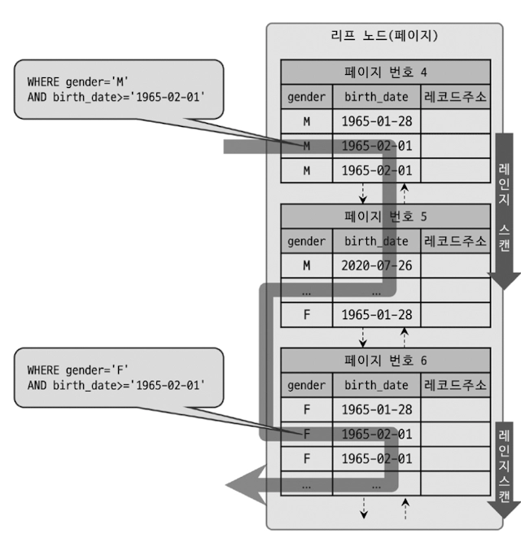
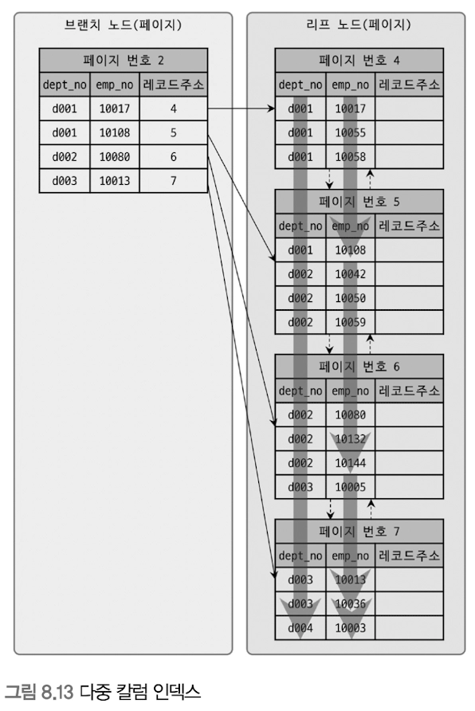

# [RealMySQL] 8.인덱스
MySQL에서 사용가능한 인덱스의 종류 및 특성을 살펴보자.

## 8.1 디스크 읽기 방식

- 랜덤I/O, 순차I/O와 같은 디스크 읽기 방식을 먼저 간단히 알아보고 인덱스를 살펴보자.
- 데이터베이스의 성능 튜닝은 어떻게 디스크I/O를 줄이느냐가 관건이다.

> **8.1.1 HDD와 SSD**

CPU나 메모리 등 주요장치는 전자식 장치지만 HDD는 기계식 장치다. 그래서 DB에선 디스크장치가 병목이된다. 이를 대체하기 위해 전자식 저장매체인 SSD가 많이 출시되고 있다. 훨씬 빠르다. DBMS용 서버에는 대부분 SSD를 채택하고 있다.

> **8.1.2 랜덤 I/O와 순차 I/O**
- 랜덤I/O와 순차I/O는 HDD의 플래터(원판)을 돌려서 읽어야할 데이터가 저장된 위치로 디스크 헤더를 이동시킨 다음 데이터를 읽는다.
- 차이점은 데이터 저장위치와 헤더 이동횟수에 있다.
    - 순차I/O는 데이터가 연속된 위치에 있어 헤더이동이 한번만 발생하며, 이후엔 회전하며 연속적으로 읽는다. → 빠르다!
    - 랜덤I/O는 데이터가 흩어져있어 데이터를 읽을때마다 헤더이동이 반복적으로 발생한다. → 느리다!

## 8.2 인덱스란?

- 원하는 데이터를 찾기위해 DB테이블을 풀스캔하면 시간이 오래걸릴것이다. 따라서 컬럼값과 해당 레코드가 저장돈 주소를 KeyValue쌍으로 삼아 인덱스를 만든다. 또한 인덱스안에서도 최대한 빠르게 찾을 수 있도록 컬럼값을 정렬해서 보관한다.
- **인덱스의 특징**
    - 인덱스는 자료구조의 SortedList와 마찬가지로 동작한다. 이 자료구조는 데이터가 저장될때마다 항상 값을 정렬해야하므로 저장과정이 복잡하고 느리지만, 이미 정렬되어있어 원하는 값을 빨리 찾아온다. 따라서 DBMS의 인덱스의 경우에도 인덱스가 많은 테이블은 INSERT, UPDATE, DELETE가 느려지지만 SELECT는 빠르게 처리한다.
    - 따라서 DBMS에서 인덱스란 데이터의 쓰기성능을 희생하고 데이터 읽기속도를 높이는 기능이다. 인덱스의 추가여부 결정은 쓰기속도를 어디까지 희생할지, 읽기속도를 얼마나 더 빠르게 만들어야 하는지에 따라 결정해야한다.
- **인덱스의 종류**
    - PK - 레코드를 대표하는 컬럼으로 만들어짐, Null비허용, 중복 비허용
    - Secondary Index - PK 제외한 나머지 인덱스
    - 알고리즘 별로 구분할 경우
        - B-tree 인덱스 - 가장 일반적 인덱스 알고리즘으로 컬럼값 변형 없이 인덱싱
        - Hash 인덱스 - 컬럼값으로 해시값 계산해 인덱싱하여 빠른 검색 지원하나, 결국 값을 변형해 인덱싱하므로 전방일치나 범위검색시에 사용 불가
        - 이외에 Fractal-Tree인덱스나 로그기반의 Merge-Tree인덱스 기반의 DBMS도 있다.
    - 중복허용 여부로 분류할 경우
        - Unique 인덱스
        - Non-Unique 인덱스
    - 기능별로 분류할 경우
        - 전문검색용 인덱스
        - 공간검색용 인덱스

## 8.3 B-Tree 인덱스

- B-Tree(Balanced Tree)는 DB 인덱싱 알고리즘중 가장 일반적으로 사용되고 가장 먼저 도입된 알고리즘
- 칼럼값을 변형시키지 않고 인덱스 구조체 내에서 정렬된 상태로 유지한다.

> **8.3.1 구조 및 특성**

- B-Tree 구조
    - 트리구조의 최상위에 하나의 루트노드가 있고 중간에 브랜치노드, 최하위에 자식노드가 붙어있는 형태
    - 인덱스와 실제데이터는 따로 관리되는데, 인덱스의 리프노드는 항상 실제 데이터 레코드를 찾아가기 위한 주솟값을 가진다.
- 인덱스의 키값은 정렬되어있나 데이터파일의 레코드는 임의의순서로 저장되어있다.
    
    
    
    - 위 그림은 MyISAM테이블의 인덱스와 데이터파일관계이다.
    - MyISAM테이블은 보조인덱스가 물리적 주소를 가지는데, InnoDB테이블은 PK를 주소처럼 사용해 논리적 주소만 가진다.
    - 데이터 파일의 레코드는 꼭 INSERT순이 아니다(삭제시 거길 먼저 채우므로)
    - InnoDB에서 레코드는 기본적으로 PK순으로 정렬되어 저장된다
    - 인덱스는 테이블의 키 컬럼만 가지고 있으므로 나머지 컬럼을 읽으려면 데이터파일에서 해당 레코드를 찾아야한다. 이를 위해 인덱스 리프노드는 데이터파일에 저장된 레코드 주소를 가진다.
- InnoDB에서 인덱스를 통해 레코드를 읽을때는 위 그림처럼 데이터파일로 찾아가지 못한다.
    
    
    
    - 인덱스에 저장된 PK값을 이용해 PK 키 인덱스를 한번더 검색한 후 PK 키 인덱스의 리프페이지에 저장된 레코드를 읽는다.
    - 즉 InnoDB의 스토리지 엔진에서는 모든 보조 인덱스 검색에서 데이터 레코드를 읽기위해선 반드시 PK를 저장하고있는 B-Tree를 다시한번 검색해야한다.

> **8.3.2 B-Tree 인덱스 키 추가 및 삭제**
- **인덱스 키 추가**
    - 새로운 키값이 B-Tree에 저장될때 테이블 스토리지 엔진에 따라 새로운 키값이 즉시 인덱스에 저장될수도 있고 그렇지 않을수도있다.
    - B-Tree의 경우
        - 저장될 키 값을 이용해 B-Tree상의 적절한 위치를 검색해야한다.
        - 저장될 위치가 결정되면 레코드의 키값과 대상 레코드의 주소정보를 B-Tree 리프노드에 저장한다.
        - 리프노드가 꽉차서 저장할수없으면 리프노드가 분리되어야 하는데, 이는 상위브랜치 노드까지 처리범위가 넓어진다.
        - 따라서 B-Tree는 상대적으로 쓰기작업에 비용이 더 많이든다.
    - MyISAM이나 MEMORY 스토리지 엔진을 쓸땐 INSERT시 즉시 새로운 키값을 인덱스에 반영한다. InnoDB 스토리지 엔진은 이 작업을 더 지능적으로 처리하는데, 필요하다면 인덱스 키 추가 작업을 지연시켜 나중에 처리한다. 다만 PK나 유니크인덱스는 중복체크가 필요하므로 즉시 B-Tree에 추가/삭제한다.

- **인덱스 키 삭제**
    - 해당 키값이 저장된 B-Tree의 리프노드를 찾아 삭제마크하면 작업 끝
    - 삭제마킹된 인덱스 키 공간은 계속 그대로 방치하거나 재활용
    - InnoDB에서는 이 마킹작업또한 버퍼링되어 지연처리가 가능하다(MyISAM이나 MEMORY는 체인지버퍼같은 기능없으므로 키삭제완료후 쿼리완료)

- **인덱스 키 변경**
    - 인덱스 키값은 그 값에 따라 저장될 리프노드 위치가 결정되므로 인덱스상 키 값만 변경하는것은 불가능
    - 키 값변경은 키값 삭제후 새로운 키값을 추가하는 형태로 처리된다. 즉, 앞의 인덱스 키 삭제 + 추가 작업이 실행된다.
    - InnoDB 사용중이라면 체인지 버퍼를 이용해 지연처리 가능하다.

- **인덱스 키 검색**
    - 빠른 검색을 위해 쓰기 성능을 감수하면서 인덱스를 구축했다.
    - 인덱스 검색은 B-Tree 루트부터 브랜치를 거쳐 최종리프노드까지 이동하며 비교작업을 수행하며, 이를 ‘트리탐색’ 이라고 한다.
    - UPDATE나 DELETE처리를 위해 해당 레코드를 먼저 검색할 경우에도 사용된다.
    - B-Tree인덱스를 이용한 검색은 100% 일치 또는 값의 앞부분이 일치하는 경우, 부등호를 이용한 비교조건에서만 사용할수있다.
    - InnoDB 테이블에서 지원하는 레코드 잠금과 넥스트키락이 검색을 수행한 인덱스를 잠근 후 테이블 레코드를 잠그는 방식으로 구현되어있다. 따라서 UPDATE나 DELETE문이 실행될때 테이블에서 적절히 사용할수있는 인덱스가 없으면 불필요하게 많은 레코드를 잠근다.

> **8.3.3 B-Tree 인덱스 사용에 영향을 미치는 요소**
- B-tree 인덱스는 인덱스를 구성하는 칼럼의 크기와 레코드 건수, 유니크한 인덱스 키 값 갯수에 의해 검색이나 변경작업 성능이 영향받는다.

- **인덱스 키 값의 크기**
    - InnoDB 스토리지 엔진은 디스크에 데이터를 저장하는 가장 기본단위를 Page나 Block이라고 하며, 디스크의 모든 읽기 및 쓰기작업의 최소단위가 된다.
    - 페이지는 InnoDB스토리지 엔진의 버퍼 풀에서 데이터를 버퍼링하는 기본단위이다. 인덱스도 결국 페이지단위로 관리되며, 앞서 루트와 브랜치, 그리고 리프노드를 구분한 기준이 바로 페이지 단위이다.
    - B-Tree는 자식노드 갯수가 가변적 구조이다. 갯수는 인덱스의 페이지크기와 키값의 크기에 따라 결정된다.

- **B-Tree 깊이**
    - B-Tree의 깊이는 중요하지만 제어할 방법은 없다.
    - 인덱스 키값의 크기가 커지면 커질수록 하나의 인덱스 페이지가 담을 수 있는 인덱스 키값의 갯수가 적어지고, 그때문에 같은 레코드건수라 하더라도 B-Tree 깊이가 깊어져 디스크 읽기가 더 많이 필요하다.
    - 따라서 인덱스 키값의 크기는 가능한 작게 만드는것이 좋다.

- **선택도(기수성)**
    - 모든 인덱스 키 값 가운데 유니크한 값의 수를 의미한다.
    - 중복된 값이 많아질수록 선택도는 떨어지며, 선택도가 높을수록 검색대상이 적어 빠르게 처리된다.
    - 아래 쿼리에 대해 똑같은결과를 받지만 쿼리가 처리되기 위해 MySQL서버가 수행한 작업내용은 효율성 차이가 큼을 알 수 있다.
        
        ```sql
        -- 전체레코드는 1만건
        SELECT *
        FROM test
        WHERE country='KOREA' AND city='SEOUL';
        ```
        
        - country 컬럼의 유니크값이 10개일때
            - KOREA로 거르면 1000건(1만건/10)이 일치할것이며, 그중 SEOUL은 1건이므로 999건은 불필요하게 읽은것
        - country 컬럼의 유니크값이 1000개일때
            - KOREA로 거르면 10개(10000/10)이 일치할것이며 그중 SEOUL은 1건이므로 9건만 불필요하게 읽은것

> **8.3.4 B-Tree 인덱스를 통한 데이터 읽기**
- 어떤 경우에 인덱스를 사용할지는 MySQL이 어떻게 인덱스를 이용해서 레코드를 읽는지 알아야한다. 세가지 방법이 있다.

- **인덱스 레인지 스캔**
    - 검색할 범위가 결정되었을때 사용한다.
    - 가장 대표적 접근방식으로, 나머지에비해 빠르다.
    
    ```sql
    SELECT * FROM employees WHERE first_name BETWEEN 'Ebbe' AND 'Gad'
    ```
    
    
    
    - 루트노드에서 비교를 시작해 브랜치 노드를 거치고 최종적으로 리프노드까지 들어가야만 필요한 레코드의 시작점을 찾을 수 있다.
    - 시작할 위치를 찾으면 그다음부터는 리프노드의 레코드만 순서대로 읽으면 된다. 스캔하다가 리프노드의 끝까지 읽으면 리프노드간 링크를 이용해 다음 리프노드를 찾아 다시 스캔한다.
    - 위 그림은 실제 인덱스만 읽는 경우를 보여주는데, B-Tree 인덱스의 리프노드를 스캔하면서 실제 데이터 파일의 레코드를 읽는경우는 다음과같다.
        
        
        
    - 인덱스의 리프노드에서 검색조건에 일치하는 건들은 데이터파일에서 레코드를 읽어오는 과정이 필요하다. 레코드 한건단위로 랜덤 I/O가 한번씩 일어난다.
    - 따라서 인덱스를 통해 데이터 레코드를 읽는 작업은 비용이 많이 드는 작업이다.
    - 정리하자면
        1. 인덱스에서 조건을 만족하는 값이 저장된 위치를 찾는다(인덱스 탐색)
        2. 1번에서 탐색된 위치부터 필요한만큼 인덱스를 차례로 읽는다(인덱스 스캔)
        3. 2번에서 읽어들인 인덱스 키와 레코드 주소를 이용해 레코드가 저장된 페이지를 가져오고 최종 레코드를 읽어온다.
    - 3번이 필요없는, 즉 레코드에 접근하지 않아도 충분한 인덱스를 커버링인덱스라고 한다.

- **인덱스 풀 스캔**
    - 인덱스의 처음부터 끝까지 읽는 방식이다
    - 쿼리의 초건절에 사용된 칼럼이 첫번째 컬럼이 아닌 경우 인덱스 풀스캔을 사용한다.
    
    
    
    - 인덱스 리프노드의 제일 앞으로 이동한 뒤 인덱스의 리프노드를 연결하는 LinkedList를 따라 처음부터 끝까지 스캔하는 방식이다.
    - 인덱스 레인지 스캔보단 느리지만 테이블 풀스캔보단 효율적이다

- **루스 인덱스 스캔**
    - 오라클의 인덱스 스킵 스캔과 비슷한 개념으로, 듬성듬성하게 인덱스를 읽는다
    - 인덱스 레인지 스캔과 비슷하게 작동하지만 중간에 필요없는 인덱스 키값은 스킵하고 다음으로 넘어가는 형태
    - 예를들어 그룹화한뒤 그 그룹의 MIN(특정컬럼)을 가진 row만 select하는 경우, 각 그룹의 MIN(특정컬럼) row를 구한뒤 해당 그룹의 다른 row는 스캔하지 않는다.(특정컬럼이 정렬되어있을경우임)
    - GROUP BY나 MAX(), MIN()함수 최적화할때 사용한다.

- **인덱스 스킵 스캔**
    - gender와 birth_date를 사용해 만든 복합 인덱스를 타기 위해선 gender컬럼에대한 비교조건이 필수였다.
    
    ```sql
    // 인덱스를 사용하지 못하는 쿼리
    SELECT * FROM employees WHERE birth_date >= '1965-02-01';
    
    // 인덱스를 사용할 수 있는 쿼리
    SELECT * FROM employees WHERE gender = 'M' AND birth_date >= '1965-02-01';
    ```
    
    - 하지만 MySQL8.0부터 도입된 인덱스 스킵 스캔기능으로 gender컬럼을 건너뛰고 birth_date만으로도 인덱스 검색이 가능하게 되었다.
    
    
    
    - 동작과정은 위와같은데, gender컬럼은 M과 F값만 가지므로 아래와 같이 변형된 쿼리를 이용해 탐색하도록 옵티마이저가 최적화한다
        
        ```sql
        SELECT gender, birth_date FROM employees WHERE gender = 'M' AND birth_date >= '1965-02-01';
        SELECT gender, birth_date FROM employees WHERE gender = 'F' AND birth_date >= '1965-02-01';
        ```
        
    - 다만 단점도 있는데
        - WHERE절에 조건이 없는 인덱스의 선행컬럼의 유니크값 갯수가 적어야함
            - 즉 gender가 아니라 유니크값이 많은 컬럼이였다면 비효율적
        - 쿼리가 인덱스에 존재하는 컬럼만으로 처리가능해야함(커버링인덱스)
            - 즉 select절에 인덱스에 포함된 컬럼 뿐만 아니라 다른 컬럼(name 등)을 포함한다면 인덱스를 타지않고 테이블 풀스캔이 일어난다.

> **8.3.5 다중컬럼인덱스**
- 두개이상의 컬럼으로 구성된 인덱스(=복합컬럼인덱스)
    
    
    
- 편의상 루트노드는 생략되었다. 레코드건수가 적은경우 브랜치노드가 없는 경우는 존재할수있다.
- 인덱스의 두번째 컬럼은 첫번째 컬럼에 의존해서 정렬된다. 두번째 컬럼의 정렬은 첫번째 컬럼이 똑같은 레코드에서만 의미있다.
- 따라서 emp_no값의 정렬순서가 빠르더라도 dept_no컬럼의 정렬순서가 늦다면 인덱스의 뒷쪽에 위치한다.

> **8.3.6 B-Tree 인덱스의 정렬 및 스캔 방향**
- 인덱스 생성시 설정한 정렬 규칙에 따라 인덱스 키값은 항상 오름차순/내림차순
- 하지만 정렬된 방향에 따라 항상 인덱스를 읽는것은 아님. 인덱스를 읽는 방향은 쿼리에 따라 옵티마이저가 실시간으로 만드는 실행계획에 따라 결정
- **인덱스의 정렬**
    - MySQL 8.0부터는 다음과같은 형태의 정렬순서를 혼합한 인덱스도 생성이 가능해졌다.
    
    ```sql
    CREATE INDEX ix_teamname_userscore ON employees (team_name ASC, user_score DESC);
    ```
    
- **인덱스 스캔 방향**
    - first_name 컬럼에 대한 인덱스가 포함된 employees 테이블에 대해
    
    ```sql
    SELECT *
    FROM employees
    ORDER BY first_name DESC
    LIMIT 1;
    ```
    
    - 인덱스는 오름차순 정렬되어있지만 인덱스를 최솟값부터 읽으면 오름차순으로 값을 가져올 수 있고 최댓값부터 거꾸로 읽으면 내림차순으로 가져올 수 있음을 옵티마이저가 알고있다.
    - 따라서 위 쿼리는 인덱스를 역순으로 접근해 첫번째 레코드만 읽어온다.
    - 즉, 인덱스 생성 시점에 오름차순 또는 내림차순으로 정렬이 결정되지만 쿼리가 그 인덱스를 사용하는 시점에 인덱스를 읽는 방향에 따라 오름차순/내림차순 정렬효과를 얻을 수 있다.
- **내림차순 인덱스**
    - MySQL서버에서 정렬된 값을 조회할때 인덱스가 실제로 오름차순인지 내림차순인지 관계없이 읽는 순서만 변경해 해결할 수 있다.
    - 물론 복합인덱스에서 정렬조건이 혼합된 경우엔 내림차순 인덱스를 직접 사용해야 효과를 얻을 수 있다. 하지만 단일인덱스의 경우 역순으로 정렬하는 요건만 있을때 오름차순인덱스만 사용할지 내림차순 인덱스만 사용할지 고민이 들것이다.
        - 이때 역순으로 정렬되는 요건이 대부분이라면 내림차순 인덱스를 사용하는게 효율적이다. InnoDB스토리지 엔진이 Forward index scan에 적합한 구조이기 때문이고, 페이지 인덱스 레코드는 단방향으로 연결된 구조이기 때문이기도 하다.

> **8.3.7 B-Tree 인덱스의 가용성과 효율성**
- 쿼리의 WEHRE조건이나 GROUP BY, 또는 ORDER BY절이 어떤 경우에 인덱스를 사용할 수 있고 어떤방식으로 사용할 수 있는지 식별할 수 있어야 한다.

- **비교조건의 종류와 효율성**
    - 다중컬럼인덱스에서 각 컬럼의 순서와 그 컬럼에 사용된 조건이 동등비교 또는 범위 조건인지에 따라 각 인덱스 컬럼의 활용 형태가 달라지며 그 효율또한 달라진다.
    
    ```sql
    select * from dept_emp 
    where dept_no='d002' and emp_no >= 10114
    ```
    
    - 위 쿼리를 위해 각각 컬럼 순서만 다른 인덱스를 생성했다고 가정하자.
        - case 1 : INDEX(dept_no, emp_no)
        - case 2 : INDEX(emp_no, dept_no)
    - 1번은 dept_no=d002, emp_no=10114인 레코드를 찾고 그 이후 레코드가 dept_no=d002가 아닐때까지 쭉 읽는다. 읽은 레코드가 모두 사용자가 원하는 레코드임을 알 수 있다.
    - 2번은 dept_no=d002, emp_no=10114인 레코드를 찾고 그 이후 모든 레코드에 대해 dept_no가 d002인지 비교하는 과정을 거쳐야한다.
    - 이때 1번조건을 작업범위결정조건 이라고 하고, 2번조건을 필터링조건 이라고 한다. 전자는 많을수록 쿼리성능을 높이지만 후자는 떨어트린다.

- **인덱스의 가용성**
    - B-Tree인덱스의 특징은 왼쪽값에 기준해 오른쪽값이 정렬되어있다는것이다. 이는 다중컬럼인덱스 또한 마찬가지이다.
    - index(name)인 상태에서
        - `select * from test where name like %mer` 의 경우 값의 왼쪽부분이 없어 인덱스 사용불가
    - index(dept_no, emp_no)인 상태에서
        - `select * from test where emp_no≥4885` 의 경우 첫인덱스 기준 정렬되어있기에 인덱스 사용 불가

- **가용성과 효율성 판단**
    - B-Tree 인덱스 특성상 다음 조건은 사용할 수 없다.
    - 여기서 사용할 수 없다는것은 범위결정조건으로 사용할 수 없다는것을 의미하며, 경우에 따라 체크조건으로 인덱스를 사용할수는 있다.
        - NOT-EQUAL로 비교된 경우
            - WHERE column <> 'N'
            - WHERE column NOT IN (10, 11, 12)
            - WHERE column IS NOT NULL
        - LIKE '%??'
            - WHERE column like '%glen'
            - WHERE column like '_glen'
            - WHERE column like '%glen%'
        - 스토어드 함수 또는 인덱스 컬럼이 비교된 경우
            - WHERE SUBSTRING(column, 1, 1) = 'X'
            - WHERE DAYOFMONTH(column) = 1
        - NOT-DETERMINSTIC 속성의 스토어드 함수가 비교 조건에 사용된 경우
            - WHERE column = deterministic_function()
        - 데이터 타입이 서로 다른 비교
            - WHERE char_column = 10
        - 문자열 데이터 타입의 콜레이션이 다른 경우
            - WHERE utf8_bin_char_column = euckr_bin_char_column
    - MySQL은 Null값도 인덱스에 저장된다. 다음과 같은 조건도 작업범위 결정 조건으로 인덱스를 사용한다
        - `WHERE column IS NULL`
    - 다중컬럼으로 만들어진인덱스는 어떤 조건에서 사용될수있고 어떤경우는 절대사용할수없다
        - `index (col_1, col_2, col_3 ... col_n)`
            - 작업 범위 결정 조건으로 사용할 수 있는 경우
                - 각 컬럼에 대해 동등 비교 형태(`=` , `IN`)
                - 두 번째 컬럼에 대해 다음 연산자 중 하나로 비교
                    - 동등 비교(`=` , `IN`)
                    - 크다 작다 형태 (`>` , `<`)
                    - LIKE로 좌측 일치 패턴 (LIKE 'glen%')
            - 작업 범위 결정 조건으로 사용할 수 없는 경우
                - 첫 컬럼에 대한 조건이 없는 경우
                - 첫 컬럼의 비교 조건이 위에서 나온 사용 불가 조건 중 하나인 경우

## **8.5 전문 검색 인덱스**

- 지금까지 살펴본 인덱스는 크지않은 데이터 또는 이미 키워드한 작은값에 대한 인덱싱
- 문사의 전체내용을 인덱스화해 특정 키워드가 포함된 문서를 검색하는 전문검색에는 InnoDB나 MyISAM스토리지 엔진에서 제공하는 일반적 용도의 B-Tree 인덱스를 사용할수 없다.

> **8.5.1 인덱스 알고리즘**
- 전문검색에서는 문서 본문내용에서 사용자가 검색하게될 키워드를 분석해내고 빠른 검색용으로 사용할 수 있게 이러한 키워드로 인덱스를 구축한다.
- 문서의 키워드를 인덱싱하는 기법에따라 두가지로 구분한다
    - 어근분석알고리즘
    - N-gram 알고리즘

- **어근 분석 알고리즘**
    - MySQL서버 전문 검색인덱스는 다음과같은 두가지 중요과정을 거쳐 색인한다.
    - 불용어처리
        - 검색에서 가치가 없는 단어를 모두 필터링해 제거
        - 불용어 갯수가 많지 않으므로 모두 상수로 정의해 사용하는 경우가 많다
        - 불용어 자체를 DB화해서 사용자가 추가, 삭제할수있게 구현하는 경우도있다.
    - 어근분석
        - 검색어로 선정된 단어의 뿌리인 원형을 찾는다
        - 오픈소스 형태소 분석 라이브러리인 MeCab을 플러그인 형태로 지원한다
        - 한글이나 일본어의 경우 어근분석보다는 문장의 형태소를 분석해서 명사와 조사를 구분하는 기능이 더 중요하다
- **n-gram 알고리즘**
    - 전문적 검색엔진을 고려하는것이 아니라면 MeCab을 범용적으로 적용하기 쉽지않다. 이를 보완하기 위한것이 N-gram 알고리즘이다.
    - 본문을 무조건 몇글자씩 잘라서 인덱싱하는 방법이다.
    - 형태소 분석에 비해 알고리즘이 단순하고 국가별 언어에 대한 이해와 준비작업이 필요없지만 만들어진 인덱스 크기가 상당히 큰편이다
    - n-gram의 n은 인덱싱할 키워드의 최소글자수를 의미하는데, 일반적으로 2글자를 쪼개는 2-gram방식이 사용된다.
    
    ```sql
    To be or not to be. That is the question
    ```
    
    - 각 단어는 띄워쓰기와 마침표 기준으로 10개 단어로 구분되고, 2글자씩 중첩해서 토큰으로 분리된다. 그리고 구분된 토큰을 인덱스에 저장한다.
    - 중복된 토큰은 하나의 인덱스 엔트리로 병합되어 저장된다.
    - 이렇게 생성된 토큰에 대해 불용어를 걸러내는 작업을 수행하는데, 불용어와 동일하거나 불용어를 포함하는 경우 걸러서 버린다.
    - MySQL의 내장불용어는 information_schema.innodb_ft_default_stopword 테이블에서 확인가능

- **불용어 변경 및 삭제**
    - 앞서 살펴본 불용어 처리는 사용자에 도움이 되기보다 더 혼란스럽게 하는 기능이 될 수 있다. 따라서 불용어 자체를 완전히 무시하거나 직접 등록할수있다.
    - 전문검색인덱스의 불용어 처리 무시
        1. 스토리지 엔진에 관계없이 모든 전문검색인덱스에 대해 불용어 완전제거
            - my.cnf의 ft_stopword_file 시스템 변수에 빈 문자열 설정
        2. InnoDB 스토리지 엔진의 경우 테이블의 전문 검색 인덱스에 대해서만 불용어처리 무시
            - innodb_ft_enable_stopword 시스템 변수를 OFF로 설정
            - 다른 스토리지 엔진을 사용하는 테이블은 여전히 내장 불용내장 불용어 처리를 사용
    - 사용자정의 불용어 사용
        1. 불용어 목록을 파일로 저장하고 ft_stopworld_file설정에 등록
        2. InnoDB스토리지 엔진 전용으로 불용어 목록을 테이블로 저장

> **8.5.2 전문 검색 인덱스의 가용성**
- 전문검색 인덱스를 사용하려면 반드시 두가지 조건을 갖춰야한다
    - 쿼리문장이 전문검색을 위한 문법(MATCH(), AGAINST())을 사용
    - 테이블이 전문검색 대상 칼럼에 대해 전문인덱스 보유
- 테이블에 전문검색인덱스를 생성했다면 다음 쿼리로도 원하는 검색결과 얻을 수 있지만, 풀테이블 스캔으로 처리하게 된다. 꼭 MATCH와 AGAINST를 써야함
    
    ```sql
    // 풀테이블 스캔
    SELECT * FROM tb_test WHERE doc_body LIKE '%애플%';
    SELECT * FROM tb_test
    // 전문검색 인덱스 사용
    WHERE MATCH(doc_body) AGAINST('애플' IN BOOLEAN MODE);
    ```
    

## 8.6 함수 기반 인덱스

- 일반적인 인덱스는 칼럼값 일부 또는 전체에 대해서만 인덱스 생성 허용
- 컬럼값을 변형해서 만들어진 값에 대해 인덱스를 구축하기도 하는데, 함수기반 인덱스를 사용하면 된다
- 구현방법은 두가지이다.
    1. 가상 컬럼을 이용한 인덱스
    2. 함수를 이용한 인덱스
- 함수기반 인덱스는 인덱싱할 값을 계산하는 과정의 차이만 존재할뿐, 실제 인덱스의 내부구조및 유지관리 방법은 B-Tree 인덱스와 동일하다.

> **8.6.1 가상 칼럼을 이용한 인덱스**
- first_name과 last_name을 합쳐서 검색해야하는 요건이 생겼다면 가상칼럼을 추가하고 그 가상칼럼에 인덱스를 생성할 수 있다.
    
    ```sql
    CREATE TABLE user (
    					user_id BIGINT,
    					first_name VARCHAR(10),
    					last_name VARCHAR(10),
    					PRIMARY KEY (user_id)
    				);
    				
    ALTER TABLE user
    				ADD full_name VARCHAR(30) AS (CONCAT(first_name, ' ', last_name)) VIRTUAL
    				ADD INDEX ix_fullname (full_name);
    ```
    
    - 가상칼럼은 VIRTUAL이나 STORED 옵션으로 생성 가능하다.
    - 가상컬럼은 테이블에 새로운 컬럼을 추가하는것과 같은 효과를 내기 때문에 실제 테이블 구조가 변경된다는 단점이있다.

> **8.6.2 함수를 이용한 인덱스**
- 테이블 구조를 변경하지 않고 함수를 직접 사용하는 인덱스를 생성할 수 있다.
    
    ```sql
    CREATE TABLE user (
    					user_id BIGINT,
    					first_name VARCHAR(10),
    					last_name VARCHAR(10),
    					PRIMARY KEY (user_id),
    					INDEX ix_fullname((CONCAT(first_name, ' ', last_name)));
    				);
    ```
    
    - 이경우 테이블 구조를 변경하지 않고 계산된 결괏값의 검색을 빠르게 만든다.
    - 함수기반 인덱스를 제대로 활용하려면 반드시 조건절에 함수기반 인덱스에 명시된 표현식이 그대로 사용돼야 한다. 다를경우 옵티마이저는 다른 표현식으로 간주하여 함수기반 인덱스를 사용하지 못함.
- 가상칼럼과 함수를 직접 이용하는 인덱스는 내부적으로 동일한 구현방법을 사용한다. 따라서 어떤 방법을 쓰더라도 둘의 성능차이는 발생하지 않는다.

## 8.7 멀티 밸류 인덱스

- 전문검색인덱스를 제외한 모든 인덱스는 레코드 1건이 1개의 인덱스 키값을 가진다. 하지만 멀티밸류 인덱스는 하나의 데이터 레코드가 여러개의 키값을 가질 수 있는 형태의 인덱스다.
    
    ```sql
    //신용정보점수를 배열로 JSON타입 컬럼에 저장하는 테이블
    CREATE TABLE user (
    					user_id BIGINT AUTO_INCREMENT PRIMARY KEY,
    					first_name VARCHAR(10),
    					last_name VARCHAR(10),
    					credit_info JSON,
    					INDEX mx_creditscores ( (CAST(credit_info->'$.credit_scores' AS UNSIGNED ARRAY)) )
    				);
    ```
    
    - 멀티밸류 인덱스를 활용하기 위해서는 일반적 조건방식이 아닌 반드시 다음 함수들을 이용해서 검색해야 옵티마이저가 인덱스를 활용한 실행계획을 수립한다.
        - MEMBER OF()
        - JSON_CONTAINS()
        - JSON_OVERLAPS()

## 8.8 클러스터링 인덱스

- 클러스터링이란 여러개를 하나로 묶는다는 의미이다.
- MySQL에서의 클러스터링은 테이블 레코드를 비슷한것(PK기준으로)들끼리 묶어서 저장하는 형태로 구현하는데, 이는 주로 비슷한 값들을 동시에 조회하는 경우가 많다는 점에 착안한다.
- InnoDB스토리지 엔진에서만 지원하며, 다른 스토리지 엔진에서는 지원되지 않는다.

> **8.8.1 클러스터링 인덱스**
- 테이블의 PK에만 적용되는 내용이며, PK값이 비슷한 레코드끼리 묶어서 저장하는것을 클러스터링 인덱스라고 표현한다.
    - PK값에 의해 레코드 저장 위치가 결정된다
    - PK값이 변경된다면 그 레코드의 물리적 저장 위치가 바뀌어야 한다는것을 의미
- 클러스터링 인덱스는 PK값에 의해 레코드의 저장위치가 결정되므로 사실 인덱스 알고리즘이라기보단 테이블 레코드의 저장방식으로 볼수있다.
- InnoDB와 같이 항상 클러스터링 인덱스로 저장되는 테이블은 PK기반의 검색이 매우 빠르며 레코드 저장이나 PK변경이 상태적으로 느리다.


- 위와같이 클러스터링 테이블 구조 자체는 일반 B-Tree와 비슷하지만 세컨더리 인덱스를 위한 B-Tree의 리프노드와는 달리 클러스터링 인덱스의 리프노드에는 레코드의 모든칼럼이 같이 저장되어있다.
- 클러스터링 테이블에서 프라이머리 키를 변경하면 어떻게 될까?
    - emp_no가 10007이던걸 10002로 바꾼다면, 3번페이지의 레코드가 2번페이지로 이동할것이다.
    - PK가 없는 InnoDB테이블은 InnoDB스토리지 엔진이 다음 우선순위대로 PK대체 컬럼을 선택한다.
        1. `PK` 가 있으면 기본적으로 `PK` 를 클러스터링 키로 선택
        2. NOT NULL 옵션의 유니크 인덱스 중에서 첫 번째 인덱스를 클러스터링 키로 선택
        3. 자동으로 유니크한 값을 가지도록 증가되는 칼럼을 내부적으로 추가한 후, 클러스터링 키로 선택
        4. 적절한 클러스터링 키 후보를 찾지 못하는 경우 스토리지 엔진이 내부적으로 레코드의 일련번호 칼럼을 생성한다. 하지만 이는 사용자에게 노출되지 않으며, 쿼리 문장에 명시적으로 사용할 수 없다.
- InnoDB 테이블에서 클러스터링 인덱스는 테이블당 단 하나만 가질 수 있는 엄청난 혜택이므로 가능하다면 PK를 명시적으로 생성하자!
    
    

> **8.8.2 세컨더리 인덱스에 미치는 영향**
- PK가 세컨더리 인덱스에 미치는 영향을 알아보자.
- InnoDB테이블(클러스터링 테이블)의 모든 세컨더리 인덱스는 해당 레코드가 저장된 주소가 아닌 PK값을 저장하도록 구현되어있다.
    
    ```sql
    CREATE TABLE employees (
    					emp_no INT NOT NULL,
    					first_name VARCHAR(10) NOT NULL,
    					PRIMARY KEY (emp_no),
    					INDEX ix_firstname (first_name)
    				);
    				
    SELECT * FROM employees WHERE first_name='Aamer';
    ```
    
    - MyISAM
        - ix_firstname인덱스 검색 → 레코드 주소 확인 → 최종레코드
    - InnoDB
        - ix_firstname인덱스 검색 → 레코드 PK 확인 → PK인덱스 검색 → 최종레코드

> **8.8.3 클러스터링 인덱스의 장점과 단점**
- 클러스터링 되지 않은 일반 PK와 클러스터링 인덱스를 비교했을때 장단점
- 장점
    - PK(클러스터링 키)로 검색할때 처리성능이 빠르다(특히 범위검색에서)
    - 테이블의 모든 세컨더리 인덱스가 PK를 가지고 있기 때문에 인덱스만으로 처리될 수 있는 경우가 많다(커버링인덱스)
- 단점
    - 테이블의 모든 세컨더리 인덱스가 클러스터링 키를 갖기 때문에 클러스터링 키값의 크기가 클 경우 전체적으로 인덱스크기 커짐
    - 세컨더리 인덱스를 통해 검색할때 PK로 다시한번 검색해야하므로 처리성능이 느림
    - INSERT할때 PK에 의해 레코드 저장위치가 결정되므로 처리성능이 느림
    - PK를 변경할때 레코드를 DELETE하고 INSERT해야해서 처리성능이 느림
- 즉 장점은 빠른 READ, 단점은 느린 CUD이다. 일반적으로 웹서비스와같은 온라인 트랜잭션 환겨엥서는 쓰기와 읽기비율이 2:8~1:9이므로 빠른 R이중요함

> **8.8.4 클러스터링 테이블 사용시 주의사항**
- **클러스터링 인덱스의 크기**
    - 모든 세컨더리 인덱스가 프라이머리 키 값을 포함하기에 프라이머리 키의 크기가 커지면 세컨더리 인덱스도 자동으로 크기가 커진다.
    - 인덱스가 커질수록 같은 성능을 내기 위해 그만큼의 메모리가 더 필요해 지므로 InnoDB 테이블의 프라이머리 키는 신중하게 선택해야 한다.

- **PK는 AUTO_INCREMENT보다는 업무적 컬럼으로 생성**
    - PK 로 검색하는 경우 클러스터링되지 않은 테이블에 비해 매우 빠르게 처리될 수 있다.
    - 프라이머리 키는 그 의미 만큼이나 중요한 역할을 하기 때문에 대부분 검색에서 상당히 빈번하게 사용되는 것이 일반적이다. 설력 컬럼의 크기가 크더라도 업무적으로 해당 레코드를 대표할 수 있다면 그 칼럼을 PK로 설정하는 것이 좋다.

- **AUTO_INCREMENT 컬럼을 인조식별자로 사용할 경우**
    - 여러 개의 칼럼이 복합으로 PK 가 만들어지는 경우 PK 의 크기가 길어질 때가 있다.
    - PK의 크기가 길어도 세컨더리 인덱스가 필요하지 않다면 그대로 PK를 사용하는 것이 좋다.
    - 세컨더리 인덱스도 필요하고, PK의 크기도 길다면 AUTO INCREMENT 칼럼을 추가하고, 이를 PK로 설정하면 된다.
    - PK를 대체하기 위해 인위적으로 추가된 PK를 인조식별자(Surrogate key) 라고 한다. 조회보다 INSERT 위주의 테이블은 인조 식별자를 PK로 설정하는것이 성능 향상에 도움이 된다.

## 8.9 유니크 인덱스

- 유니크는 사실 인덱스라기보단 제약조건이다.
- 테이블이나 인덱스에 같은값이 2개이상 저장될 수 없음을 의미하는데, MySQL에서는 인덱스 없이 유니크 제약만 설정할순없다.
- 유니크 인덱스에는 Null도 저장 가능하지만 Null은 특정값이 아니므로 2개이상 저장 가능

> **8.9.1 유니크 인덱스와 세컨더리 인덱스의 비교**
- 유니크인덱스와 유니크하지않은 일반 보조인덱스는 인덱스구조상 아무 차이 X
- **인덱스 읽기**
    - 유니크 인덱스가 빠르다? → X
    - 유니크하지 않은 세컨더리 인덱스는 중복값이 허용되므로 읽어야할 레코드가 많아서 느린것이지 인덱스 자체의 특성때문에 느린것은 아님.
    - 읽어야할 레코드건수가 같다면 성능상 차이는 미미하다.
- **인덱스 쓰기**
    - 새로운 레코드가 INSERT되거나 인덱스 컬럼의 값이 변경되는 경우 인덱스 쓰기작업이 필요하다.
    - 유니크 인덱스의 키값을 쓸때는 중복된 값이 있는지 없는지 체크하는 과정이 한단계 더 필요하기 때문에 유니크하지 않은 세컨더리 인덱스의 쓰기보다 느리다.
        - 유니크 인덱스에서 중복값 체크시 읽기잠금사용
        - 유니크 인덱스에서 쓰기시 쓰기잠금 사용
        - 이 과정에서 데드락이 아주 빈번히 발생
    - InnoDB스토리지 엔진에서 인덱스 키의 저장을 버퍼링하기 위해 체인지버퍼가 사용되는데, 유니크 인덱스는 중복체크를 해야하므로 작업 자체를 버퍼링하지 못하기 때문에 더 느리다.

> **8.9.2 유니크 인덱스 사용시 주의사항**
- 꼭 필요한 경우라면 유니크 인덱스를 생성하는것은 당연하지만 불필요하게 유니크 인덱스를 생성하지 않는것이 좋다.
    - MySQL의 유니크 인덱스는 다른 일반 인덱스와 같은 역할을 하므로 중복 생성할 필요가 없다.
    - PK와 유니크 인덱스를 동일하게 생성하는 것도 불필요한 중복이다.
- 결론적으로 유일성이 꼭 보장돼야 하는 칼럼에 대해서는 유니크 인덱스를 생성하되, 꼭 필요하지 않다면 유니크 인덱스보다는 유니크하지 않은 세컨더리 인덱스를 생성하는 방법도 고려해보자.

## **8.10 외래키**

- MySQL에서 외래키는 InnoDB 스토리지 엔진에서만 생성할 수 있으며, 외래키 제약이 설정되면 자동으로 연관되는 테이블의 컬럼에 인덱스까지 생성된다.
- **외래키의 특징**
    - 테이블의 변경이 발생하는 경우에만 잠금경합 발생
    - 외래키와 연관되지 않은 컬럼의 변경은 최대한 잠금경합을 발생시키지 않음
    - 외래키가 제거되지 않은 상태에서는 자동으로 생성된 인덱스 삭제 불가

> **8.10.1 자식 테이블의 변경이 대기하는 경우**

```sql
//커넥션(1)
1. BEGIN;
2. UPDATE tb_parent SET fd = 'changed-2' WHRE id=2;
3. 대기
4. 대기
5. ROLLBACK;
6.

//커넥션(2)
3. BEGIN;
4. UPDATE tb_child SET pid=2 WHERE id=100;
5.
6. Query OK
```

- 1번 커넥션에서 먼저 트랜잭션을 시작하고 부모 테이블에서 ID가 2인 레코드에 UPDATE를 실행한다. 이과정에서 1번 커넥션이 부모 테이블에서 ID가 2인 레코드에 대해 쓰기 잠금을 획득한다.
- 2번 커넥션에서 자식 테이블의 외래키 칼럼인 PID를 2로 변경하는 쿼리를 실행, 이 쿼리는 부모 테이블의 변경 작업이 완료될 때까지 대기한다.
- 다시 1번 커넥션에서 ROLLBACK이나 COMMIT으로 트랜잭션을 종료하면 2번 커넥션의 대기중이던 작업이 즉시 처리되는 것을 확인할 수 있다.
- 즉 자식 테이블의 외래키 칼럼의 변경은 부모 테이블의 확인이 필요

> **8.10.2 부모 테이블의 변경작업이 대기하는 경우**

```sql
//커넥션(1)
1. BEGIN;
2. UPDATE tb_child SET fd='changed-100' WHERE id = 100;
3.
4.
5. ROLLBACK
6.

//커넥션(2)
1.
2.
3. BEGIN;
4. DELETE FROM tb_parent WHERE id=1;
5.
6. Query Ok
```

- 트랜잭션 1의 부모키를 참조하는 자식 테이블의 레코드를 변경하면 쓰기 잠금을 획득
- 트랜잭션 2의 부모 테이블의 레코드를 삭제하는 경우 쓰기 잠금이 해제될 때까지 기다려야 한다.
- 이는 자식 테이블이 생성될 때 정의된 외래키의 특성 ONDELETE CASCADE 때문에