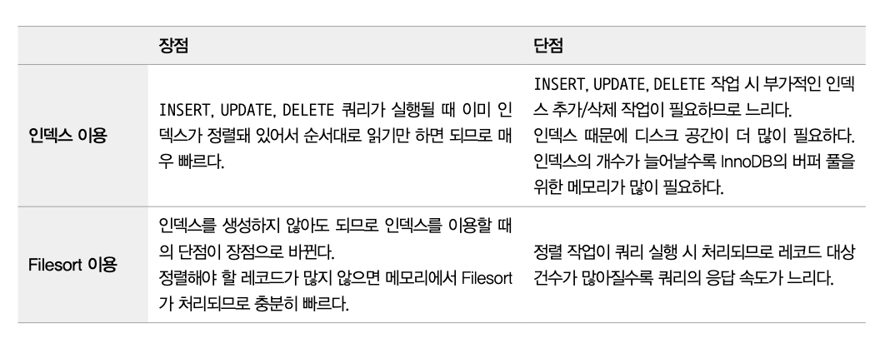
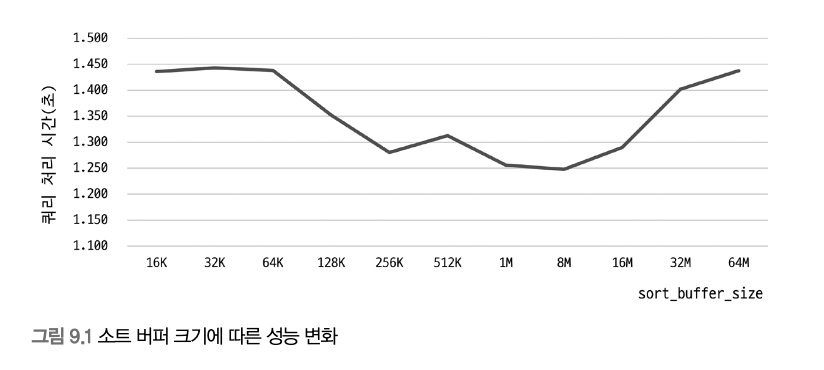
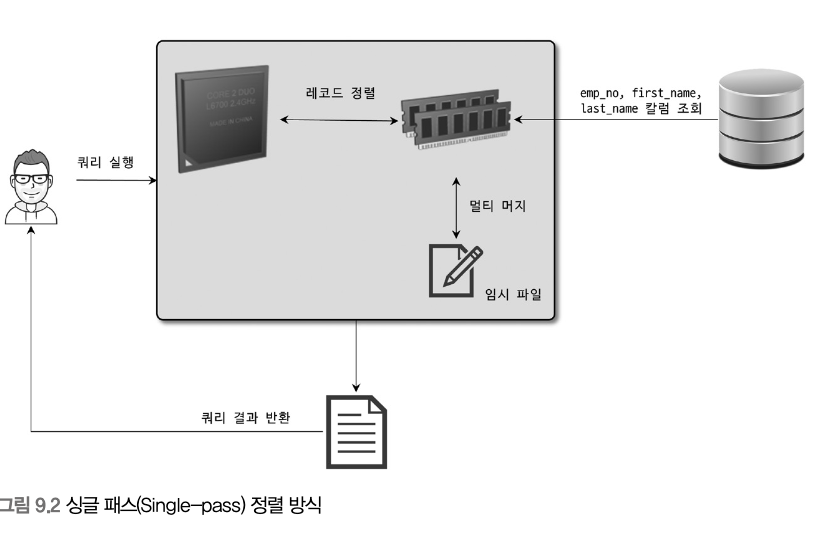
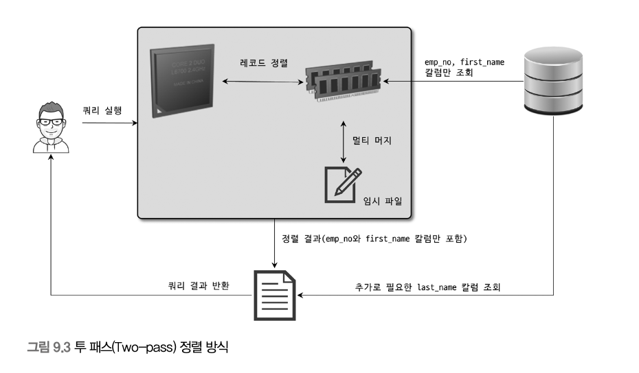
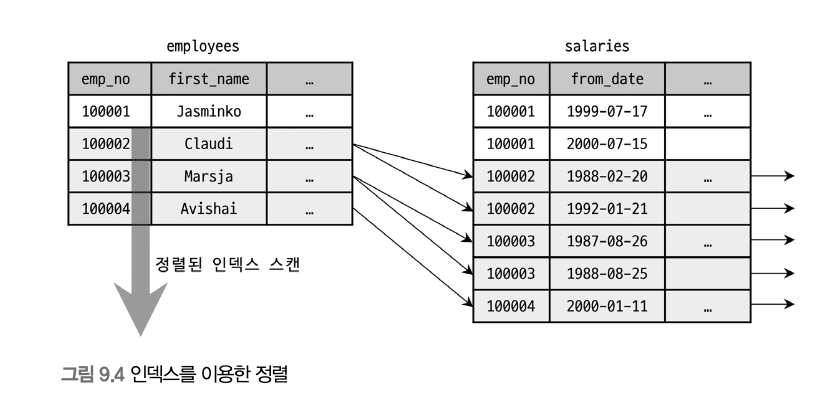
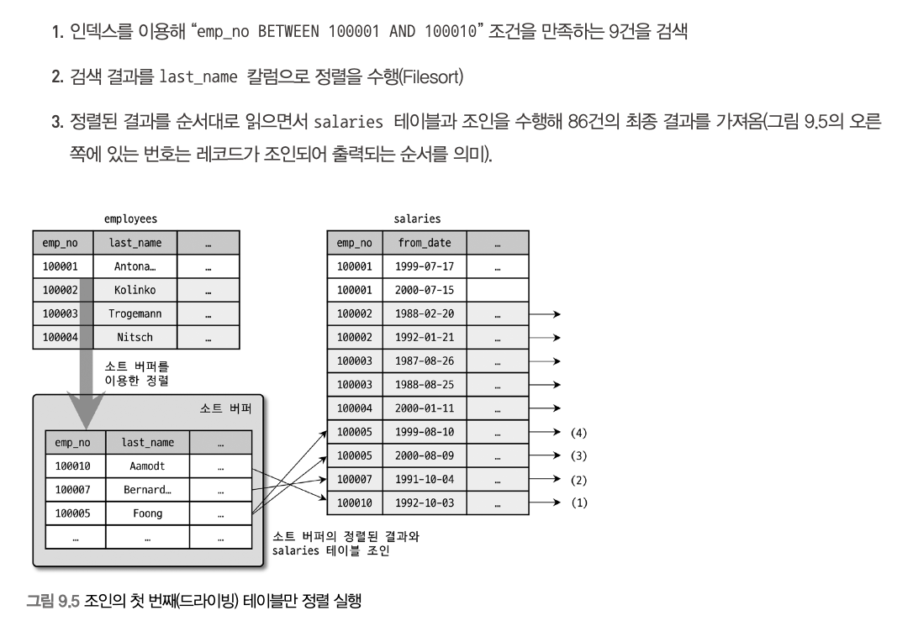
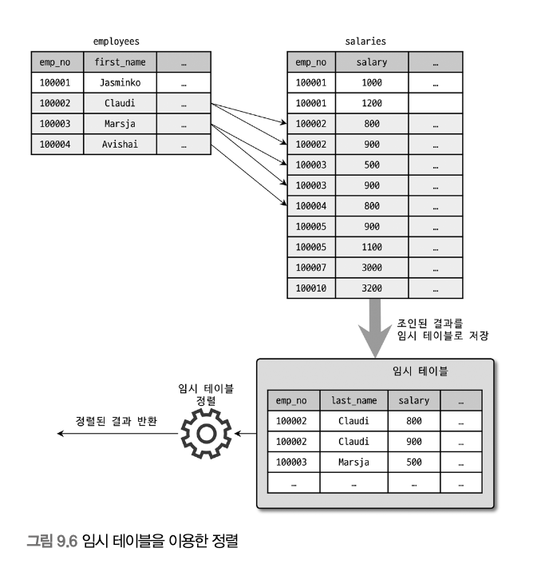
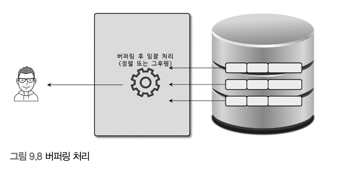
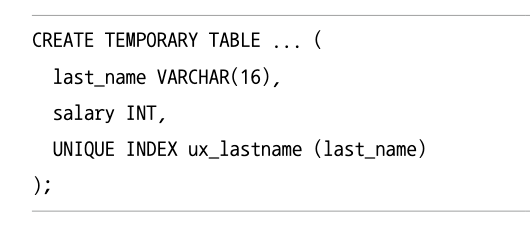

# 9.1 개요
## 9.1.1 쿼리 실행 절차
1. 사용자로부터 요청된 SQL 문장을 잘게 쪼개서 분리
2. 파스 트리를 확인하면서 어떤 테이블부터 읽고 어떤 인덱스를 이용해 테이블을 읽을지 선택 -> 최적화 및 실행 계획 수립 단계 : **옵티마이저**에서 처리
3. 두 번째 단계에서 결정된 테이블의 읽기 순서나 선택된 인덱스를 이용해 스토리지 엔진으로부터 데이터를 가져옴

## 9.1.2 옵티마이저의 종류
- 규칙 기반 최적화 : 대상 테이블의 레코드 건수나 선택도 등을 고려하지 않고 옵티마이저에 내장된 우선순위에 따라 실행 계획을 수립하는 방식
- 비용 기반 최적화 : 쿼리를 처리하기 위한 여러 가지 가능한 방법을 만들고 실행 계획별 비용 산출, 최소 소요 처리 방식 선택하려 쿼리 실행

---
# 9.2 기본 데이터 처리
## 9.2.1 풀 테이블 스캔과 풀 인덱스 스캔
풀 테이블 스캔 : 인덱스를 사용하지 않고 테이블의 데이터를 처음부터 끝까지 읽음

옵티마이저가 풀 테이블 스캔을 선택하는 조건
- 테이블의 레코드 건수가 너무 작은 경우
- WHERE 절이나 ON 절에 인덱스를 이용할 수 있는 적절한 조건이 없는 경우
- 인덱스 레인지 스캔을 사용할 수 있는 쿼리라고 하더라도 조건 일치 레코드 건수가 너무 많은 경우

InnoDB vs MyISAM
- InnoDB는 MyISAM과 달리 연속된 데이터 페이지가 읽히면 백그라운드 스레드가 리드 어헤드(Read Ahead)를 수행해 다음 페이지들을 미리 버퍼 풀에 적재한다.
- 풀 테이블 스캔이 진행되면 초반 일부는 포그라운드 스레드가 읽고, 이후부터는 백그라운드 스레드가 여러 페이지를 묶어서 읽으며 최대 64개 페이지까지 확장할 수 있다.
- 이 덕분에 포그라운드 스레드는 버퍼 풀에 준비된 데이터를 바로 사용하므로 쿼리 처리 속도가 빨라진다.
- `innodb_read_ahead_threshold` 값으로 리드 어헤드를 시작할 임계치를 조정할 수 있고, 대용량 분석 환경에서는 더 낮춰서 빨리 시작하게 할 수도 있다.
- 리드 어헤드는 풀 테이블 스캔뿐 아니라 풀 인덱스 스캔에도 동일하게 적용된다.
- `SELECT COUNT(*) FROM employees;` 같은 쿼리는 전체 레코드 수만 필요하므로, 보통 테이블 전체보다 크기가 작은 인덱스를 끝까지 읽는 풀 인덱스 스캔이 더 유리하다.
- 반대로 필요한 칼럼이 인덱스에 없으면 풀 인덱스 스캔을 사용할 수 없어서 풀 테이블 스캔이 수행된다.

## 9.2.2 병렬 처리
`innodb_parallel_read_threads` : 하나의 쿼리를 최대 몇개의 스레드를 이용해서 처리할지를 변경 가능

## 9.2.3 ORDER BY 처리


### 9.2.3.1 소트 버퍼
소트 버퍼(Sort Buffer) : MySQL은 정렬을 수행하기 위해 별도의 메모리 공간을 할당받아 사용

- 소트 버퍼는 정렬이 필요한 경우에만 할당
- 크기는 정렬해야 할 레코드의 크기에 따라 가변적으로 증가
- 최대 사용 가능 공간 지정 가능
- 쿼리의 실행이 완료되면 메모리 공간 즉시 시스템으로 반납

정렬 과정
- 정렬 데이터가 sort buffer에 들어가면 메모리에서 바로 정렬한다.
- 데이터가 sort buffer보다 크면 여러 조각으로 나눠 정렬 후 디스크에 임시 저장한다.
- 이후 디스크의 정렬 결과들을 병합(Multi-merge) 하면서 최종 정렬한다.
- 이 과정에서 디스크 I/O가 발생하며 데이터가 많을수록 병합 횟수가 증가한다.
- 병합 횟수는 Sort_merge_passes 변수로 확인할 수 있다.
- sort buffer를 크게 해도 성능 차이는 크지 않을 수 있다.


### 9.2.3.2 정렬 알고리즘
**싱글 패스**, **투 패스** 두가지 정렬 모드로 나눔

MySQL 서버의 정렬 방식
- 투 패스 - <sort_key, row_id> : 정렬 키와 레코드의 row id만 가져와서 정렬하는 방식
- 싱글 패스 - <sort_key, additional_fields> : 정렬 키와 레코드 전체를 가져와서 정렬하는 방식으로, 레코드의 컬럼들은 고정 사이즈로 메모리 저장
- 싱글 패스 - <sort_key, packed_additional_fields> : 정렬 키와 레코드 전체를 가져와서 정렬하는 방식으로, 레코드의 칼럼들은 가변 사이즈로 메모리 저장

#### 싱글 패스 정렬 방식
소트 버퍼에 정렬 기준 칼럼을 포함해 SELECT 대상이 되는 칼럼 전부를 담아서 정렬을 수행하는 정렬 방식
```sql
SELECT emp_no, first_name, last_name
FROM employees
ORDER BY first_name;
```


최신 버전에서는 일반적으로 싱글 패스 정렬 방식 수행

정렬 대상 레코드의 크기나 건수가 작은 경우 빠른 성능을 보임

#### 투 패스 정렬 방식
정렬 대상 칼럼과 프라이머리 키 값만 소트 버퍼에 담아서 정렬 수행

정렬된 순서대로 다시 프라이머리 키로 테이블을 읽어서 SELECT할 칼럼을 가져오는 정렬 방식



사용되는 경우
- 레코드의 크기가 max_length_for_sort_data 시스템 변수에 설정된 값보다 클 때
- BLOB나 TEXT 타입의 칼람이 SELECT 대상에 포함될 때

정렬 대상 레코드의 크기나 건수나 많은 경우 효율적

### 9.2.3.3 정렬 처리 방법
ORDER BY 사용 시


옵티마이저가 정렬 대상 레코드를 최소화하기 위해 사용하는 방법
- 조인의 드라이빙 테이블만 정렬한 다음 조인을 수행
- 조인이 끝나고 일치하는 레코드를 모두 가져온 후 정렬을 수행

#### 1. 인덱스를 활용한 정렬
반드시 ORDER BY에 명시된 칼럼이 제일 먼저 읽는 테이블에 속하고, ORDER BY의 순서대로 생성된 인덱스가 있어야 함

WHERE 절에 첫 번째로 읽는 테이블의 칼럼에 대한 조건이 있다면 그 조건과 ORDER BY는 같은 인덱스를 사용할 수 있어야 함



#### 2. 조인의 드라이빙 테이블만 정렬
조인을 실행하기 전에 첫 번째 테이블의 레코드를 먼저 정렬한 다음 정렬



#### 3. 임시 테이블을 이용한 정렬
2게 이상의 테이블을 조인해서 정렬해야 할 때

```sql
SELECT *
FROM employees e, salaries s
WHERE s.emp_no=e.emp_no
AND e.emp_no BETWEEN 100002 AND 100010
ORDER BY s.salary;
```

ORDER BY 절의 정렬 기준 칼럼이 드리븐 테이블에 있음
-> 정렬이 수행되기 전에 salaries 테이블 읽어야 함



#### 4. 정렬 처리 방법의 성능 비교
##### 1. 스트리밍 방식
서버 쪽에서 처리할 데이터가 얼마인지에 관계없이 조건에 일치하는 레코드가 검색될 때마다 바로바로 클라이언트로 전송해주는 방식

클라이언트는 MySQL 서버가 일치하는 레코드를 찾는 즉시 전달받기 때문에 동시에 데이터의 가공 작업을 시작할 수 있음

##### 2. 버퍼링 방식
먼저 결과를 모아서 MySQL 서버에서 일괄 가공

버퍼링 방식으로 처리되는 쿼리는 LIMIT 조건이 있어도 성능 향상에 별로 도움이 되지 않음


### 9.2.3.4 정렬 관련 상태 변수
- Sort_merge_passes : 멀티 머지 처리 횟수
- Sort_range : 인덱스 레인지 스캔을 통해 검색된 결과에 대한 정렬 작업 횟수
- Sort_scan : 풀 테이블 스캔을 통해 검색된 결과에 대한 정렬 작업 횟수
- Sort_rows : 지금까지 정렬한 전체 레코드 건수

### 9.2.4 GROUP BY 처리
#### 9.2.4.1 인덱스 스캔을 사용하는 GROUP BY
조인의 드라이빙 테이블에 속한 칼럼만 이용해 그루핑할 때 GROUP BY 칼럼으로 이미 인덱스가 있다면 그 인덱스를 차례대로 읽으면서 그루핑 작업을 수행하고 그 결과로 조인 처리
#### 9.2.4.2 루스 인덱스 스캔을 이용하는 GROUP BY
루스 인덱스 스캔 : 인덱스의 레코드를 건너뛰면서 필요한 부분만 읽어서 가져오는 것
#### 9.2.4.3 임시 테이블을 사용하는 GROUP BY
인덱스를 전혀 사용하지 못할 때


### 9.2.5 DISTINCT 처리
#### 1. SELECT DISTINCT
GROUP BY와 동일한 방식으로 처리

SELECT 하는 레코드를 유니크하게 SELECT

#### 2. 집합 함수와 함께
집합 함수 내에서 사용된 DISTINCT : 그 집합 함수의 인자로 전달된 칼럼값이 유니크한 것들을 가져옴

- MySQL은 중복 제거를 위해 임시 테이블(temporary table) 을 만든다.
- DISTINCT 값을 저장하면서 유니크 인덱스를 사용해 중복을 제거한다.
- 그래서 데이터가 많으면 느려질 수 있다.

### 9.2.6 내부 임시 테이블 활용
#### 1. 내부 임시 테이블
- MySQL은 **정렬, GROUP BY, DISTINCT 등 추가 데이터 가공이 필요할 때 내부 임시 테이블을 생성**한다.
- 사용자가 생성하는 `CREATE TEMPORARY TABLE`과 다르다.
- **쿼리 실행 중에만 존재하며 쿼리 종료 후 자동 삭제된다.**
#### 2. 메모리 임시 테이블 vs 디스크 임시 테이블

기본 동작
1. 먼저 **메모리에서 임시 테이블 생성**
2. 크기가 커지면 **디스크 임시 테이블로 전환**

MySQL 8.0 기준
| 유형 | 스토리지 엔진 |
|---|---|
| 메모리 임시 테이블 | TempTable |
| 디스크 임시 테이블 | InnoDB 또는 mmap 파일 |

관련 설정 변수
- `temptable_max_ram` : 메모리 임시 테이블 최대 크기 (기본 1GB)
- `temptable_use_mmap` : 디스크 전환 시 mmap 사용 여부

#### 3. 임시 테이블이 생성되는 대표 쿼리

다음 패턴의 쿼리는 **내부 임시 테이블이 생성될 가능성이 높다.**

- `ORDER BY`와 `GROUP BY` 컬럼이 다른 경우
- `ORDER BY` 또는 `GROUP BY` 컬럼이 **조인의 첫 번째 테이블이 아닌 경우**
- `DISTINCT`와 `ORDER BY`를 함께 사용하는 경우
- `UNION` 또는 `UNION DISTINCT`
- **서브쿼리 결과(derived table)** 를 사용하는 경우

#### 4. 디스크 임시 테이블이 생성되는 경우

다음 조건이면 **메모리 대신 디스크 임시 테이블이 생성된다.**

- 컬럼 크기가 **512byte 이상**
- `GROUP BY` 또는 `DISTINCT` 대상 컬럼이 큰 경우
- 임시 테이블 크기가 아래 설정값을 초과한 경우
  - `tmp_table_size`
  - `max_heap_table_size`
  - `temptable_max_ram`

#### 5. 임시 테이블 사용 여부 확인
상태 변수 확인

```sql
SHOW SESSION STATUS LIKE 'Created_tmp%';
```
---
# 9.3 고급 최적화

---
# 9.4 쿼리 힌트

옵티마이저 힌트는 MySQL 옵티마이저가 실행 계획을 선택할 때  
특정 방식으로 실행하도록 유도하거나 제한하는 기능이다.

일반적으로 옵티마이저가 최적의 실행 계획을 선택하지만  
통계 정보가 부정확하거나 특수한 쿼리에서는 잘못된 실행 계획을 선택할 수 있다.

이럴 때 **쿼리 힌트를 사용해 실행 계획을 제어**할 수 있다.

## 9.4.1 힌트의 종류

MySQL의 쿼리 힌트는 크게 두 가지로 나뉜다.

### 1. 인덱스 힌트 (Index Hint)

특정 인덱스를 사용하거나 사용하지 않도록 지정하는 방식

#### 사용 목적
- 옵티마이저가 잘못된 인덱스를 선택할 때
- 특정 인덱스를 강제로 사용하거나 제외할 때

#### 종류

| 힌트 | 설명 |
|---|---|
| USE INDEX | 특정 인덱스를 사용하도록 권장 |
| FORCE INDEX | 특정 인덱스를 강제로 사용 |
| IGNORE INDEX | 특정 인덱스를 사용하지 않도록 설정 |

#### 예시

```sql
SELECT *
FROM employees USE INDEX(idx_firstname)
WHERE first_name = 'Matt';
```

```sql
SELECT *
FROM employees FORCE INDEX(idx_firstname)
WHERE first_name = 'Matt';
```

```sql
SELECT *
FROM employees IGNORE INDEX(idx_firstname)
WHERE first_name = 'Matt';
```

---

### 2. 옵티마이저 힌트 (Optimizer Hint)

MySQL 5.7 이후 도입된 방식으로  
쿼리의 실행 전략 자체를 제어할 수 있는 힌트

#### 사용 방식

```sql
SELECT /*+ 힌트 */ ...
```

예시

```sql
SELECT /*+ JOIN_ORDER(e, s) */
*
FROM employees e
JOIN salaries s ON e.emp_no = s.emp_no;
```

---

## 9.4.2 주요 옵티마이저 힌트

### 1. JOIN_ORDER

조인의 실행 순서를 지정

옵티마이저가 선택한 조인 순서가 비효율적일 때 사용

```sql
SELECT /*+ JOIN_ORDER(e, s) */
*
FROM employees e
JOIN salaries s ON e.emp_no = s.emp_no;
```

---

### 2. INDEX 힌트

특정 인덱스를 사용하도록 지정

```sql
SELECT /*+ INDEX(e idx_name) */
*
FROM employees e
WHERE emp_no = 10001;
```

---

### 3. NO_INDEX

특정 인덱스를 사용하지 않도록 지정

```sql
SELECT /*+ NO_INDEX(e idx_name) */
*
FROM employees e
WHERE emp_no = 10001;
```

---

## 9.4.3 쿼리 힌트 사용 시 주의사항

- 옵티마이저는 대부분의 경우 **적절한 실행 계획을 자동으로 선택한다.**
- 쿼리 힌트는 **최후의 수단으로 사용하는 것이 좋다.**
- 데이터 분포나 인덱스 상태가 바뀌면 **힌트가 오히려 성능을 악화시킬 수 있다.**

일반적인 튜닝 순서

1. 인덱스 설계 개선
2. 쿼리 구조 개선
3. 실행 계획 분석
4. 마지막으로 힌트 사용