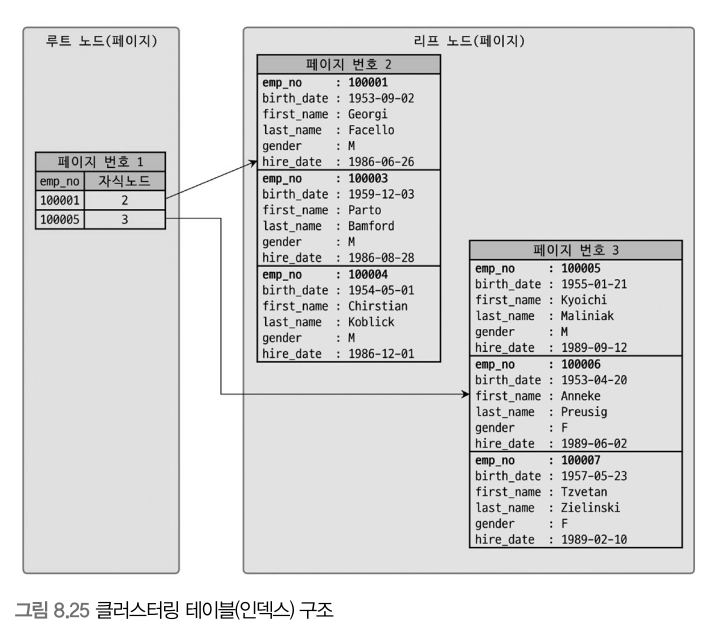

## 8.8 클러스터링 인덱스

클러스터링이란 여러 개를 하나로 묶는다는 의미로 주로 사용되는데, 인덱스의 클러스터링도 그 의미를 크게 벗어나지 않는다. MySQL 서버에서 클러스터링은 테이블의 레코드를 비슷한 것(프라이머리 키를 기준으로)들끼리 묶어서 저장하는 형태로 구현되는데, 이는 주로 비슷한 값들을 동시에 조회하는 경우가 많다는 점에 착안한 것이다.

MySQL에서 클러스터링 인덱스는 InnoDB 스토리지 엔진에서만 지원하며, 나머지 스토리지 엔진에서는 지원되지 않는다.

### 8.8.1 클러스터링 인덱스

클러스터링 인덱스는 테이블의 프라이머리 키에 대해서만 적용되는 내용이다.

즉 프라이머리 키 값이 비슷한 레코드끼리 묶어서 저장하는 것을 클러스터링 인덱스라고 표현한다. 여기서 중요한 것은 프라이머리 키 값에 의해 레코드의 저장 위치가 결정된다는 것이다. `또한 프라이머리 키 값이 변경되면 그 레코드의 물리적 저장 위치가 바뀌어야 한다는 것을 의미하기도 한다.`

프라이머리 키 값으로 클러스터링된 테이블은 프라이머리 키 값 자체에 대한 의존도가 상당히 크기 때문에 신중히 프라이머리 키를 결정해야 한다.

클러스터링 인덱스는 인덱스 알고리즘이라기보다 테이블 레코드 저장 방식이라고 볼 수 있다.

그래서 “클러스터링 인덱스”와 “클러스터링 테이블”은 동의어로 사용되기도 한다. 또한 클러스터링의 기준이 되는 프라이머리 키는 클러스터링 키라고도 표현한다.

일반적으로 InnoDB와 같이항상 클러스터링 인덱스로 저장되는 테이블은 프라이머리 키 기반의 검색이 매우 빠르며, 대신 레코드의 저장이나 프라이머리 키의 변경이 상대적으로 느리다.

<aside>

테이블의 레코드가 프라이머리 키 값으로 정렬되어 저장된 경우만 “클러스터링 인데스”라고 한다.

</aside>

클러스터링 테이블은 그 자체가 하나의 거대한 인덱스 구조로 관리된다.



그림 8.25의 클러스터링 테이블에서 다음 쿼리와 같이 프라이머리 키를 변경하는 문장이 실행되면 클러스터링 테이블의 데이터 레코드에는 어떤 변화가 일어날까?

```sql
mysql> UPDATE tb_test SET emp_no=100002 WHERE emp_no=100007;
```

**emp_no가 100007인 레코드는 3번 페이지에 저장되어 있지만, emp_no가 100002로 바뀌면서 2번 페이지로 이동하게된다.**

실제로는 프라이머리 키의 값이 변경되는 경우는 거의 없을 것이다.

<aside>

MyISAM 테이블이나 기타 InnoDB를 제외한 테이블의 데이터 레코드는 프라이머리 키나 인덱스 키 값이 변경된다고 해서 실제 데이터 레코드의 위치가 변경되지는 않는다. 데이터 레코드가 INSERT될 때 데이터 파일의 끝에 저장된다.
이렇게 한번 결정된 위치는 절대 바뀌지 않고, 레코드가 저장된 주소는 MySQL 내부적으로 레코드를 식별하는 아이디로 인식된다. 레코드가 저장된 주소를 로우 아이디라고 표현하며, 일부 DBMS에서는 이 값을 사용자가 직접 조회하거나 쿼리의 조건으로 사용할 수 있다.
MySQL에서는 사용자에게 노출되지 않는다.

</aside>

> 프라이머리 키가 없는 InnoDB 테이블은 어떻게 클러스터링 테이블로 구성될까?
프라이머리 키가 없는 경우에는 InnoDB 스토리지 엔진이 다음 우선순위대로 프라이머리 키를 대체할 칼럼을 선택한다.
>

1. 프라이머리 키가 있으면 기본적으로 프라이머리 키를 클러스터링 키로 선택
2. NOT NULL 옵션의 유니크 인덱스 중에서 첫 번째 인덱스를 클러스터링 키로 선택
3. 자동으로 유니크한 값을 가지도록 증가되는 칼럼을 내부적으로 추가한 후, 클러스터링 키로 선택

InnoDB 스토리지 엔진이 적절한 클러스터링 키 후보를 찾지 못하는 경우 InnoDB 스토리지 엔진이 내부적으로 레코드의 일련번호 칼럼을 생성한다.
이렇게 자동으로 추가된 프라이머리 키(일련번호 칼럼)는 사용자에게 노출되지 않으며, 쿼리 문장에 명시적으로 사용할 수 없다. 이것은 우리에게 아무런 혜택을 주지 않는다. InnoDB 테이블에서 클러스터링 인덱스는 테이블당 단 하나만 가질 수 있는 엄청난 혜택. 가능하다면 프라이머리 키를 명시적으로 생성하자.

### 8.8.2 세컨더리 인덱스에 미치는 영향

프라이머리 키가 세컨더리 인덱스에 어떤 영향을 미칠까?

→ MyISAM이나  테이블 같은 클러스터링되지 않은 테이블은 INSERT될 때 처음 공간에서 절대 이동하지 않는다.

프라이머리 키나 세컨더리 인덱스의 각 키는 그 주소(ROWID)를 이용해 실제 데이터 레코드를 찾아온다.

employees 테이블에서 first_name 칼럼으로 검색하는 경우 프라이머리 키로 클러스터링된 InnoDB와 그렇지 않은 MyISAM에서 어떤 차이가 있는지 한번 살펴보자.

```sql
mysql> CREATE TABLE employees (
				emp_no INT NOT NULL,
				first_name VARCHAR(20) NOT NULL,
				PRIMARY KEY (emp_no),
				INDEX ix_firstname (first_name)
			);
			
mysql> SELECT * FROM employees WHERE first_name='Aamer';
```

- MyISAM: ix_firstname 인덱스를 검색해서 레코드의 주소를 확인한 후, 레코드의 주소를 이용해 최종 레코드를 가져옴
- InnoDB: ix_firstname 인덱스를 검색해 레코드의 프라이머리 키 값을 확인한 후, 프라이머리 키 인덱스를 검색해서 최종 레코드를 가져옴

InnoDB 테이블에서 프라이머리 키는 큰 장점을 제공하므로 성능 저하에 대해 너무 걱정하지 않아도 된다.

### 8.8.3 클러스터링 인덱스의 장점과 단점

- 장점
  - 프라이머리 키로 검색할때 처리 성능이 매우 빠름(특히, 프라이머리 키를 범위 검색하는 경우 매우 빠름)
  - 테이블의 모든 세컨더리 인덱스가 프라이머리 키를 가지고 있기 때문에 인덱스만으로 처리될 수 있는 경우가 많음(이를 커버링 인덱스라고 한다.)
- 단점
  - 테이블의 모든 세컨더리 인덱스가 클러스터링 키를 갖기 때문에 클러스터링 키의 크기가 클 경우 전체적으로 인덱스의 크기가 커짐
  - 세컨더리 인덱스를 통해 검색할 때 프라이머리 키로 다시 한번 검색해야 해서 처리 성능이 느림
  - INSERT할 때 프라이머리 키에 의해 레코드의 저장 위치가 결정되기 때문에 처리 성능이 느림
  - 프라이머리 키를 변경할 때 레코드를 DELETE하고 INSERT하는 작업이 필요하기 때문에 처리 성능이 느림

### 8.8.4 클러스터링 테이블 사용 시 주의사항

8.8.4.1 클러스터링 인덱스의 키의 크기

클러스터링 테이블의 경우 모든 세컨더리 인덱스가 프라이머리 키 값을 포함한다. 그래서 프라이머리 키의 크기가 커지면 세컨더리 인덱스도 자동으로 크기가 커진다. 하지만 일반적으로 테이블에 세컨더리 인덱스가 4~5개 정도 생성된다는 것을 고려하면 세컨더리 인덱스 크기는 급격히 증가한다.

8.8.4.2 프라이머리 키는 AUTO-INCREMENT보다는 업무적인 칼럼으로 생성(가능한 경우)

**8.8.4.3 프라이머리 키는 반드시 명시할 것**

**8.8.4.4 AUTO-INCREMENT 칼럼을 인조 식별자로 사용할 경우**

세컨더리 인덱스도 필요하고 프라이머리 키의 크기도 길다면 AUTO_INCREMENT 칼럼을 추가하고, 이를 프라이머리 키로 설정하면 된다. 이렇게 프라이머리 키를 대체하기 위해 인위적으로 추가된 프라이머리 키를 인조 식별자라고 한다.

## 8.9 유니크 인덱스

유니크는 사실 인덱스라기보다는 제약 조건에 가깝다.  MySQL에서는 인덱스 없이 유니크 제약만 설정할 방법이 없다.

### 8.9.1 유니크 인덱스와 일반 세컨더리 인덱스의 비교

유니크 인덱스와 유니크하지 않은 일반 세컨더리 인덱스의 구조상 아무런 차이점이 없다.

8.9.1.1 인덱스 읽기

유니크하지 않은 세컨더리 인덱스에서 한 번 더 해야 하는 작업은 디스크 읽기가 아니라 CPU에서 칼럼값을 비교하는 작업이기 때문에 이는 성능상 영향이 거의 없다.

**8.9.1.2 인덱스 쓰기**

유니크 인덱스의 키 값을 쓸 때는 중복된 값이 있는지 없는지 체크하는 과정이 한 단계 더 필요하다. 그래서 유니크하지 않은 세컨더리 인덱스의 쓰기보다 느리다. 그런데 MySQL에서는 유니크 인덱스에서 중복된 값을 체크할 때는 읽기 잠금을 사용하고, 쓰기를 할 때는 쓰기 잠금을 사용하는데 이과정에서 데드락이 아주 빈번히 발생한다.

또한 InnoDB 스토리지 엔진에는 인덱스 키의 저장을 버퍼링하기 위해 체인지 버퍼가 사용된다. 그래서 인덱스의 저장이나 변경 작업이 상당히 빨리 처리되지만,

유니크 인덱스는 반드시 중복 체크를 해야 하므로 작업 자체를 버퍼링하지 못한다. 이 때문에 유니크 인덱스는 일반 세컨더리 인덱스보다 변경 작업이 더 느리게 작동한다.

### 8.9.2 유니크 인덱스 사용 시 주의사항

MySQL의 유니크 인덱스는 일반 다른 인덱스와 같은 역할을 하므로 중복해서 인덱스를 생성할 필요가 없다.

결론적으로 꼭 유일성이 보장되어야 하는 칼럼에 대해서는 유니크 인덱스를 생성하되, 꼭 필요하지 않다면 유니크 인덱스보다는 유니크하지 않은 세컨더리 인덱스를 생성하는 방법도 한 번씩 고려해 보자.

## 8.10 외래키

InnoDB의 외래키 특징

- 테이블의 변경이 발생하는 경우에만 잠금 경합이 발생한다.
- 외래키와 연관되지 않은 칼럼의 변경은 최대한 잠금 경합을 발생시키지 않는다.

### 8.10.1 자식 테이블의 변경이 대기하는 경우

| 커넥션-1 | 커넥션-2 |
| --- | --- |
| BEGIN; |  |
| UPDATE tb_parent
SET fd=’changed-2’ WHERE id=2; |  |
|  | BEGIN; |
|  | UPDATE tb_child
SET pid=2 WHERE id=100; |
| ROLLBACK; |  |
|  | Query OK, |

자식 테이블의 외래 키 칼럼의 변경은 부모 테이블의 확인이 필요한데, 이 상태에서 부모 테이블의 해당 레코드가 쓰기 잠금이 걸려 있으면 해당 쓰기 잠금이 해제될 때까지 기다리게 되는 것이다.

*읽기 잠금: 잠금의 주체가 이제 읽기를 할거니 아무도 건드리지 말라는 의미로 쓰기를 락

*쓰기 잠금: 잠금의 주체가 이제 쓰기를 할거니 아무도 읽기와 쓰기를 하지 말라는 락

> 외래키 제약조건에서는 참조 무결성 검사를 위해 관련 부모/자식 레코드에 S-lock이 걸릴 수 있고, 실제 UPDATE/DELETE가 발생하는 행에는 X-lock이 걸린다. 부모 작업이 있다고 자식에 자동으로 X-lock이 걸리는 것은 아니다.
>

**8.10.2 부모 테이블의 변경 작업이 대기하는 경우**

변경하는 테이블의 순서만 변경해서 자식이 먼저 잠길 경우.

자식 테이블의 레코드가 x-lock을 얻은 경우, 두번째 커넥션에서 부모 테이블을 삭제하려고 한다면 2번 커넥션이 1번 커넥션의 x-lock이 해제될 때까지 기다려야 한다. 이는 부모 레코드가 삭제되면 자식 레코드도 동시에 삭제되는 식으로 동작하기 때문이다.(ON DELETE CASCADE)

`이렇게 잠금이 다른 테이블로 확장되면 그만큼 전체적으로 쿼리의 동시 처리에 영향을 미친다`