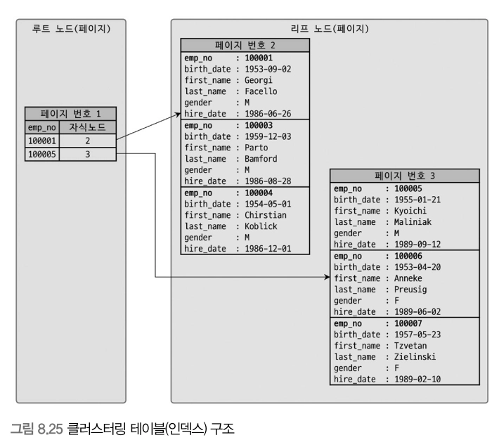

## 8.8 클러스터링 인덱스

- 클러스터링이란 여러개를 하나로 묶는다는 의미이다.
- MySQL에서의 클러스터링은 테이블 레코드를 비슷한것(PK기준으로)들끼리 묶어서 저장하는 형태로 구현하는데, 이는 주로 비슷한 값들을 동시에 조회하는 경우가 많다는 점에 착안한다.
- InnoDB스토리지 엔진에서만 지원하며, 다른 스토리지 엔진에서는 지원되지 않는다.

> **8.8.1 클러스터링 인덱스**
- 테이블의 PK에만 적용되는 내용이며, PK값이 비슷한 레코드끼리 묶어서 저장하는것을 클러스터링 인덱스라고 표현한다.
    - PK값에 의해 레코드 저장 위치가 결정된다
    - PK값이 변경된다면 그 레코드의 물리적 저장 위치가 바뀌어야 한다는것을 의미
- 클러스터링 인덱스는 PK값에 의해 레코드의 저장위치가 결정되므로 사실 인덱스 알고리즘이라기보단 테이블 레코드의 저장방식으로 볼수있다.
- InnoDB와 같이 항상 클러스터링 인덱스로 저장되는 테이블은 PK기반의 검색이 매우 빠르며 레코드 저장이나 PK변경이 상태적으로 느리다.



- 위와같이 클러스터링 테이블 구조 자체는 일반 B-Tree와 비슷하지만 세컨더리 인덱스를 위한 B-Tree의 리프노드와는 달리 클러스터링 인덱스의 리프노드에는 레코드의 모든칼럼이 같이 저장되어있다.
- 클러스터링 테이블에서 프라이머리 키를 변경하면 어떻게 될까?
    - emp_no가 10007이던걸 10002로 바꾼다면, 3번페이지의 레코드가 2번페이지로 이동할것이다.
    - PK가 없는 InnoDB테이블은 InnoDB스토리지 엔진이 다음 우선순위대로 PK대체 컬럼을 선택한다.
        1. `PK` 가 있으면 기본적으로 `PK` 를 클러스터링 키로 선택
        2. NOT NULL 옵션의 유니크 인덱스 중에서 첫 번째 인덱스를 클러스터링 키로 선택
        3. 자동으로 유니크한 값을 가지도록 증가되는 칼럼을 내부적으로 추가한 후, 클러스터링 키로 선택
        4. 적절한 클러스터링 키 후보를 찾지 못하는 경우 스토리지 엔진이 내부적으로 레코드의 일련번호 칼럼을 생성한다. 하지만 이는 사용자에게 노출되지 않으며, 쿼리 문장에 명시적으로 사용할 수 없다.
- InnoDB 테이블에서 클러스터링 인덱스는 테이블당 단 하나만 가질 수 있는 엄청난 혜택이므로 가능하다면 PK를 명시적으로 생성하자!
    
    

> **8.8.2 세컨더리 인덱스에 미치는 영향**
- PK가 세컨더리 인덱스에 미치는 영향을 알아보자.
- InnoDB테이블(클러스터링 테이블)의 모든 세컨더리 인덱스는 해당 레코드가 저장된 주소가 아닌 PK값을 저장하도록 구현되어있다.
    
    ```sql
    CREATE TABLE employees (
    					emp_no INT NOT NULL,
    					first_name VARCHAR(10) NOT NULL,
    					PRIMARY KEY (emp_no),
    					INDEX ix_firstname (first_name)
    				);
    				
    SELECT * FROM employees WHERE first_name='Aamer';
    ```
    
    - MyISAM
        - ix_firstname인덱스 검색 → 레코드 주소 확인 → 최종레코드
    - InnoDB
        - ix_firstname인덱스 검색 → 레코드 PK 확인 → PK인덱스 검색 → 최종레코드

> **8.8.3 클러스터링 인덱스의 장점과 단점**
- 클러스터링 되지 않은 일반 PK와 클러스터링 인덱스를 비교했을때 장단점
- 장점
    - PK(클러스터링 키)로 검색할때 처리성능이 빠르다(특히 범위검색에서)
    - 테이블의 모든 세컨더리 인덱스가 PK를 가지고 있기 때문에 인덱스만으로 처리될 수 있는 경우가 많다(커버링인덱스)
- 단점
    - 테이블의 모든 세컨더리 인덱스가 클러스터링 키를 갖기 때문에 클러스터링 키값의 크기가 클 경우 전체적으로 인덱스크기 커짐
    - 세컨더리 인덱스를 통해 검색할때 PK로 다시한번 검색해야하므로 처리성능이 느림
    - INSERT할때 PK에 의해 레코드 저장위치가 결정되므로 처리성능이 느림
    - PK를 변경할때 레코드를 DELETE하고 INSERT해야해서 처리성능이 느림
- 즉 장점은 빠른 READ, 단점은 느린 CUD이다. 일반적으로 웹서비스와같은 온라인 트랜잭션 환겨엥서는 쓰기와 읽기비율이 2:8~1:9이므로 빠른 R이중요함

> **8.8.4 클러스터링 테이블 사용시 주의사항**
- **클러스터링 인덱스의 크기**
    - 모든 세컨더리 인덱스가 프라이머리 키 값을 포함하기에 프라이머리 키의 크기가 커지면 세컨더리 인덱스도 자동으로 크기가 커진다.
    - 인덱스가 커질수록 같은 성능을 내기 위해 그만큼의 메모리가 더 필요해 지므로 InnoDB 테이블의 프라이머리 키는 신중하게 선택해야 한다.

- **PK는 AUTO_INCREMENT보다는 업무적 컬럼으로 생성**
    - PK 로 검색하는 경우 클러스터링되지 않은 테이블에 비해 매우 빠르게 처리될 수 있다.
    - 프라이머리 키는 그 의미 만큼이나 중요한 역할을 하기 때문에 대부분 검색에서 상당히 빈번하게 사용되는 것이 일반적이다. 설력 컬럼의 크기가 크더라도 업무적으로 해당 레코드를 대표할 수 있다면 그 칼럼을 PK로 설정하는 것이 좋다.

- **AUTO_INCREMENT 컬럼을 인조식별자로 사용할 경우**
    - 여러 개의 칼럼이 복합으로 PK 가 만들어지는 경우 PK 의 크기가 길어질 때가 있다.
    - PK의 크기가 길어도 세컨더리 인덱스가 필요하지 않다면 그대로 PK를 사용하는 것이 좋다.
    - 세컨더리 인덱스도 필요하고, PK의 크기도 길다면 AUTO INCREMENT 칼럼을 추가하고, 이를 PK로 설정하면 된다.
    - PK를 대체하기 위해 인위적으로 추가된 PK를 인조식별자(Surrogate key) 라고 한다. 조회보다 INSERT 위주의 테이블은 인조 식별자를 PK로 설정하는것이 성능 향상에 도움이 된다.

## 8.9 유니크 인덱스

- 유니크는 사실 인덱스라기보단 제약조건이다.
- 테이블이나 인덱스에 같은값이 2개이상 저장될 수 없음을 의미하는데, MySQL에서는 인덱스 없이 유니크 제약만 설정할순없다.
- 유니크 인덱스에는 Null도 저장 가능하지만 Null은 특정값이 아니므로 2개이상 저장 가능

> **8.9.1 유니크 인덱스와 세컨더리 인덱스의 비교**
- 유니크인덱스와 유니크하지않은 일반 보조인덱스는 인덱스구조상 아무 차이 X
- **인덱스 읽기**
    - 유니크 인덱스가 빠르다? → X
    - 유니크하지 않은 세컨더리 인덱스는 중복값이 허용되므로 읽어야할 레코드가 많아서 느린것이지 인덱스 자체의 특성때문에 느린것은 아님.
    - 읽어야할 레코드건수가 같다면 성능상 차이는 미미하다.
- **인덱스 쓰기**
    - 새로운 레코드가 INSERT되거나 인덱스 컬럼의 값이 변경되는 경우 인덱스 쓰기작업이 필요하다.
    - 유니크 인덱스의 키값을 쓸때는 중복된 값이 있는지 없는지 체크하는 과정이 한단계 더 필요하기 때문에 유니크하지 않은 세컨더리 인덱스의 쓰기보다 느리다.
        - 유니크 인덱스에서 중복값 체크시 읽기잠금사용
        - 유니크 인덱스에서 쓰기시 쓰기잠금 사용
        - 이 과정에서 데드락이 아주 빈번히 발생
    - InnoDB스토리지 엔진에서 인덱스 키의 저장을 버퍼링하기 위해 체인지버퍼가 사용되는데, 유니크 인덱스는 중복체크를 해야하므로 작업 자체를 버퍼링하지 못하기 때문에 더 느리다.

> **8.9.2 유니크 인덱스 사용시 주의사항**
- 꼭 필요한 경우라면 유니크 인덱스를 생성하는것은 당연하지만 불필요하게 유니크 인덱스를 생성하지 않는것이 좋다.
    - MySQL의 유니크 인덱스는 다른 일반 인덱스와 같은 역할을 하므로 중복 생성할 필요가 없다.
    - PK와 유니크 인덱스를 동일하게 생성하는 것도 불필요한 중복이다.
- 결론적으로 유일성이 꼭 보장돼야 하는 칼럼에 대해서는 유니크 인덱스를 생성하되, 꼭 필요하지 않다면 유니크 인덱스보다는 유니크하지 않은 세컨더리 인덱스를 생성하는 방법도 고려해보자.

## **8.10 외래키**

- MySQL에서 외래키는 InnoDB 스토리지 엔진에서만 생성할 수 있으며, 외래키 제약이 설정되면 자동으로 연관되는 테이블의 컬럼에 인덱스까지 생성된다.
- **외래키의 특징**
    - 테이블의 변경이 발생하는 경우에만 잠금경합 발생
    - 외래키와 연관되지 않은 컬럼의 변경은 최대한 잠금경합을 발생시키지 않음
    - 외래키가 제거되지 않은 상태에서는 자동으로 생성된 인덱스 삭제 불가

> **8.10.1 자식 테이블의 변경이 대기하는 경우**

```sql
//커넥션(1)
1. BEGIN;
2. UPDATE tb_parent SET fd = 'changed-2' WHRE id=2;
3. 대기
4. 대기
5. ROLLBACK;
6.

//커넥션(2)
3. BEGIN;
4. UPDATE tb_child SET pid=2 WHERE id=100;
5.
6. Query OK
```

- 1번 커넥션에서 먼저 트랜잭션을 시작하고 부모 테이블에서 ID가 2인 레코드에 UPDATE를 실행한다. 이과정에서 1번 커넥션이 부모 테이블에서 ID가 2인 레코드에 대해 쓰기 잠금을 획득한다.
- 2번 커넥션에서 자식 테이블의 외래키 칼럼인 PID를 2로 변경하는 쿼리를 실행, 이 쿼리는 부모 테이블의 변경 작업이 완료될 때까지 대기한다.
- 다시 1번 커넥션에서 ROLLBACK이나 COMMIT으로 트랜잭션을 종료하면 2번 커넥션의 대기중이던 작업이 즉시 처리되는 것을 확인할 수 있다.
- 즉 자식 테이블의 외래키 칼럼의 변경은 부모 테이블의 확인이 필요

> **8.10.2 부모 테이블의 변경작업이 대기하는 경우**

```sql
//커넥션(1)
1. BEGIN;
2. UPDATE tb_child SET fd='changed-100' WHERE id = 100;
3.
4.
5. ROLLBACK
6.

//커넥션(2)
1.
2.
3. BEGIN;
4. DELETE FROM tb_parent WHERE id=1;
5.
6. Query Ok
```

- 트랜잭션 1의 부모키를 참조하는 자식 테이블의 레코드를 변경하면 쓰기 잠금을 획득
- 트랜잭션 2의 부모 테이블의 레코드를 삭제하는 경우 쓰기 잠금이 해제될 때까지 기다려야 한다.
- 이는 자식 테이블이 생성될 때 정의된 외래키의 특성 ONDELETE CASCADE 때문